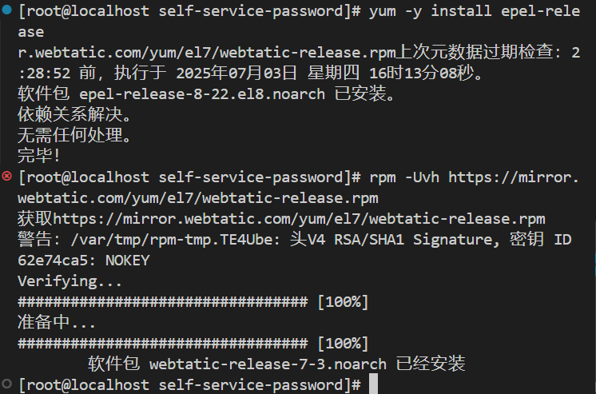
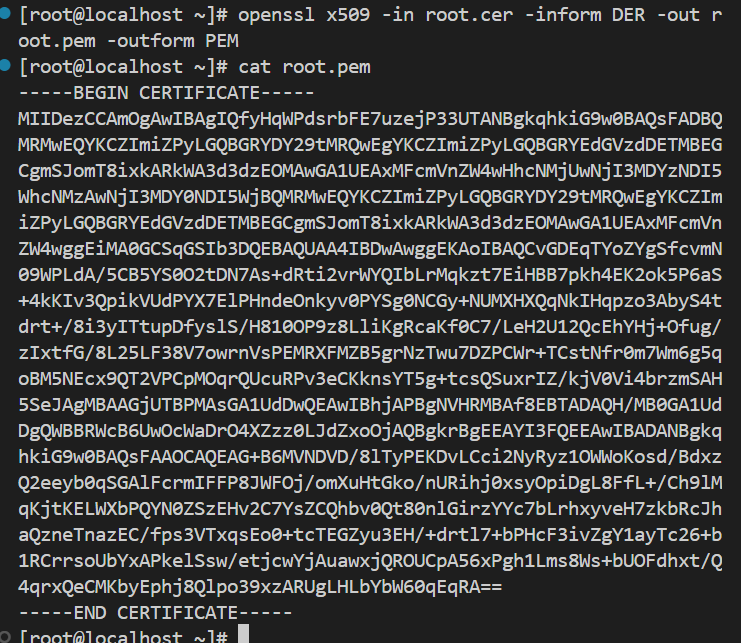
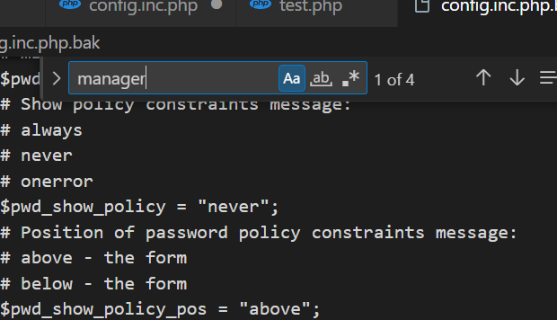
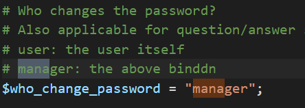
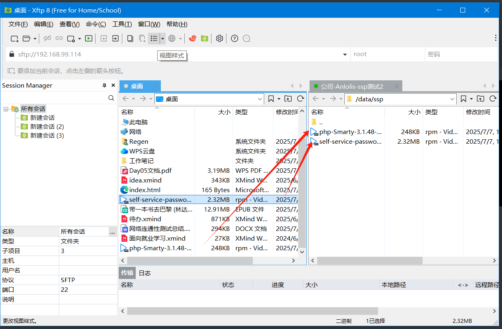
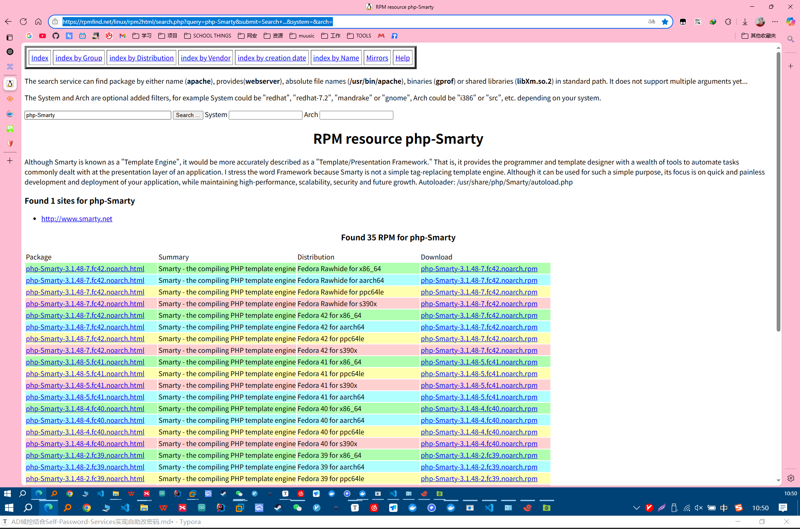
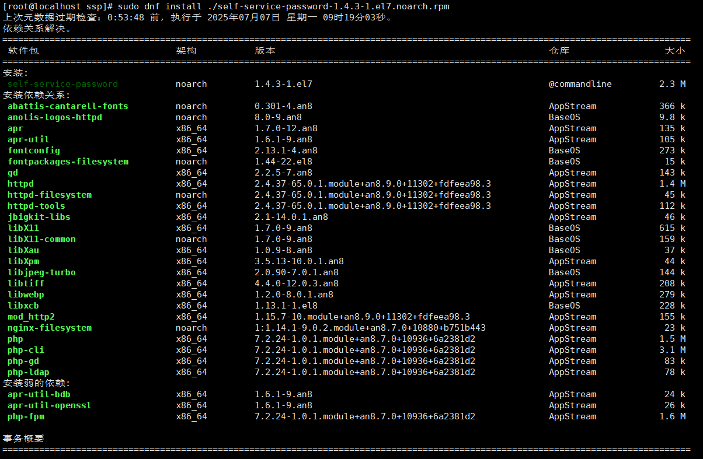
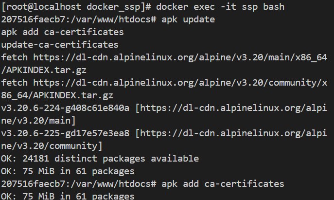

> 1. 操作系统：Anolis（类似centos，使用yum，dnf包管理）

# AD域控结合Self-Password-Services实现自助改密码

# 直接安装部署

​	经常会有这样的场景，AD域用户忘记或遗失了自己的密码。这时候可以找管理员进行修改，但是情况多了也会有些麻烦。所以可以尝试搭建**ssp(self-password-sercive)**实现用户自助改密码。还可以通过脚本的方式实现批量改密码，结合邮件等功能也能自主改密码。	

​	使用了两种方式部署，分别是实体机部署以及docker部署，本文部署方式为实体机部署，docker部署可能因为镜像，等等原因不及而终。最后整理部分报错信息以及解决方案供参考。	

​	

* 准备资料

​	SSP项目地址：[ltb-project/self-service-password: Web interface to change and reset password in an LDAP directory](https://github.com/ltb-project/self-service-password)

​	AD域控服务器（CS）搭建方式：[企业AD域（域控服务器）的安装和配置详细教程_域服务器的安装与配置-CSDN博客](https://blog.csdn.net/m0_49254484/article/details/129364336)

​	AD CA服务器搭建方式：[AD域控与CA证书、NPS（radius）超级详细安装_ad ca-CSDN博客](https://blog.csdn.net/weixin_48711866/article/details/127204995)

* 参考部署资料

    [Self Service Password部署-CSDN博客](https://blog.csdn.net/qq461391728/article/details/115867721)

## 1. 安装httpd（apache）php各项依赖

```bash
# 安装 Apache 和 PHP
dnf install httpd php php-ldap php-mbstring -y
```


## 2. 开始安装ssp

### 1.配置源

* 可以尝试先下载

```
dnf -y install self-service-password
```


我这里下载过所以显示已经安装，如果不能安装则进入下一步：

1. 配置源：

```bash
vim /etc/yum.repos.d/ltb-project.repo
```

写入以下信息：

```
[ltb-project-noarch]
name=LTB project packages (noarch)
baseurl=https://ltb-project.org/rpm/$releasever/noarch
enabled=1
gpgcheck=1
gpgkey=file:///etc/pki/rpm-gpg/RPM-GPG-KEY-LTB-project
```

2. 导入GPG私钥

```
rpm --import https://ltb-project.org/wiki/lib/RPM-GPG-KEY-LTB-project
```


3. 添加php72的yum源

```bash
yum -y install epel-release
rpm -Uvh https://mirror.webtatic.com/yum/el7/webtatic-release.rpm
```



## 3. 下载安装

```bash
dnf -y install self-service-password
```


## 4. 配置文件

​	其实最麻烦的其实是这里，这个配置文件很长，有很多细节。此时你下载好了之后，启动httpd服务就可以访问到ssp的界面了，但是会报错：**在使用凭据加密前，需要在 keyphrase 设置中填写一个随机字符串**


先实现基本功能-**用户自己使用旧密码改为新密码**。只要这一步能够pass，那么使用邮件就能通过。

### 1. 证书设置

#### 1. 导出证书

1. 要想ssp能够**正常修改**AD域的用户名账号密码**几乎**无法逃开证书认证的部分
    1. 个人尝试过各种方式跳过加密，都是不行的，顶多能够查询信息，修改是不可能的。

* AD域**根证书导出**

登录到服务器后Win+R输入cmd打开命令行输入：

```
cd Desktop
certutil -ca.cert root.cer
```

这样根证书就导出到桌面了，**注意如果没有安装AD CS服务，这个命令是无法生效的**

然后传到服务器即可

```bash
scp root.cer root@192.168.72.128:/root/
```


#### 2. 导入证书并生效

* 上一步传过来的证书是二进制的，无法被Linux添加，需要先转换格式


```
openssl x509 -in root.cer -inform DER -out root.pem -outform PEM
```



* **根据Linux发行版的不同，导入方式有差别**，基于**Debian/Ubuntu**：

```bash
# 对于基于 Debian/Ubuntu
cp ca.crt /usr/local/share/ca-certificates/
update-ca-certificates
```

* 基于 RHEL/CentOS （龙蜥使也是用这种方式）

```bash
# 对于基于 RHEL/CentOS
cp ca.crt /etc/pki/ca-trust/source/anchors/
update-ca-trust
```

#### 3. 检查是否导入成功。

* 基于**Debian/Ubuntu**：

```bash
openssl verify -CAfile /etc/ssl/certs/ca-certificates.crt root.pem
```

* RHEL/CentOS （龙蜥使也是用这种方式）

```bash
openssl verify -CAfile /etc/pki/ca-trust/extracted/pem/tls-ca-bundle.pem root.pem
```


### 2. config.inc.php配置文件设置

* 首先保证最小功能，也就是ldap和ad的设置
* **LDAP**

```php

# Debug mode
# true: log and display any errors or warnings (use this in configuration/testing)
# false: log only errors and do not display them (use this in production)
$debug = true;

# LDAP
$ldap_url = "ldaps://WIN-QAG6G63NI1O.suitbim.com:636";# 替换成自己的AD域服务器
$ldap_starttls = false; # 已经使用了ldaps，所以关闭

$ldap_binddn = "CN=Administrator,CN=Users,DC=www,DC=test,DC=com";# AD域DN,可以通过查看AD域服务器或者ldapsearch命令查看
$ldap_bindpw = "PAssword"; # 密码

$ldap_base = "DC=www,DC=test,DC=com"; # 待修改的用户所在的组织结构，一般是一开始创建的林

$ldap_login_attribute = "sAMAccountName"; # 不改
$ldap_fullname_attribute = "cn";         #   不改

$ldap_filter = "(&(objectClass=user)(sAMAccountName={login})(!(userAccountControl:1.2.840.113556.1.4.803:=2)))";# 过滤器，可以照抄

$ldap_scope = "sub"; # 不改，sub模式出错概率小

$ldap_use_exop_passwd = false; #  出错可以试true
$ldap_use_ppolicy_control = false;

$ldap_network_timeout = 10;
$ldap_page_size = 0;

```

* **AD设置**

```php

# Active Directory mode
# true: use unicodePwd as password field
# false: LDAPv3 standard behavior
$ad_mode = true;  # 必改
$ad_options=[];
# Force account unlock when password is changed
$ad_options['force_unlock'] = false;
# Force user change password at next login
$ad_options['force_pwd_change'] = false;
# Allow user with expired password to change password
$ad_options['change_expired_password'] = false;
```

* **还有一处重要的地方！**
* 搜索 manager，一共有2处设置



需要将对应的设置比如`$who_change_password = "manager";`改为`manager`，否则会遇到改密码权限问题。




### 3. 修改本地域名解析

```bash
vim /etc/hosts
```

增加ip-域名映射。

```
192.168.99.190 WIN-QAG6G63NI1O.example.com
```

**域名**在AD域服务器中可查

查看方法：powershell 

```
([System.Net.Dns]::GetHostByName($env:COMPUTERNAME)).HostName
```


## 5. 启动

​	至此大部分配置均已结束，可以开始启动或尝试重启httpd和php-fpm进行测试了。

```bash
systemctl restart httpd
systemctl restart php-fpm
```


# 直接部署遇到的问题汇总与解决方式

### 1. 安装ssp时提示有关php的版本问题

查看已有的版本，并启用对应的版本：

```
dnf module reset php -y
dnf module enable php:7.4 -y
# 之后再尝试下载
dnf install php php-cli php-common php-ldap php-mbstring php-gd php-opcache php-json php-xml -y

```

```bash
dnf module list php # 查看系统的php模块
```


### 2. 不能访问LDAP服务

* 这个问题可能是由以下原因造成
    1. 网络问题（防火墙等）

对于网络问题，可以测试用telnet

```
telnet 192.168.72.129 636
```


对于防火墙策略：

* 客户端和服务端可以关闭防火墙进行测试

### 3. 证书问题引起的无法修改密码

证书问题也是我卡住的主要问题，比较棘手。

* 引起证书问题的原因
    1. 根证书不对
    2. 证书加密强度不够
    3. 证书未正确加载

1. **根证书不对的解决方向：**

1. 重复重新操作证书设置，
2. 从AD域服务器重装CA服务器角色
3. 不使用命令行，使用图形化的方式导出方式

2. **证书加密强度不够**

* 这个会导致能够访问到ldap服务器，但是无法修改成功，会显示密码被拒绝，即使你用了强密码，完全符合AD域服务器的密码策略。

解决方法：

1. **重新导出根证书：使用加密方式更为安全的算法：sha512 * 4096 bit或更好**
2. 放宽加密证书要求的策略，也是我测试时使用的最有效的方式

```bash
vim /etc/openldap/ldap.conf
```

增加，或者禁用

```
TLS_CIPHER_SUITE NORMAL
```

```
TLS_REQCERT allow # or TLS_REQCERT never
```

3. 证书未正确加载

1. 查看证书是否一致

```bash
cat root.crt # or cat root.pem
```

2. 查看证书是否放在正确的位置，根据发行版不同放在不同的位置

```bash
# 对于基于 Debian/Ubuntu
ca.crt /usr/local/share/ca-certificates/
update-ca-certificates
# 对于基于 RHEL/CentOS
cp ca.crt /etc/pki/ca-trust/source/anchors/
update-ca-trust
```

# 离线RPM包安装部署

## 1. 使用离线RPM包安装

> 很多运维工程师倾向于使用离线安装包而非直接通过 `dnf` 或其他包管理器在线安装，主要是为了保证软件版本的稳定和可控，避免因仓库自动更新带来的不确定性；此外，生产环境往往限制服务器访问外网，使用离线包可以绕过网络限制，确保安装顺利；同时，离线安装方便快速在多台机器间复制，满足安全合规和审计要求，也便于自定义安装和配置，从而提升部署的灵活性和可靠性。

### 1. 准备离线RPM包

这里先给出两个官方archive

1. [Index of /archives](https://ltb-project.org/archives/)这个是ssp官方资源包括rpm以及tar包
2. [RPM resource php-Smarty](https://rpmfind.net/linux/rpm2html/search.php?query=php-Smarty&submit=Search+...&system=&arch=)这个是php依赖包库，搜索下载用

根据系统版本来确认安装的版本为1.4.3、查看发行版的命令为：

```bash
cat /etc/os-release
```


## 2. 上传至服务器

### 1. ftp服务传送

使用xshell的xftp进行传送



### 2. 或scp传送

```bash
scp self-service-password-1.4.3-1.el7.noarch.rpm php-Smarty-3.1.48-2.el8.noarch.rpm root@192.168.72.128:/data/ssp/
```

## 3. 安装

```
sudo dnf install ./self-service-password-1.4.3-1.el7.noarch.rpm
```

此时会报错：


所以需要去给出的网站搜索这个依赖rpm包并下载传送到服务器。



找到对应版本后下载即可

然后安装这个依赖

```bash
sudo dnf install ./php-Smarty-3.1.48-2.el8.noarch.rpm
```


最后安装ssp即可

```bash
sudo dnf install ./self-service-password-1.4.3-1.el7.noarch.rpm
```



## 4. 配置文件简单介绍

> | Web 根目录              | `/usr/share/self-service-password`                 |
> | ----------------------- | -------------------------------------------------- |
> | **配置文件**            | **`/etc/self-service-password/config.inc.php`**    |
> | **Apache 配置（可选）** | **`/etc/httpd/conf.d/self-service-password.conf`** |

**其余操作同上述直接安装部署**

# Docker容器安装部署

## 1. 准备镜像

> 这里选择**alpine-1.7.3**，是个人尝试部署后较为成功的一个镜像，其余的镜像例如dev-master、latest都遇到了有关系统证书的问题。问题与系统的证书策略有关。这里给出相关信息供参考。


```
docker pull docker.io/ltbproject/self-service-password:alpine-1.7.3
```

## 2. 准备需要的挂载文件

1. **`rootca.crt`** ：获取方法见上文： 直接部署安装-4.1.1
2. **`config.inc.php`** ：文件与上文文件内容相同。

## 3. 起容器

* 端口、路径以及名字自主修改

```
docker run -p 18080:80 \
--name ssp \
-v /data/soft/ssp-docker/config.inc.php:/var/www/config.inc.php.orig \
-d docker.io/ltbproject/self-service-password:alpine-1.7.3
```

## 4. 配置文件

### 1. 证书配置

#### 1. 拷贝证书到容器

```bash
docker cp ./rootca.crt ssp:/usr/local/share/ca-certificates/rootca.crt
```


#### 2. 更新到系统证书链

```bash
docker exec -it ssp bash # 如果在容器内则不用
apk update
apk add ca-certificates
update-ca-certificates
```



#### 3. 测试证书是否添加

```bash
docker exec -it ssp bash # 如果在容器内则不用
openssl verify /usr/local/share/ca-certificates/rootca.crt
```


### 2. 域名解析配置


```
docker exec -it ssp bash # 如果在容器内则不用
vim /etc/hosts
```

* 添加一行 ip - 域名：来源同上

```bash
192.168.99.190 WIN-QAG6G63NI1O.example.com
```

## 5. 至此配置已结束，可以开始使用。


# Docker部署遇到问题解决方式

* 提供思路参考

* 网络问题

    * 对于网络问题，可以测试用telnet

        ```
        telnet 192.168.72.129 636
        ```

        

        对于防火墙策略：

        * 客户端和服务端可以关闭防火墙进行测试

* 证书问题

    * 无法访问ldap目录大部分是ssp与服务器进行ssl握手时断开连接
    * 以下为参考测试方式。


