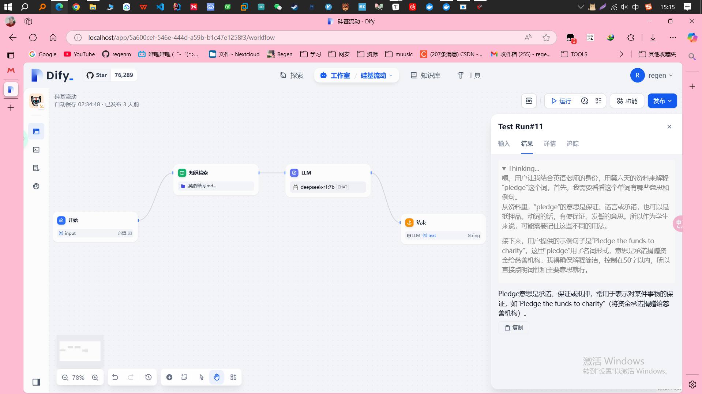
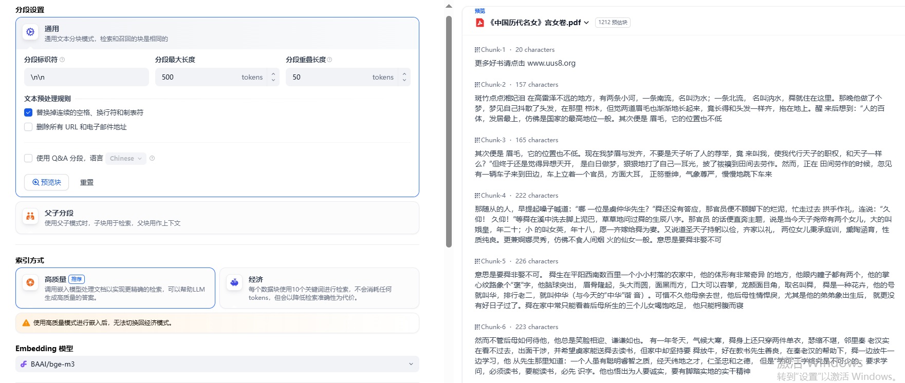

# 摘要	

​	最近一个星期看到了身边的牛人是如何使用AI大模型进行提高工作效率，以及实现新想法促进个人以及企业发展的高效性。于是搭建了一套可以客制化的本地的AI，基于以下方案（项目）。

1. Dify

    > ​	用工作流的方式组合各种模型、知识库、工具来搭建高度客制化的AI工具。

2. ollama + deepseek-r1:7b + bge-m3

    > ollama 帮助管理推理模型以及知识库模型，提供API接口给DIFY使用

3. ragflow

    > 基于检索增强生成（Retrieval-Augmented Generation, RAG）技术的工作流工具，旨在通过结合检索和生成模型提升问答系统、文本生成等任务的性能。

# ragflow和dify的不同应用

> 1. RAGFlow更适合需要深度文档解析和无幻觉生成的企业，尤其是处理复杂格式文档的场景。
> 2. Dify更适合需要灵活工作流编排和多模型集成的开发者，尤其是构建复杂AI应用的场景。
> 3. 如果企业需要高度定制化的文档解析和检索增强生成，建议选择RAGFlow；如果需要快速构建生产级AI应用，建议选择Dify。
>     

# 我的下一步AI应用计划

## 1. 学习dify的工作流原理

* 搭建一个简单的工作流并运行

## 2. 使用bge-m3搭建一个知识库模

## 型

1. 手头恰好有40g的电子书，在pdf格式里面随机选择了几册。

2. 先尝试硅基流动的bge-m3模型

3. 检索设置

    > # Rerank模型
    >
    > 在知识库检索中，Rerank是一个非常重要的环节，尤其在检索增强生成（RAG）架构中。它可以帮助大语言模型（LLM）获取更精确的内容，从而提高生成回答的准确性和相关性。
    >
    > Rerank的原理和机制：
    >
    > 1. 初步检索
    >
    >     在知识库检索的过程中，首先通过向量检索或其他检索方法，从知识库中检索出于用户问题相关的多个文档或文本片段。这些文档可能与用户问题的相关性不同，有些可能非常贴切，而有些知只是稍微相关，甚至不相关。
    >
    > 2. 重新排序、过滤和优化
    >
    >     Rerank模型 接收初步检索到的文档和列表和用户的问题作为输入。评估每个结果与用户问题的**相关性**，计算相关性分数。根据分数对文档进行重新排序，将最相关订单文档排在前面。并且，过滤掉不相关的文档，从而减少噪声。这样，当LLM生成回答时，会优先考虑排名靠前的、更加相关订单文档。最后，重新排序的文档作为上下文输入到LLM中，LLM根据这些**更精确**的上下文生成回答。
    >
    > # Top K
    >
    > Top K用于控制检索系统返回结果的数量。例如，如果配置为2，会返回最多两个结果。
    >
    > Top K通常与👇🏻的Score阈值配合使用。Score阈值用于过滤掉相似度低于某个阈值的结果，而Top K则在满足阈值条件的基础上，进一步筛选出来最相关的K个结果。
    >
    > - 更全面的结果，可以适当增加 **Top K** 的值。
    > - 更精准的结果，可以适当减小 **Top K** 的值，并结合较高的 **Score 阈值**。
    >
    > # Score 阈
    >
    > Score阈值作为一种标准选择检索结果。用于过滤掉相似度低于阈值的结果。

## 3. 使用dify搭建一个简单的客制化的AI应用（使用2的知识库）

已实现

## 4. 使用ragflow基于相同数据源搭建客制化AI应用

已实现

## 5. 使用工具例如搜索引擎实现联网

# 有关各种AI模型以及工具、概念的扫盲

> # RAG
>
> ​	RAG（Retrieval-Augmented Generation，检索增强生成） 是一种结合了信息检索技术与语言生成模型的人工智能技术。该技术通过从外部知识库中检索相关信息，并将其作为提示（Prompt）输入给大型语言模（LLMs），以增强模型处理知识密集型任务的能力，如问答、文本摘要、内容生成等。RAG模型由Facebook AI Research（FAIR）团队于2020年首次提出，并迅速成为大模型应用中的热门方案。
> 
>
