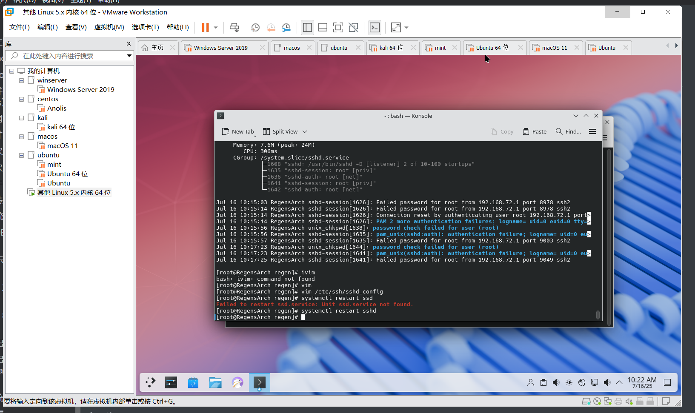

> 尝试使用大名鼎鼎的Arch，记录一下安装方法以便后续在实体机复现。
>
> 1. 安装Arch
> 2. 安装kde

# VMware 安装 Arch Linux 步骤

------

## 一、新建虚拟机

1. 打开 VMware，点击 **“Create a New Virtual Machine”**（新建虚拟机）
2. 选择：
    - **Installer disc image file (iso)**
    - 点击 **Browse**，选择下载好的 Arch Linux 镜像（例如 `archlinux-2025.07.01-x86_64.iso`）
3. 点击 **Next**
4. **Guest Operating System** 选择：
    - **Linux**
    - **Version** 选择：**Other Linux 5.x or later kernel 64-bit**
5. 点击 **Next**
6. 给虚拟机命名（例如：`ArchLinux`），并选择虚拟机存放位置（默认即可）
7. 点击 **Next**
8. 设置磁盘容量：
    - 20 GB 或更大
    - 选择 **Store virtual disk as a single file**（单文件，性能稍好）
9. 点击 **Next**
10. 点击 **Customize Hardware...**
    - 内存：建议 2048 MB（2GB）或更大
    - 处理器：2 个核心
    - 网络适配器：保持 NAT
    - 确认 **CD/DVD** 连接并挂载了 Arch ISO
    - USB、声卡按需启用
11. 点击 **Close**
12. 点击 **Finish**，完成虚拟机创建

------

## 二、启动虚拟机进入 Arch live 环境

1. 选中你创建的虚拟机，点击 **Power on this virtual machine**
2. 会进入 Arch Linux 的启动菜单，选第一个默认项直接回车（通常是 `Arch Linux install medium`）
3. 等待进入命令行界面，看到类似 `root@archiso ~#` 提示符即表示成功进入

------

## 三、设置网络

### 1. 检查网络连通性

1. 检查网络连通性（默认 NAT 应该能自动获取 IP）

```bash
ping -c 3 www.baidu.com
```

能通说明网络正常。

### 2. 换源加速下载

* 备份

```bash
cp /etc/pacman.d/mirrorlist /etc/pacman.d/mirrorlist.backup
```

* 编辑源

```bash
vim /etc/pacman.d/mirrorlist
```

世界各地镜像源连接https://archlinux.org/mirrorlist/

改为：

```bash
##
## Arch Linux repository mirrorlist
## Generated on 2025-07-17
##

## China
#Server = http://mirrors.163.com/archlinux/$repo/os/$arch
#Server = http://mirrors.aliyun.com/archlinux/$repo/os/$arch
#Server = https://mirrors.aliyun.com/archlinux/$repo/os/$arch
#Server = http://mirrors.bfsu.edu.cn/archlinux/$repo/os/$arch
#Server = https://mirrors.bfsu.edu.cn/archlinux/$repo/os/$arch
#Server = http://mirrors.cqu.edu.cn/archlinux/$repo/os/$arch
#Server = https://mirrors.cqu.edu.cn/archlinux/$repo/os/$arch
#Server = http://mirrors.hit.edu.cn/archlinux/$repo/os/$arch
#Server = https://mirrors.hit.edu.cn/archlinux/$repo/os/$arch
#Server = http://mirrors.hust.edu.cn/archlinux/$repo/os/$arch
#Server = https://mirrors.hust.edu.cn/archlinux/$repo/os/$arch
#Server = http://mirrors.jcut.edu.cn/archlinux/$repo/os/$arch
#Server = https://mirrors.jcut.edu.cn/archlinux/$repo/os/$arch
#Server = http://mirrors.jlu.edu.cn/archlinux/$repo/os/$arch
#Server = https://mirrors.jlu.edu.cn/archlinux/$repo/os/$arch
#Server = http://mirrors.jxust.edu.cn/archlinux/$repo/os/$arch
#Server = https://mirrors.jxust.edu.cn/archlinux/$repo/os/$arch
#Server = http://mirror.lzu.edu.cn/archlinux/$repo/os/$arch
#Server = http://mirrors.neusoft.edu.cn/archlinux/$repo/os/$arch
#Server = https://mirrors.neusoft.edu.cn/archlinux/$repo/os/$arch
#Server = http://mirrors.nju.edu.cn/archlinux/$repo/os/$arch
#Server = https://mirrors.nju.edu.cn/archlinux/$repo/os/$arch
#Server = http://mirror.nyist.edu.cn/archlinux/$repo/os/$arch
#Server = https://mirror.nyist.edu.cn/archlinux/$repo/os/$arch
#Server = https://mirrors.qlu.edu.cn/archlinux/$repo/os/$arch
#Server = http://mirrors.shanghaitech.edu.cn/archlinux/$repo/os/$arch
#Server = https://mirrors.shanghaitech.edu.cn/archlinux/$repo/os/$arch
#Server = https://mirrors.sjtug.sjtu.edu.cn/archlinux/$repo/os/$arch
#Server = http://mirrors.tuna.tsinghua.edu.cn/archlinux/$repo/os/$arch
#Server = https://mirrors.tuna.tsinghua.edu.cn/archlinux/$repo/os/$arch
#Server = http://mirrors.ustc.edu.cn/archlinux/$repo/os/$arch
#Server = https://mirrors.ustc.edu.cn/archlinux/$repo/os/$arch
#Server = http://mirrors.wsyu.edu.cn/archlinux/$repo/os/$arch
#Server = https://mirrors.wsyu.edu.cn/archlinux/$repo/os/$arch
#Server = https://mirrors.xjtu.edu.cn/archlinux/$repo/os/$arch
#Server = http://mirrors.zju.edu.cn/archlinux/$repo/os/$arch
```

* 选择自己想要的源
* 或者全选

使用vim可以快速删除第一列

```bash
:%normal! 0x
```


------

## 四、校准时间

```bash
timedatectl set-ntp true
```

保证系统时间同步，避免后续安装出错。

------

## 五、磁盘分区

> 这里图方便只分了两个分区。

1. 查看磁盘名称（VMware 默认一般是 `/dev/sda`）

```bash
lsblk
```

一般会看到 `/dev/sda`，以及没有分区的情况。

1. 运行分区工具：

```bash
cfdisk /dev/sda
```

1. 在 cfdisk 界面操作：

    - 如果提示创建 GPT，选择 **gpt**

    - 创建新分区：

        | 分区      | 大小     | 类型             |
        | --------- | -------- | ---------------- |
        | /dev/sda1 | 512M     | EFI System       |
        | /dev/sda2 | 剩余空间 | Linux filesystem |

2. 写入分区表，选择 **Write**，输入 `yes` 确认

3. 选择 **Quit** 退出 cfdisk

------

## 六、格式化分区

```bash
mkfs.fat -F32 /dev/sda1    # 格式化EFI分区
mkfs.ext4 /dev/sda2        # 格式化根分区
```

------

## 七、挂载分区

```bash
mount /dev/sda2 /mnt
mkdir /mnt/boot
mount /dev/sda1 /mnt/boot
```

------

## 八、安装基础系统

```bash
pacstrap /mnt base linux linux-firmware vim networkmanager
```

这个过程需要联网，会自动下载基本包。

------

## 九、生成 fstab 文件

```bash
genfstab -U /mnt >> /mnt/etc/fstab
cat /mnt/etc/fstab  # 可查看确认
```

------

## 十、切换根环境

```bash
arch-chroot /mnt
```

------

## 十一、设置时区

```bash
ln -sf /usr/share/zoneinfo/Asia/Shanghai /etc/localtime
hwclock --systohc
```

------

## 十二、设置本地化

1. 编辑 `locale.gen`，取消以下两行前的注释：

```bash
vim /etc/locale.gen
# 找到：
en_US.UTF-8 UTF-8
zh_CN.UTF-8 UTF-8
# 删除行首的#
```

1. 生成本地化文件

```bash
locale-gen
```

1. 设置语言环境

```bash
echo "LANG=en_US.UTF-8" > /etc/locale.conf
```

------

## 十三、设置主机名

```bash
echo "archvm" > /etc/hostname
```

------

## 十四、配置 hosts 文件

编辑 `/etc/hosts` 文件，加入：

```bash
127.0.0.1   localhost
::1         localhost
127.0.1.1   archvm.localdomain archvm
```

------

## 十五、设置 root 密码

```bash
passwd
```

输入两次新密码。

------

## 十六、安装并配置引导加载器（EFI 系统）

```bash
pacman -S grub efibootmgr
grub-install --target=x86_64-efi --efi-directory=/boot --bootloader-id=GRUB
grub-mkconfig -o /boot/grub/grub.cfg
```

------

## 十七、启用网络服务

```bash
systemctl enable NetworkManager
```

------

## 十八、退出并重启

1. 退出 chroot 环境

```bash
exit
```

1. 卸载挂载分区

```bash
umount -R /mnt
```

1. 重启

```bash
reboot
```

* 可能需要一处iso

------

## 十九、第一次启动 Arch 系统

- 登录 root 用户，输入密码

------

## 二十、第一次启动 Arch 系统

- 新建普通用户：

```bash
useradd -m -G wheel -s /bin/bash yourname
passwd regen
```

- 编辑 sudo 权限（安装 sudo）：

```bash
pacman -S sudo
EDITOR=vim visudo
# 取消 %wheel ALL=(ALL) ALL 前的注释
```

- 安装桌面环境 (GNOME / KDE / XFCE)，根据需求后续配置

## 二十一、允许root使用ssh

```bash
sudo vim /etc/ssh/sshd_config
```

找到`#PermitRootLogin prohibit-password`

改为

```
PermitRootLogin yes
```

最后

```bash
systemctl restart sshd
```


## 二十二、安装桌面环境-KDE

> 记得创建一个普通用户，都则安装好了桌面环境后无法登陆！

### 1. 更新系统（建议先做）

```
sudo pacman -Syu
```

------

### 2. 安装 KDE Plasma 和相关组件

```
sudo pacman -S plasma kde-applications
```

- `plasma`：KDE 桌面核心包
- `kde-applications`：KDE 官方常用软件套件（文件管理器、文本编辑器、多媒体工具等）

如果想轻量点，可以只装 `plasma`，后续再装需要的软件。

------

### 3. 安装显示服务器及登录管理器

#### 3.1 安装 Xorg 显示服务器

```
sudo pacman -S xorg
```

#### 3.2 安装 SDDM 登录管理器

```
sudo pacman -S sddm
```

------

### 4. 启用并启动 SDDM 服务

```
sudo systemctl enable sddm.service --now
```

------

### 5. 启用并启动 NetworkManager（如果没启用）

```
sudo systemctl enable NetworkManager.service --now
```

------

### 6. 重启系统

```
sudo reboot
```

------

### 7. 登录界面

重启后，你应该能看到 KDE 的 SDDM 登录界面。输入用户名和密码登录进入 KDE 桌面。


