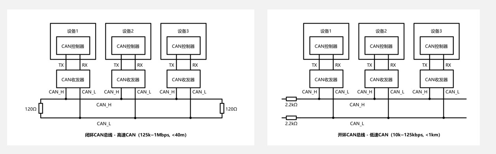
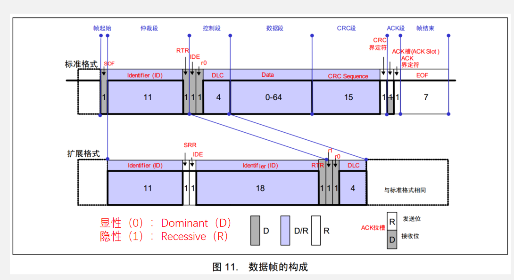

# **CAN总线**

> CAN（Controller Area Network）总线是一种串行通信协议，用于在汽车、工业自动化设备和物联网等嵌入式系统中实现设备之间的可靠数据传输。

## 主要特点

**多主架构**：CAN总线采用多主通信方式，任何节点（即连接在总线上的设备）都可以在总线空闲时发起通信。这种设计提高了系统的灵活性和可靠性。

**差分信号传输**：CAN总线使用差分信号传输数据，即CAN_H和CAN_L两根信号线之间的电压差用来表示逻辑状态。这种方式能有效地降低电磁干扰的影响，适合在工业环境中使用。

**优先级机制**：CAN协议内置消息优先级，通过标识符的方式决定通信优先级，当两个或多个节点同时发送消息时，优先级高的节点可以继续发送，而优先级低的节点会自动延迟发送。这种机制保障了紧急消息能够优先传输。

**高可靠性与数据完整性**：CAN协议内置多种错误检测和纠正机制，如CRC校验、帧检测和ACK确认机制。通过这些机制，CAN总线能够及时检测和纠正数据传输过程中的错误，确保数据的准确性和可靠性。

# 硬件特性

## 结构

1. 每个设备通过CAN收发器挂载在CAN总线网络上
2. 高速CAN使用闭环网络，CAN_H和CAN_L两端添加120Ω的终端电阻
3. 低速CAN使用开环网络，CAN_H和CAN_L其中一端添加2.2kΩ的终端电阻

## 电平标准

**CAN总线采用差分信号，**即两线电压差（VCAN_H-VCAN_L）传输数据位

**高速CAN规定：**	

	1. 电压差为0V时表示逻辑1（隐性电平）	
	1. 电压差为2V时表示逻辑0（显性电平）

**低速CAN规定：**	

1. 电压差为-1.5V时表示逻辑1（隐性电平）	
2. 电压差为3V时表示逻辑0（显性电

# CAN总线帧格式

| **帧类型** | **用途**                               |
| ---------- | -------------------------------------- |
| 数据帧     | 发送设备主动发送数据（广播式）         |
| 遥控帧     | 接收设备主动请求数据（请求式）         |
| 错误帧     | 某个设备检测出错误时向其他设备通知错误 |
| 过载帧     | 接收设备通知其尚未做好接收准备         |
| 帧间隔     | 用于将数据帧及遥控帧与前面的帧分离开   |

> # **数据帧各部分用途简介**
>
> 1. SOF（Start of Frame）：帧起始，表示后面一段波形为传输的数据位
> 2. ID（Identify）：标识符，区分功能，同时决定优先级
> 3. RTR（Remote Transmission Request ）：远程请求位，区分数据帧和遥控帧
> 4. IDE（Identifier Extension）：扩展标志位，区分标准格式和扩展格式
> 5. SRR（Substitute Remote Request）：替代RTR，协议升级时留下的无意义位
> 6. r0/r1（Reserve）：保留位，为后续协议升级留下空间DLC（Data Length Code）：数据长度，指示数据段有几个字节
> 7. Data：数据段的1~8个字节有效数据
> 8. CRC（Cyclic Redundancy Check）：循环冗余校验，校验数据是否正确
> 9. ACK（Acknowledgement）：应答位，判断数据有没有被接收方接收
> 10. CRC/ACK界定符：为应答位前后发送方和接收方释放总线留下时间
> 11. EOF（End of Frame ）：帧结束，表示数据位已经传输完毕
