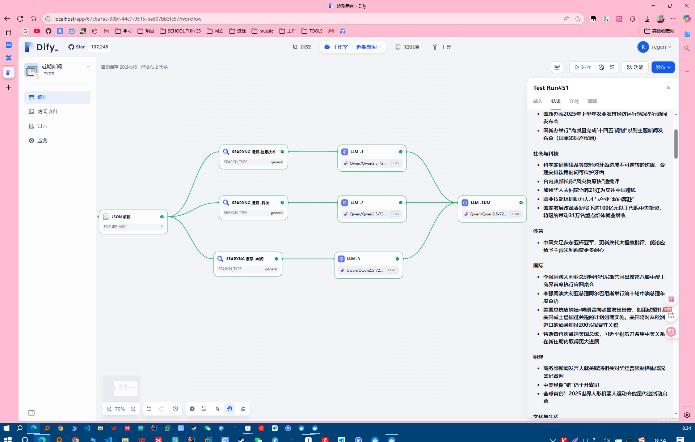

# DIFY 新闻助手

> 老是被说跟不上互联网的各种信息节奏，被说落后、村里没通网之类的。现在利用这个简单的工具快速地了解世界在发生什么。**世界不是由孤立的东西或孤立的过程构成的，而是由事物的联系和相互作用构成的**。不能一心只读圣贤书。

整体思路就是：模型+搜索引擎+时间API

# 效果

---

> ### 新闻摘要
>
> #### 国内外要闻
>
> - **乌议会批准延长国家战时状态至11月5日**
> - **巴卫生部门称以军袭击加沙多地致70人死亡**
> - **第十一批国家组织药品集中带量采购工作启动**
> - **2025年黄河调水调沙流量全部入海**
>
> #### 政策与会议
>
> - **国新办就2025年上半年工业和信息化发展情况举行新闻发布会**
> - **国新办举行“高质量完成'十四五'规划”系列主题新闻发布会（商务部）**
> - **国新办就2025年上半年农业农村经济运行情况举行新闻发布会**
> - **国新办举行“高质量完成'十四五'规划”系列主题新闻发布会（国家知识产权局）**
>
> #### 社会与科技
>
> - **科学家证明果茶等饮料对牙齿造成不可逆转的伤害，合理安排饮用时间可保护牙齿**
> - **台内政部长称“风灾复原快”遭批评**
> - **加州华人夫妇豪宅养21娃为卖往中国赚钱**
> - **职业技能培训助力人才与产业“双向奔赴”**
> - **国家发展改革委新增下达100亿元以工代赈中央投资，将吸纳带动31万名重点群体就业增收**
>
> #### 体育
>
> - **中国女足获东亚杯亚军，更新换代太慢惹批评，舆论应给予主帅米利西奇更多耐心**
>
> #### 国际
>
> - **李强同澳大利亚总理阿尔巴尼斯共同出席第八届中澳工商界首席执行官圆桌会**
> - **李强同澳大利亚总理阿尔巴尼斯举行第十轮中澳总理年度会晤**
> - **美国总统唐纳德·特朗普向欧盟发出警告，如果欧盟针对美国威士忌加征关税的计划如期实施，美国将对从欧洲进口的酒类加征200%报复性关税**
> - **特朗普再次当选美国总统，习近平祝贺并希望中美关系在新任期内取得更大进展**
>
> #### 财经
>
> - **商务部新闻发言人就美取消相关对华经贸限制措施情况答记者问**
> - **中美经贸“链”仍十分密切**
> - **全球首创！2025世界人形机器人运动会能量传递活动启幕**
>
> #### 文化与生活
>
> - **各地高校持续实施"宏志助航计划" 精准帮扶毕业生顺利就业**
> - **信息化时代，课堂教学还需要板书吗？**
>
> #### 彩票
>
> - **2025080双色球开奖号码：03 07 08 10 16 19 + 05**
> - **2025079双色球开奖号码：08 11 14 15 30 32 + 05**
>
> #### 外交
>
> - **习近平祝贺特朗普再次当选美国总统，指出希望中美关系在美国总统新任期有一个好的开始**
> - **习近平向多哥新任领导人致贺电**
>
> #### 环境与气象
>
> - **中国气象报社 版权所有**
> - **为党和国家事业发展凝聚...进2025/07/01**
>
> #### 其他
>
> - **商务部新闻发言人就加拿大政府关闭海康威视在加业务事答记者问**
> - **7月16日出版的第14期《求是》杂志发表习近平总书记重要文章 《坚定不移推进高水平对外开放》**
>
> ------
>
> ### 科技新闻摘要
>
> #### 1. 我国科学家在世界上首次绘制脑科学图谱
>
> - **时间**：5天前
> - **内容**：我国科学家在世界上首次绘制了大脑图谱，大脑由约860亿个神经元和数万亿个神经连接组成，是人体最为复杂和精密的器官，负责调控神经系统。
>
> #### 2. 地球系统科学的发展过程与全球变化国际大科学计划
>
> - **作者**：符淙斌
> - **内容**：地球系统科学是当今世界最具挑战性的前沿科学领域之一。文章总结分析了近半个世纪以来，国际科学理事会（ICSU）在地球系统科学领域的发展和国际大科学计划。
>
> #### 3. 世界化学工程大会暨第21届亚太化工联盟大会在中国召开
>
> - **时间**：2025年7月14-18日
> - **地点**：中国
> - **内容**：这是全球化工领域历史悠久、学术领先的盛会，首次在中国召开。
>
> #### 4. 羅佩凌博士的跨领域研究
>
> - **人物**：羅佩凌博士
> - **背景**：物理背景出身，现研究跨足化学与光电，致力于通过基础物理化学研究探索大气科学的关键议题，展现了难得的跨领域深度与广度。
>
> #### 5. 云南出土30万年前的木质工具
>
> - **时间**：2025年7月9日
> - **地点**：云南
> - **内容**：出土的30万年前木质工具保存完好，为古人类研究提供了重要线索。
>
> #### 6. 双色球开奖号码
>
> - **日期**：2025年7月10日
> - **内容**：红球：06, 08, 16, 22, 29, 32；蓝球：16；开奖号：03 07 08 10 16 19 + 05。
>
> #### 7. 马斯克发布AI女友
>
> - **时间**：2025年7月10日
> - **内容**：马斯克发布了一款AI女友应用，刚上线就因内容“少儿不宜”引发争议。
>
> #### 8. 京东向骑手卖电动自行车
>
> - **时间**：2025年7月10日
> - **内容**：京东推出电动自行车销售计划，骑手在90天内跑够3000单可全额返款。
>
> #### 9. 华为8.8英寸小平板本季度发布
>
> - **时间**：2025年7月10日
> - **内容**：华为计划在本季度发布一款8.8英寸的小平板。
>
> #### 10. 云南出土30万年前的木质工具
>
> - **时间**：2025年7月9日
> - **地点**：云南
> - **内容**：出土的30万年前木质工具保存完好，为古人类研究提供了重要线索。
>
> #### 11. AI通过心理实验
>
> - **时间**：2025年7月9日
> - **内容**：AI通过了心理实验，展示了人类的逻辑思维能力。
>
> #### 12. 成人大脑暗藏“神经元再生”能力
>
> - **时间**：2025年7月8日
> - **内容**：科学研究发现，成人大脑中可能存在神经元再生的能力。
>
> #### 13. 熬夜导致饮食变化
>
> - **时间**：2025年7月7日
> - **内容**：研究发现，熬夜可能导致饮食习惯改变，增加食欲。
>
> #### 14. 5万吨甲醇双燃料油船首制船在广州南沙命名
>
> - **时间**：2025年7月15日
> - **地点**：广州南沙
> - **内容**：首制船命名，标志着中国在新能源船舶领域的又一突破。
>
> #### 15. 2025年全国科技工作者日活动安排
>
> - **时间**：2025年5月26日
> - **内容**：中国科协宣传文化部部长谭华霖介绍了2025年全国科技工作者日的整体工作安排，聚焦弘扬科学家精神等核心内容。
>
> #### 16. 四川成都世运会火炬传递活动
>
> - **时间**：2025年7月26日
> - **地点**：四川成都
> - **内容**：火炬传递活动标志着世界运动会历史上首次进行火炬传递，设计上融合了古蜀文明与现代科技。
>
> #### 17. 比特币市场控制权转移
>
> - **时间**：2周前
> - **内容**：比特币市场正在经历一场无声的控制权转移，重塑2.1万亿美元的市场格局。
>
> #### 18. 理论攻坚推动基础研究高质量发展
>
> - **时间**：近期
> - **人物**：周善贵
> - **内容**：周善贵在理论研究方面取得突破，推动了基础研究的高质量发展。
>
> #### 19. 《科学世界》杂志创刊400期
>
> - **时间**：2025年
> - **内容**：《科学世界》杂志迎来创刊400期，读者纷纷送上祝福和分享结缘故事。
>
> #### 20. 量子材料导电状态切换技术
>
> - **时间**：2025年7月2日
> - **内容**：科学家开发出“热淬火”技术，能够切换量子材料的导电状态。
>
> ------
>
> # 2025年7月信息技术新闻总结
>
> ## 科技动态
>
> ### 1. 科技曝光
>
> - 双脉冲发动机曾被美国反向助攻
>
>     科技媒体曝光，美国曾对双脉冲发动机技术提供反向支持。
>
>     - *来源*：Daily
>     - *时间*：2025-07-07 10:05:24
>
> ### 2. 政府采购
>
> - 2025政府采购塑料管道十大品牌等榜单在京发布
>
>     北京发布了2025年政府采购塑料管道十大品牌榜单。
>
>     - *来源*：Daily
>     - *时间*：2025-07-07 10:04:30
>
> ### 3. 科技资讯AI速递
>
> - 昨夜今晨科技热点一览
>
>     汇总了昨夜今晨的科技热点新闻。
>
>     - *来源*：新浪AI
>     - *时间*：2025-07-17 06:34
>
> ### 4. SpaceX与xAI
>
> - **SpaceX被曝拟出售内部股份，估值或达4000亿美元**
>     SpaceX计划出售内部股份，估值可能达到4000亿美元。
>     - *来源*：全球科技早参
>     - *时间*：2025-07-08 07:54:30
> - **SpaceX承诺向xAI注资20亿美元**
>     SpaceX向Elon Musk的AI公司xAI注资20亿美元。
>     - *来源*：华尔街日报
>     - *时间*：2025-07-13
>
> ### 5. 苹果AI“失血”
>
> - 华人科学家被扎克伯格挖走
>
>     苹果AI团队的一位华人科学家被扎克伯格以数千万美元年薪挖走。
>
>     - *来源*：全球科技早参
>     - *时间*：2025-07-08
>
> ### 6. 中国-中亚合作
>
> - 国家主席习近平同中亚五国元首见证合作揭牌
>
>     习近平主席同中亚五国元首见证中国-中亚合作中心和贸易畅通合作平台揭牌。
>
>     - *来源*：新华社
>     - *时间*：2025-07-11
>
> ### 7. 北京市加快人工智能赋能科学研究
>
> - 《北京市加快人工智能赋能科学研究高质量发展行动计划（2025—2027年）》发布
>
>     北京市发布未来三年发展科学智能的行动计划。
>
>     - *来源*：北京市政府
>     - *时间*：2025-07-11
>
> ## 产业新闻
>
> ### 1. 2025世界人工智能大会
>
> - 2025世界人工智能大会暨人工智能全球治理高级别会议新闻发布会
>
>     上海市政府召开新闻发布会，介绍2025世界人工智能大会的相关情况。
>
>     - *来源*：上海市政府
>     - *时间*：2025-07-10
>
> ### 2. 2025年大阪世博会
>
> - “中国馆杭州日”系列活动举行
>
>     杭州在大阪世博会中国馆举办“科技+文化”系列活动。
>
>     - *来源*：杭州政府
>     - *时间*：2025-07-13
>
> ### 3. 中国信通院发布综合算力评价报告
>
> - 《综合算力评价研究报告（2024年）》发布
>
>     中国信通院发布《综合算力评价研究报告（2024年）》，系统分析了我国各省级行政区的综合算力。
>
>     - *来源*：中国信通院
>     - *时间*：2025-01-02
>
> ### 4. 芯片与未来产业
>
> - 芯片的性能指标、创新能力与迭代方向引发全球关注
>
>     随着未来产业的发展，芯片技术成为全球科技创新和产业发展的热点。
>
>     - *来源*：科技媒体
>     - *时间*：2025-07-16
>
> ### 5. 电池技术
>
> - 特斯拉推出由xAI开发的人工智能助手Grok
>
>     特斯拉向符合条件的车辆推送由xAI开发的人工智能助手Grok。
>
>     - *来源*：特斯拉
>     - *时间*：2025-07-13
>
> ## 其他新闻
>
> ### 1. 牙齿健康
>
> - 科学家证明果茶等饮料对牙齿造成不可逆转的伤害
>
>     研究发现，合理安排饮用时间可以更好地保护牙齿。
>
>     - *来源*：科学杂志
>     - *时间*：2025-07-16
>
> ### 2. 脑机接口
>
> - 脑机接口技术快速腾飞
>
>     脑机接口技术正在逐步实现科幻片《黑客帝国》中的奇思妙想。
>
>     - *来源*：科技媒体
>     - *时间*：2025-07-16
>
> ### 3. 新冠疫情
>
> - 国新办就2025年上半年工业和信息化发展情况举行新闻发布会
>
>     国新办召开新闻发布会，介绍2025年上半年工业和信息化发展情况。
>
>     - *来源*：国新办
>     - *时间*：2025-07-18
>
> ### 4. 特朗普关税政策
>
> - 特朗普宣布对14国关税税率，拟将"对等关税"暂缓期延至8月1日
>
>     特朗普宣布对14国的关税税率，并将“对等关税”暂缓期延长至8月1日。
>
>     - *来源*：每经早参
>     - *时间*：2025-07-08
>
> ### 5. 金融新闻
>
> - 央行连续8个月增持黄金
>
>     中国人民银行连续8个月增持黄金。
>
>     - *来源*：每经早参
>     - *时间*：2025-07-08
>
> ### 6. 教育新闻
>
> - **阿里巴巴高德地图推出国内首个面向海外用户的多语言地图**
>     阿里巴巴高德地图推出多语言地图，面向海外用户。
>     - *来源*：阿里巴巴
>     - *时间*：2025-07-10
> - **上海交大联合阿里公益完成第16期乡村教师培训**
>     上海交通大学联合阿里公益完成第16期乡村教师培训。
>     - *来源*：上海交大
>     - *时间*：2025-07-10
>
> ### 7. 环保新闻
>
> - 中山加快打造新时代现代产业集群“十大舰队”
>
>     中山市加快构建“4+6”现代产业集群发展格局，集中优势资源力量培育壮大新能源、生物医药与健康、新一代信息技术、高端装备等产业。
>
>     - *来源*：中山市政府
>     - *时间*：2025-06-30
>
> ### 8. 互联网新闻
>
> - Meta收购Play AI
>
>     Meta收购了专注于利用人工智能生成逼真语音的初创公司Play AI。
>
>     - *来源*：彭博社
>     - *时间*：2025-07-13
>
> ### 9. 汽车新闻
>
> - 蔚来、小鹏背水一战
>
>     蔚来和小鹏在2025年面临严峻挑战，需在市场中突围。
>
>     - *来源*：汽车媒体
>     - *时间*：2025-03-25
>
> ### 10. 科研新闻
>
> - “发现自旋超固态巨磁卡效应与极低温制冷新机制”入选2024年度“中国科学十大进展”
>
>     该研究入选2024年度“中国科学十大进展”。
>
>     - *来源*：中国科学院
>     - *时间*：2025-03-20
>
> 以上是2025年7月信息技术新闻的总结。希望对您有所帮助！
