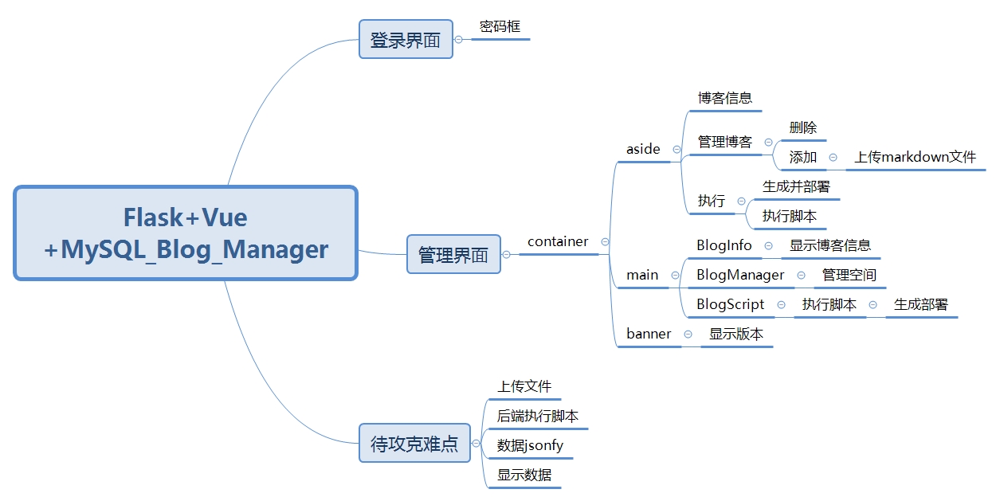
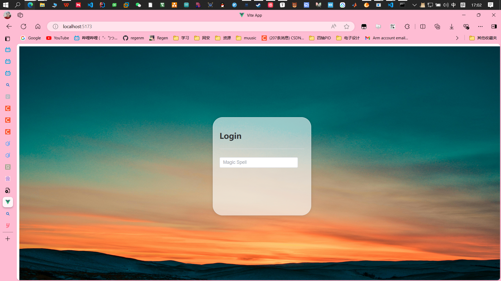
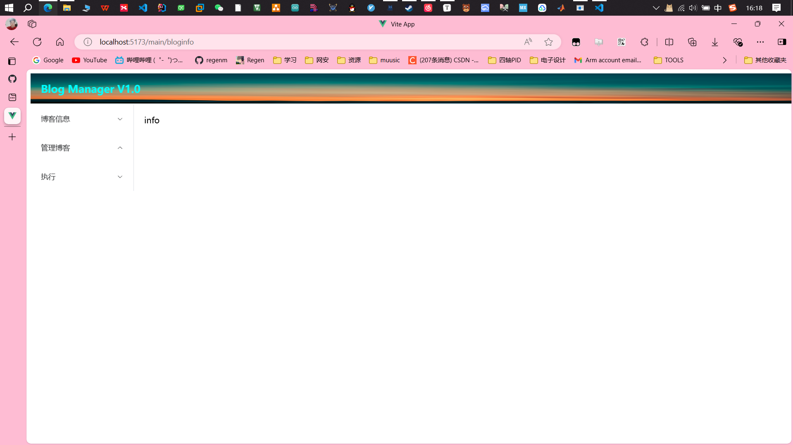
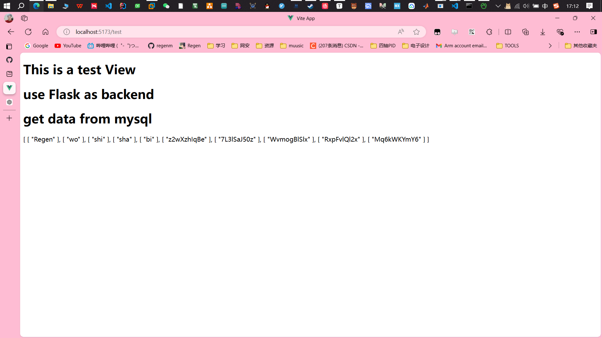
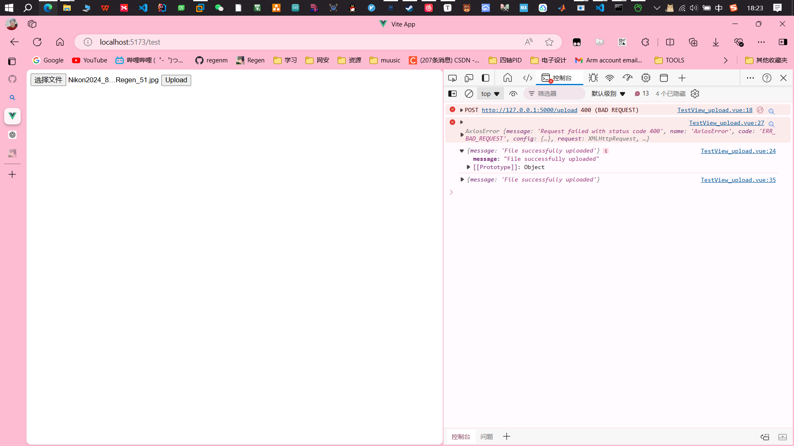
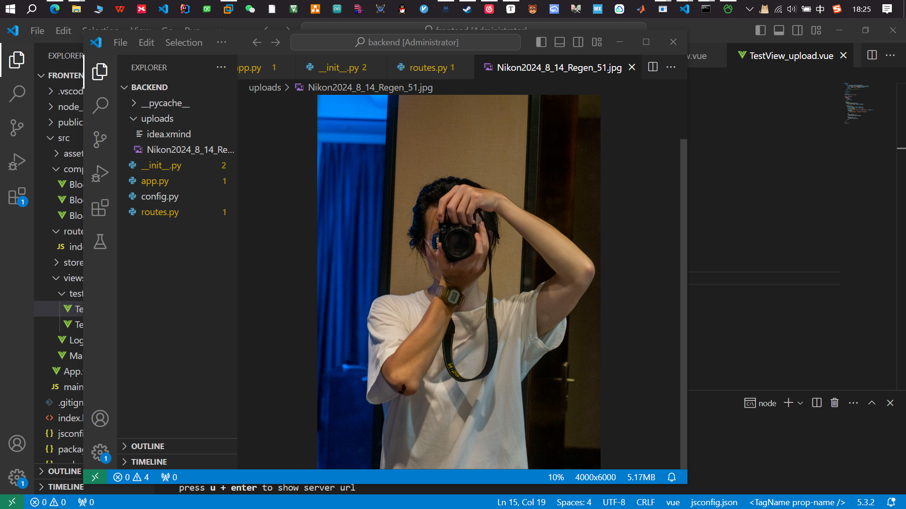
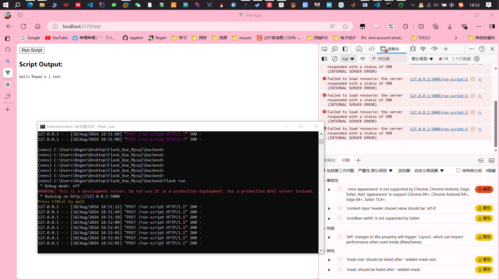

# 项目简介

## 项目内容简介

 1. 搭建一个博客管理平台。

 2. 部署到我的服务器。以便将来我不再需要在本地进行一系列操作例如：

    ```bash
    git pull 
    git push 
    hexo new " pages" 
    hexo generate 
    hexo s 
    hexo deploy
    ```

    同时还有博客文件备份的作用，预防电脑出事后的一系列恢复操作。

 2. 以及一些数据查询操作。

 3. 登录界面

 4. 管理界面

## 技术简介

[SpringBoot+vue+mysql项目实训](https://regenm.github.io/2024/07/03/SpringBoot-vue-mysql项目实训/)结束后想试试别的web框架，发现有个轻量级的框架`Flask+Vue+SQLite`，我这里没安装SQLlite，于是使用**MySQL**进行替代。

* **MySQL和SQLite的区别**

> **类型**:
>
> - **MySQL**: 是一个**完整的客户端/服务器**数据库管理系统，支持多用户访问，适用于大型和中型应用程序，具有高性能和可扩展性。
> - **SQLite**: 是一个**轻量级的嵌入式**数据库引擎，它不需要一个独立的服务器进程或配置，可以直接访问普通的数据库文件。
>
> **部署和配置**:
>
> - **MySQL**: 需要独立的服务器进程，可以在不同的操作系统上安装，需要配置和管理。
> - **SQLite**: 作为库直接链接到应用程序，不需要配置服务器，部署非常简单，适合于轻量级的应用和嵌入式系统。
>
> **性能和适用场景**:
>
> - **MySQL**: 由于其客户端/服务器架构，适合需要处理大量数据和复杂查询的应用，具有较高的性能和并发处理能力。
> - **SQLite**: 适合单用户或少量用户的本地应用，处理小型数据集和简单查询，性能通常比MySQL略低，但足够满足轻量级应用的需求。
>
> **特性和功能**:
>
> - **MySQL**: 支持丰富的功能集，包括存储过程、触发器、复制和高级安全特性等，适合于复杂的数据处理需求。
> - **SQLite**: 功能相对简单，不支持存储过程和触发器，但支持主键、索引和事务处理，满足基本的数据管理需求。

* **python虚拟环境**

> Python 虚拟环境（virtual environment）是一个独立的、隔离的 Python 运行环境。它允许你在同一个系统上运行多个项目，而这些项目可以依赖于不同的包版本或不同的 Python 解释器版本。虚拟环境可以避免包版本冲突，并且提供一个干净的环境来开发和部署 Python 应用程序。

* **Flask**

> ### Flask 简介
>
> Flask 是一个轻量级的 Python Web 框架，通常用于构建 web 应用程序。它是基于 WSGI（Web Server Gateway Interface）协议的，并且是微框架的一种，这意味着它提供了核心功能并且保持简洁，但允许开发者根据需要添加扩展或库来实现更复杂的功能。
>
> ### Flask 的特点
>
> 1. **轻量级**：Flask 被设计为一个微框架，提供最小的基础架构。它不包含 ORM（对象关系映射）或表单验证等功能，但允许开发者根据需要选择添加第三方扩展。
> 2. **灵活性**：由于 Flask 是轻量级的，它提供了高度的灵活性。开发者可以根据项目需求进行配置，而不是被框架限制。
> 3. **易于使用**：Flask 具有简单的学习曲线，非常适合快速开发原型。它的 API 设计非常直观，且有丰富的文档支持。
> 4. **扩展性**：尽管 Flask 本身是一个微框架，但它有一个强大的扩展生态系统，允许你添加数据库集成、表单处理、用户认证等功能。
>
> ### 使用场景
>
> - **小型 Web 应用程序**：由于其轻量级特性，Flask 非常适合构建小型和中型的 Web 应用程序。
> - **API 开发**：Flask 被广泛用于开发 RESTful API 服务。
> - **快速原型设计**：Flask 的简洁和灵活性使其非常适合快速开发应用程序原型。

> ### WSGI 简介
>
> **WSGI**（Web Server Gateway Interface）是Python中一个用于Web应用程序和Web服务器之间的标准接口。它的全称是 **Web Server Gateway Interface**，这个标准定义了Web服务器如何与Web应用程序进行通信，并如何处理Web请求。
>
> ### WSGI 的作用
>
> 1. **标准化接口**：WSGI 是一个规范，它定义了Python Web应用程序与Web服务器之间的接口。这意味着无论你使用什么样的Web服务器（如 Gunicorn、uWSGI）或Web框架（如 Flask、Django），只要它们遵循WSGI规范，它们就可以互相配合工作。
> 2. **应用和服务器的分离**：WSGI 将Web应用程序与Web服务器分离，允许开发者选择不同的服务器和框架。这种灵活性意味着你可以轻松切换服务器或升级应用程序而不影响另一方。
>
> ### WSGI 的工作原理
>
> WSGI 的工作流程如下：
>
> 1. **请求传递**：当Web服务器接收到HTTP请求时，它会通过WSGI将请求信息传递给Python的Web应用程序。请求的信息通常包括环境变量（如请求的URL、HTTP方法等）和请求体。
> 2. **响应生成**：Web应用程序处理请求并生成一个响应。这个响应通常包括状态码、响应头和响应体。
> 3. **响应返回**：Web应用程序将响应返回给Web服务器，Web服务器随后将响应传递给客户端（如浏览器）。

# 项目分析

## 需求分析

1. 登录界面
    1. 一个密码框
2. 管理界面
    1. 可视化显示数据
    2. 执行命令
    3. 执行脚本


### 思维导图




# 前端设计

### 登录界面



### 管理界面



# 难点解决( 测试阶段)

## 1. 获取MySQL数据

* **获取流程**

    1. 前端发送get请求

        ```vue
        <script>
          import axios from 'axios';
          
          export default {
            data() {
              return {
                data: null,
              };
            },
            mounted() {
              axios.get('http://127.0.0.1:5000/api/data')
                .then(response => {
                  this.data = response.data;
                })
                .catch(error => {
                  console.error(error);
                });
            },
          };
          </script>
        ```

        

    2. 后端响应请求，执行sql语句，返回结果

    ```python
    CORS(app, origins=['http://localhost:5173']) # 允许前端的请求
    
    @app.route('/api/data', methods=['GET'])     # get方式 返回测试数据
    def get_data():
        cur = mysql.connection.cursor()
        cur.execute('SELECT * FROM test_data')
        results = cur.fetchall()
        cur.close()
        return jsonify(results)
    
    if __name__ == '__main__':
        app.run(debug=True)
    ```

    3. 前端显示结果

        ```vue
        <template>
          
          <h1> This is a test View</h1>
          <h1> use Flask as backend</h1>
          <h1> get data from mysql</h1>
            <div v-if="data">
              <!-- 使用数据 -->
              {{ data }}
            </div>
            <div v-else>
              Loading...
            </div>
        
        </template>
        ```

    4. 结果：

    

## 2. 前端 文件上传

* 上传之前检查依赖：

```bash
pip install Werkzeug
```


* 文件上传流程

    1. 前端选择本地文件，点击上传，发送post请求

        ```vue
        <template>
            <div>
              <form @submit.prevent="uploadFile">
                <input type="file" @change="handleFileUpload">
                <button type="submit">Upload</button>
              </form>
              <!-- 文件上传按钮以及选框 -->
            </div>
          
          </template>
          
          <script>
          import axios from 'axios';
          
          export default {
            data() {
              return {
                file: null
              };
            },
            methods: {
              handleFileUpload(event) {
                this.file = event.target.files[0];
              },
              uploadFile() {
                const formData = new FormData();
                formData.append('file', this.file);
                //向后端发送POST
                axios.post('http://127.0.0.1:5000/upload', formData, {
                  headers: {
                    'Content-Type': 'multipart/form-data'
                  }
                })
                .then(response => {
                  console.log(response.data);
                })
                .catch(error => {
                  console.error(error);
                });
              }
            }
          };
          </script>
          
        ```

        

    2. 后端响应请求，保存到特定文件夹

        ```python
        UPLOAD_FOLDER = 'uploads'
        app.config['UPLOAD_FOLDER'] = UPLOAD_FOLDER
        
        
        @app.route('/upload', methods=['POST'])
        def upload_file():
            # 检查请求中是否包含文件
            if 'file' not in request.files:
                return jsonify({'error': 'No file part'}), 400
            
            file = request.files['file']
            
            # 检查文件是否有名字
            if file.filename == '':
                return jsonify({'error': 'No selected file'}), 400
            
            # 保存文件
            filename = file.filename
            file.save(os.path.join(app.config['UPLOAD_FOLDER'], filename))
            return jsonify({'message': 'File successfully uploaded'}), 200
        ```

    3. 结果

    注：修改后端代码需要重启flask应用

    ```shell
    CTRL+C
    flask run
    ```

    




## 3. 后端 执行脚本

* 执行流程

    1. 前端点击按钮

        ```vue
        <template>
            <div>
              <button @click="runScript">Run Script</button>
              <div v-if="output">
                <h3>Script Output:</h3>
                <pre>{{ output }}</pre>
              </div>
              <div v-if="error">
                <h3>Script Error:</h3>
                <pre>{{ error }}</pre>
              </div>
            </div>
          </template>
          
          <script>
          import axios from 'axios';
          
          export default {
            data() {
              return {
                output: '',
                error: '',
              };
            },
            methods: {
              runScript() {
                axios.post('http://127.0.0.1:5000/run-script')
                  .then(response => {
                    this.output = response.data.output;
                    this.error = response.data.error;
                  })
                  .catch(error => {
                    this.error = error.message;
                  });
              },
            },
          };
          </script>
        ```

        

    2. 后端执行脚本

        ```python
        @app.route('/run-script', methods=['POST'])
        def run_script():
            try:
                
                result = subprocess.run(['python', 'test.py'], capture_output=True, text=True)
                
                return jsonify({
                    'output': result.stdout,
                    'error': result.stderr,
                    'returncode': result.returncode
                })
            except Exception as e:
                return jsonify({'error': str(e)}), 500
        
        ```

        * subprocess

            > The `subprocess` module in Python is used to spawn new processes, connect to their input/output/error pipes, and obtain their return codes. It replaces older modules like `os.system` and provides more powerful functionality. 

    3. 结果

    你别管一片红，你就说跑没跑起来吧。




# 最终整合

​	除了显示数据这个难点以外，其他难点都大差不差的解决了。

​	显示的数据其实也就只是文本（文件名字，博客文章名字等等），初步打算：

1. 后端：

1. 制作一个脚本(python或者shell都可以)，然后直接调用执行脚本即可。

    ```shell
    ls > tmp
    cat tmp
    ```

2. 前端：

	1. 前端主要就是表单美化等操作了。


整合完之后再放github。

# 完结撒花

​	不得不说小web项目用用Flask还是挺方便的，虽然报错还有很多，但是能跑就行。后续打算扩展一下功能，

1. 可以加上我的物联网想法，实现一个智能物联网云平台，走mqtt协议控制一些小东西，比如家里的服务器以及电源开关，空调遥控等等。
2. 实际上这个平台只有我一个人用，也只能让我一个人用，总感觉安全性不高。打算去看看有关网站登录安全性，以及针对小用户群的web网站技术。
    1. 可以试试加上动态验证，邮箱只设置我的。
    2. 待增加。
