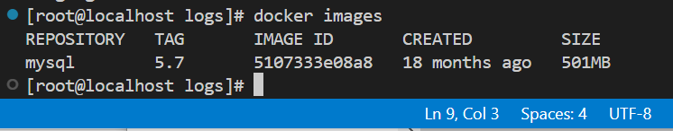
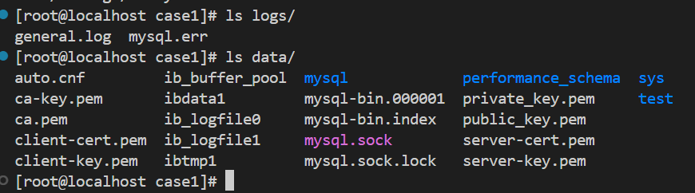
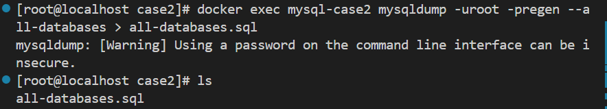
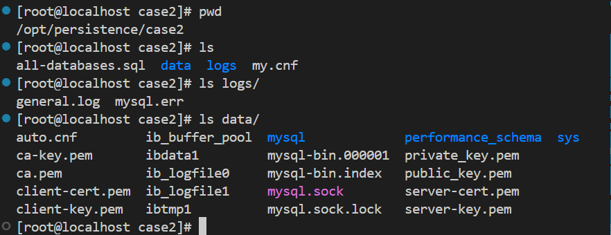
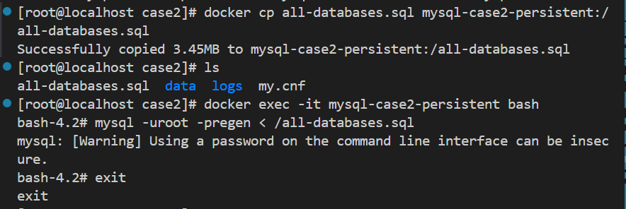
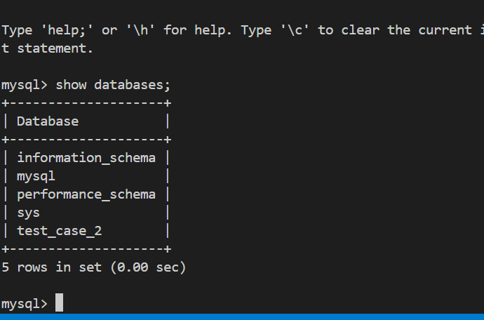
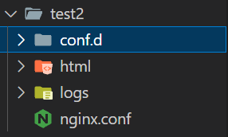
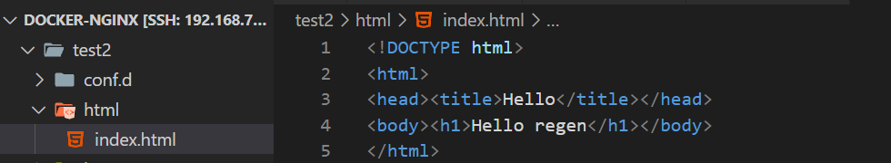
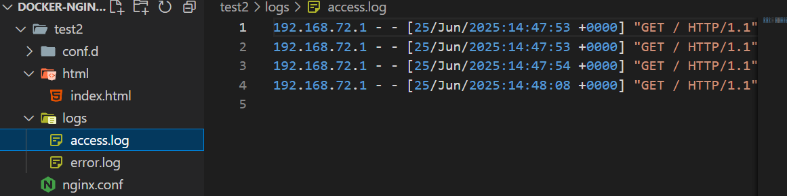
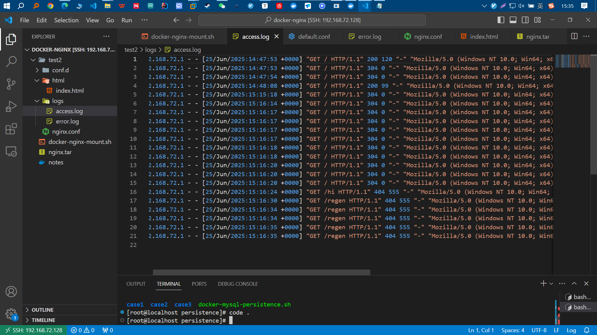

1. Docker部署的mysql实现持久存储
1. Docker部署的nginx实现持久存储

---

# 1. 情况一：还未开始进行docker部署mysql

---


## 1. 准备mysql镜像

* 查看是否已经有了镜像

```bash
docker images
```



* 可以发现我这里已经下载好了。
* 如果没有下载好则可以拉取

```
docker pull mysql:5.7
```


## 2. 使用命令起一个容器，并且设置好持久化存储的卷路径

* 目录结构


* 在对应目录下准备好`my.cnf`

```
[client]
port=3307
socket=/var/lib/mysql/mysql.sock

[mysqld]
# 基础配置
user=mysql
port=3306
bind-address=0.0.0.0
datadir=/var/lib/mysql
socket=/var/lib/mysql/mysql.sock
pid-file=/var/run/mysqld/mysqld.pid

# 字符集设置
character-set-server=utf8mb4
collation-server=utf8mb4_unicode_ci

# 错误日志
log-error=/var/log/mysql/mysql.err

# 一般日志（可选）
general_log=1
general_log_file=/var/log/mysql/general.log

# 二进制日志（用于主从复制或 point-in-time recovery）
log-bin=mysql-bin
binlog-format=ROW
server-id=1

# 启用一些推荐参数
sql_mode=STRICT_TRANS_TABLES,NO_ZERO_IN_DATE,NO_ZERO_DATE,ERROR_FOR_DIVISION_BY_ZERO,NO_ENGINE_SUBSTITUTION
explicit_defaults_for_timestamp=true
max_connections=512

# 其他
symbolic-links=0
```

* ## **使用docker命令进行持久化部署**

```
docker run -d \
  --name mysql-case1 \
  -e MYSQL_ROOT_PASSWORD=regen \
  -p 3307:3306 \
  -v /opt/persistence/case1/data:/var/lib/mysql \
  -v /opt/persistence/case1/logs:/var/log/mysql \
  -v /opt/persistence/case1/my.cnf:/etc/mysql/my.cnf:ro \
  mysql:5.7
```

### 3. 检查是否成功

* 查看对应目录下的文件是否存在

```
ls /opt/persistence/case1/data
ls /opt/persistence/case1/data
```



至此持久化存储功能已结束。

# 2. 情况二：容器运行中，并且已有数据

* 情景：已经有了一个容器化的数据库，需要使它增加持久化的功能。

## 1. 进行数据转移

进入容器内并进行数据备份

```bash
docker exec mysql-case2 mysqldump -uroot -pregen --all-databases > all-databases.sql
```



## 2. 停止旧的容器

```
docker stop mysql-case2
```

* 可以不用删除

## 3. 准备持久化目录

```
mkdir -p /opt/mysql-case2/data
mkdir -p /opt/mysql-case2/logs
```


## 4. 启动挂载了持久化目录的新容器

```
docker run -d \
  --name mysql-case2-persistent \
  -e MYSQL_ROOT_PASSWORD=regen \
  -p 3308:3306 \
  -v /opt/persistence/case2/data:/var/lib/mysql \
  -v /opt/persistence/case2/logs:/var/log/mysql \
  -v /opt/persistence/case2/my.cnf:/etc/mysql/my.cnf:ro \
  mysql:5.7
```


## 5. 检查挂载目录是否成功

```
ls /opt/persistence/case2/logs
ls /opt/persistence/case2/data
```



## 6. 恢复数据库数据

1. 复制之前生成的sql文件到docker容器内部
2. 进入容器内部
3. 迁移数据

```
docker cp all-databases.sql mysql-case2-persistent:/all-databases.sql
docker exec -it mysql-case2-persistent bash
mysql -uroot -pregen < /all-databases.sql
```



## 7. 检查数据

```
mysql -h 127.0.0.1 -P3307 -uroot -p
```



数据成功恢复。

# Docker部署Nginx

------

## 一、准备工作

### 1. 创建目录结构：

```bash
mkdir -p /opt/docker-nginx/conf.d
mkdir -p /opt/docker-nginx/html
mkdir -p /opt/docker-nginx/logs
```



### 2. 准备网页文件（静态内容）：

`/opt/docker-nginx/html/index.html`：

```html
<!DOCTYPE html>
<html>
<head><title>Hello</title></head>
<body><h1>Hello regen</h1></body>
</html>

```



### 3. 准备 Nginx 配置（静态服务）：

`/opt/docker-nginx/conf.d/default.conf`：

```nginx
server {
    listen 80;
    server_name localhost;

    location / {
        root /usr/share/nginx/html;
        index index.html;
    }
}
```

### 4. 主配置文件nginx.conf

```
worker_processes  1;

events {
    worker_connections  1024;
}

http {
    include       /etc/nginx/mime.types;
    default_type  application/octet-stream;

    access_log  /var/log/nginx/access.log;
    error_log   /var/log/nginx/error.log;

    sendfile        on;
    keepalive_timeout  65;

    include /etc/nginx/conf.d/*.conf;
}
```


------

## 二、运行 Nginx 容器（挂载配置、网页和日志）

```bash
docker run --name mynginx \
  -p 80:80 \
  -v /opt/docker-nginx/conf.d:/etc/nginx/conf.d:ro \
  -v /opt/docker-nginx/html:/usr/share/nginx/html:ro \
  -v /opt/docker-nginx/logs:/var/log/nginx \
  -d nginx
```

说明：

- `-v /opt/docker-nginx/conf.d:/etc/nginx/conf.d:ro` 挂载配置目录（只读）
- `-v /opt/docker-nginx/html:/usr/share/nginx/html:ro` 挂载网页目录（只读）
- `-v /opt/docker-nginx/logs:/var/log/nginx` 持久化日志目录（可写）


## 三、查看持久化效果

```
ls /opt/docker-nginx/test2/logs
```


## 

## 

------

## 三、测试效果

-  `http://192.168.72.128/`


