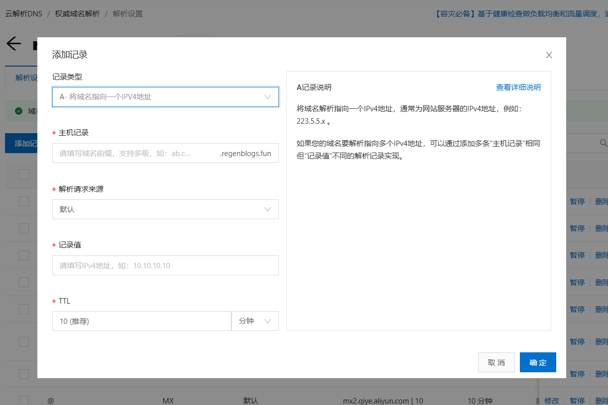

​	起因是只有一个域名，regenblogs.fun，但是云服务器在跑的服务有好几个，所以打算使用多级域名的方式进行充分利用这单个域名。过程也比较简单，总结一下便于下次复用。

------

### 多级域名简要介绍

> 域名的核心是[域名系统](https://zh.wikipedia.org/wiki/域名系统)（英语：Domain Name System，[缩写](https://zh.wikipedia.org/wiki/缩写)：DNS），域名系统中的任何名称都是域名。在域名系统的层次结构中，各种域名都隶属于域名系统根域的下级。域名的第一级是[顶级域](https://zh.wikipedia.org/wiki/頂級域)，它包括[通用顶级域](https://zh.wikipedia.org/wiki/通用頂級域)，例如[.com](https://zh.wikipedia.org/wiki/.com)、[.net](https://zh.wikipedia.org/wiki/.net)和[.org](https://zh.wikipedia.org/wiki/.org)；以及[国家和地区顶级域](https://zh.wikipedia.org/wiki/國家和地區頂級域)，例如[.us](https://zh.wikipedia.org/wiki/.us)、[.cn](https://zh.wikipedia.org/wiki/.cn)和[.tk](https://zh.wikipedia.org/wiki/.tk)。顶级域名下一层是[二级域名](https://zh.wikipedia.org/wiki/二级域)，一级一级地往下。现在，还有一些新兴的中文域名，例如[.在线](https://zh.wikipedia.org/wiki/.在线)等。这些域名向人们提供注册服务，人们可以用它创建公开的互联网资源或运行[网站](https://zh.wikipedia.org/wiki/網站)。顶级域名的管理服务由对应的[域名注册管理机构（域名注册局）](https://zh.wikipedia.org/wiki/域名注册局)负责，注册服务通常由[域名注册商](https://zh.wikipedia.org/wiki/域名注册商)负责[[2\]](https://zh.wikipedia.org/wiki/域名#cite_note-:1-2)。

# 使用宿主机 Nginx + Docker 实现多级域名访问 Web 应用

------

## 场景背景

​	我有一个 Nuxt 项目，使用 Docker 进行打包，镜像中使用 Nginx 进行静态文件托管。我们希望通过 `yuxuan.regenblogs.fun` 访问这个 Web 应用。

------

## Dockerfile 和 Nginx 配置

Dockerfile：

```Dockerfile
FROM nginx:alpine

COPY dist /usr/share/nginx/html
COPY nginx.conf /etc/nginx/conf.d/default.conf

EXPOSE 80
CMD ["nginx", "-g", "daemon off;"]
```

容器内 `nginx.conf`：

```nginx
server {
  listen 80;
  server_name yuxuan.regenblogs.fun;

  root /usr/share/nginx/html;
  index index.html;

  location / {
    try_files $uri $uri/ /index.html;
  }
}
```

------

## 容器启动

​	不直接映射宿主机的 80 端口，而是使用 3000 端口，避免与宿主机 Nginx 冲突：

```bash
docker build -t nuxt-yuxuan-app .
docker run -d --name nuxt-yuxuan-container -p 3000:80 nuxt-yuxuan-app
```

​	这表示容器内 Nginx 启动在 80 端口，宿主机通过 3000 端口访问它。

------

## 安装宿主机 Nginx 并配置反向代理

1. 安装 Nginx：

```bash
sudo apt update
sudo apt install nginx
```

1. 新建配置文件 `/etc/nginx/sites-available/yuxuan.regenblogs.fun`：

```nginx
server {
    listen 80;
    server_name yuxuan.regenblogs.fun;

    location / {
        proxy_pass http://127.0.0.1:3000;
        proxy_set_header Host $host;
        proxy_set_header X-Real-IP $remote_addr;
        proxy_set_header X-Forwarded-For $proxy_add_x_forwarded_for;
    }
}
```

1. 启用配置并重启 Nginx：

```bash
sudo ln -s /etc/nginx/sites-available/yuxuan.regenblogs.fun /etc/nginx/sites-enabled/
sudo nginx -t
sudo systemctl reload nginx
```

------

## 域名解析设置

​	在域名服务商控制台中，将 `yuxuan.regenblogs.fun` 的 A 记录指向服务器公网 IP。

​	我这里使用的是在阿里云注册的域名，可以直接添加DNS解析，就在控制台中。



------

## 成功验证

确保服务器防火墙或云安全组放行 80 端口后，浏览器访问：

```
http://yuxuan.regenblogs.fun
```

如果一切配置无误，即可正常访问部署的前端页面。

------

## 总结

通过将 Docker 部署与宿主机 Nginx 配合使用，我们实现了：

- 避免容器占用宿主机 80 端口
- 灵活配置多个二级域名
- 为日后配置 HTTPS、负载均衡打下基础

