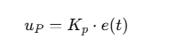
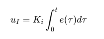
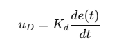

# PID基本概念

PID 控制器通过以下三部分组成调整行为：

- **比例控制（P）：快速响应当前误差**
    - 根据误差的大小调整输出，误差越大，输出越强。
    - 简单但可能存在偏差。
- **积分控制（I）：消除长期误差**
    - 累计误差的总和，让输出逐渐补偿偏差。
- **微分控制（D）：预测趋势减少震荡**
    - 根据误差变化的速度，平滑输出，避免过度反应。

# PID基本原理

* 稳态误差

    > 系统达到稳定后与目标值之间的偏差

* 历史误差

    > 系统运行过程中误差的累积总和

* 超调

    > 系统响应首次超过目标值的最大幅度

* 震荡

    > 系统输出围绕目标值反复波动，未能稳定

> P
>
> > **Proportional Control**
> >
> > 比例控制根据当前误差 e(t)e(t)e(t) 调整输出：
> >
> > 
> >
> > - **优点**：快速响应当前误差，简单直观。
> > - **缺点**：可能存在稳态误差，即系统到达目标附近但不能完全达到。
> >
> > **形象理解**：像一个弹簧，偏离目标越远，弹簧拉力越大。
>
> I
>
> > **Integral Control**
> >
> > 积分控制根据误差的累计值调整输出：
> >
> > 
> > $$
> > 
> > $$
> >
> > - **优点**：消除稳态误差，确保系统最终达到目标值。
> > - **缺点**：
> >     - **积分饱和**：如果误差持续存在，积分项的累积会无限增加，导致控制信号过大，甚至会导致控制系统的**振荡**。这是因为积分会在误差存在时不断增加，即使误差已经很小，积分项依然很大。
> >     - **引起过度反应**：积分项的过度增大可能导致系统的过度调整（比如温度突然快速上升或下降），从而产生不稳定的行为或**超调**。
> >
> > 
> >
> > > 积分部分主要用来**消除稳态误差**（steady-state error），即当系统误差存在较长时间时，积分部分会逐渐积累误差，推动系统调整，直到误差为零为止。
> > >
> > > 积分部分通过**累积误差**来对系统进行调整。它会随着时间的推移逐渐增大或减小，直到误差消除。假设在系统中存在一个持续的小误差，积分部分会随着时间的积累，产生越来越大的控制信号，从而帮助系统摆脱稳态误差。
>
> D
>
> > **Derivative Control**
> >
> > 微分控制根据误差的变化率调整输出：
> >
> > 
> >
> > - **优点**：预测误差变化趋势，减少震荡，提高系统稳定性。
> > - **缺点**：对噪声敏感，可能引入高频抖动。
> >
> > **形象理解**：像一辆车的刹车系统，车速变化越快，刹车越强。
> >
> > > 微分部分主要关注**误差变化的速率**，即系统如何快速变化。它的目的是通过“预见”误差的变化趋势来**减少系统的超调和震荡**，使系统更平稳地达到目标值。
> > >
> > > 
> > >
> > > 微分部分计算的是**误差变化率**，即误差在单位时间内的变化。它可以对误差变化的速度作出反应。如果误差变化很快，微分部分会增加控制信号来阻止系统反应过度；如果误差变化缓慢，微分部分的作用较小。

# PID性能指标

### 1. **稳态误差 (Steady-State Error)**

稳态误差是指系统在达到稳定状态后，输出与目标值之间的差异。一个好的 PID 控制器应该尽量使稳态误差接近于零。

- **计算方法**：稳态误差可以通过系统长期运行后的输出和设定点（目标值）进行比较，计算两者的差值。
- **理想情况**：PID 控制器的目标是使稳态误差最小化，最好为零（虽然在一些情况下可能会有一个微小的误差）。

### 2. **超调 (Overshoot)**

超调是指系统响应在超过目标值后再回落的现象。PID 控制器的超调应尽可能小，避免系统响应过度。

- **计算方法**：从系统响应的图像中可以看到，系统超过目标值后的最大偏差，即为超调量。一般来说，超调量越小越好。
- **理想情况**：超调应该接近零或者非常小，避免过度反应。

### 3. **振荡 (Oscillation)**

振荡是指系统输出在目标值附近来回波动，导致系统无法稳定在设定点附近。PID 控制器的输出应尽量减少振荡。

- **计算方法**：通过绘制系统响应曲线，如果系统频繁地上下波动且没有快速收敛到目标值，则存在振荡。可以通过系统的频率和幅度来判断振荡的严重性。
- **理想情况**：没有明显的振荡，系统响应应平稳。

### 4. **响应时间 (Settling Time)**

响应时间是指系统输出从开始到稳定在设定点附近所需的时间。响应时间越短，系统反应越快。

- **计算方法**：从系统响应曲线中测量，从起始时间到系统最终稳定在目标值附近的时间。
- **理想情况**：响应时间越短越好，但必须与其他指标（如超调、振荡）平衡。

### 5. **积分时间 (Integral Time, IT)**

积分时间是系统从零误差到稳态时误差累积的时间。积分时间短意味着控制器在达到稳态时能迅速消除累积的误差。

- **计算方法**：计算系统的积分误差时间，即误差在时间上的累计，较短的积分时间有助于快速消除误差。
- **理想情况**：积分时间越短越好，但要平衡可能引发的振荡和超调。

### 6. **控制信号的饱和 (Saturation of Control Signal)**

控制信号饱和是指控制器的输出值达到最大限制，不能进一步增大，这通常会导致系统反应迟缓，甚至无法达到设定目标。

- **计算方法**：观察控制信号的输出，如果系统经常达到最大或最小输出限制，则表示控制信号饱和。
- **理想情况**：控制信号应尽量避免饱和，控制器的输出应适应系统需求。

### 7. **控制器的稳定性**

稳定性是指系统在受到扰动或变化时是否能够保持其稳定性，并最终收敛到目标值。一个不稳定的 PID 控制器会导致系统过度波动，甚至无法收敛到设定点。

- **计算方法**：观察系统响应，是否会在目标值附近发生不规则的波动，是否会收敛到目标值。
- **理想情况**：系统应稳定且快速收敛。

# PID三个参数的调整

> **增加比例增益 (Kp)**：可以减少稳态误差，但可能导致系统超调和振荡。
>
> **增加积分增益 (Ki)**：可以减少稳态误差，尤其是在误差为零时；但过高会导致系统振荡。
>
> **增加微分增益 (Kd)**：可以减少超调并提高响应速度，但过高的微分增益可能导致控制信号的噪声增大。

## 一般流程

> **第一步：确定比例增益P**
>
> 确定比例增益 P 时，首先去掉 PID 的积分项和微分项，一般是令 Ti=0、 Td=0（具体见PID 的参数设定说明），使PID 为纯比例调节。
>
> 输入设定为系统允许的最大值60%~70%，由0逐渐加大比例增益 P，直至系统出现振荡；再反过来，从此时的比例增益 P 逐渐减小，直至系统振荡消失，记录此时的比例增益 P，设定 PID 的比例增益 P 为当前值60%~70%。比例增益 P 调试完成。
>
> **第二步：确定比例增益I**
>
> 比例增益 P 确定后，设定一个较大的积分时间常数 Ti 的初值，然后逐渐减小 Ti，直至系统出现振荡，之后在反过来，逐渐加大 Ti，直至系统振荡消失。记录此时的 Ti，设定 PID的积分时间常数 Ti 为当前值的150%~180%。积分时间常数 Ti 调试完成
>
> **第三步：确定比例增益d**
>
> 积分时间常数 Td 一般不用设定，为0即可。若要设定，与确定 P 和 Ti 的方法相同，取不振
> 荡时的30%。
>
> **第四步：进一步调整参数**
>
> 系统空载、带载联调，再对 PID 参数进行微调，直至满足要求。
>

