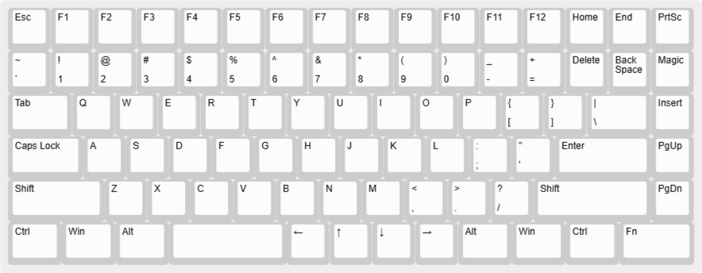
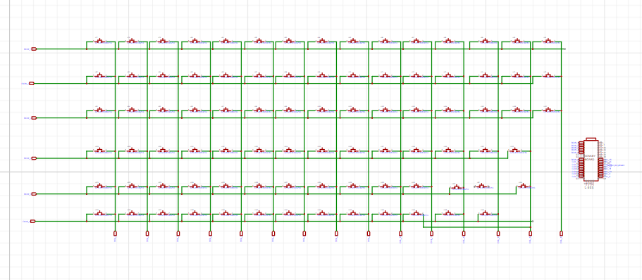
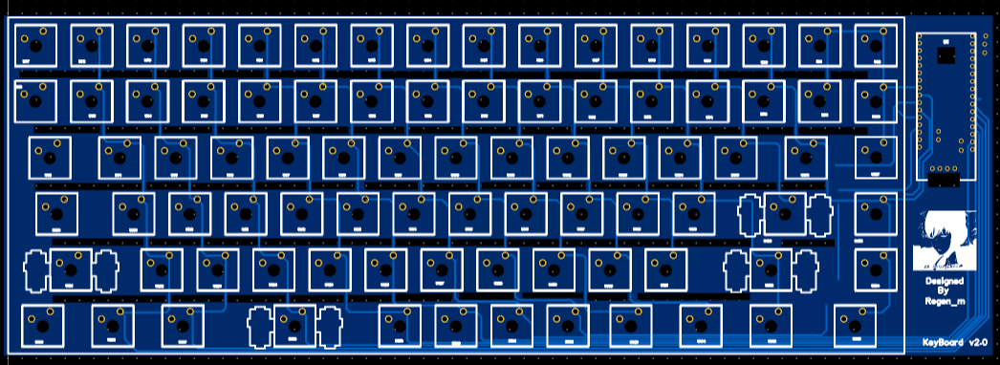
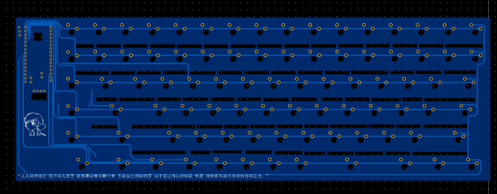
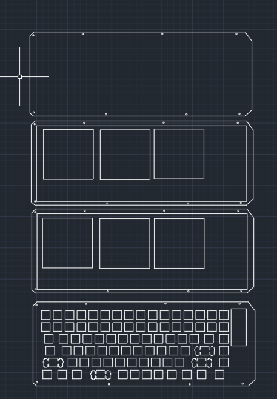

​	之前就有使用别烧好的MCU来进行键盘客制化，始终觉得不得劲。仅仅只是设计了键位PCB和外观，虽然也学到了点东西，但是我就是不爽啊。有一种核心技术自己没掌握的感觉。

​	新坑_STM32_KEYBOARD 开始！

​	二话不说就弃坑了一段时间。。。

​	直接上手STM32有些难了点，先用了别人的方案试试先。基于` sayo monkey board`的键盘

# Layout

基于网站[keyboard-layout-editor]([Keyboard Layout Editor (keyboard-layout-editor.com)](http://www.keyboard-layout-editor.com/#/))设计，同时使用[Plate & Case Builder - swillkb](http://builder.swillkb.com/))导出DXF。

# PCB设计

​	其实很简单，就是模块套模块，画一下 板子的封装即可。

# 外壳设计

​	只是简单的用亚克力打的，CAD还不是很会用。

