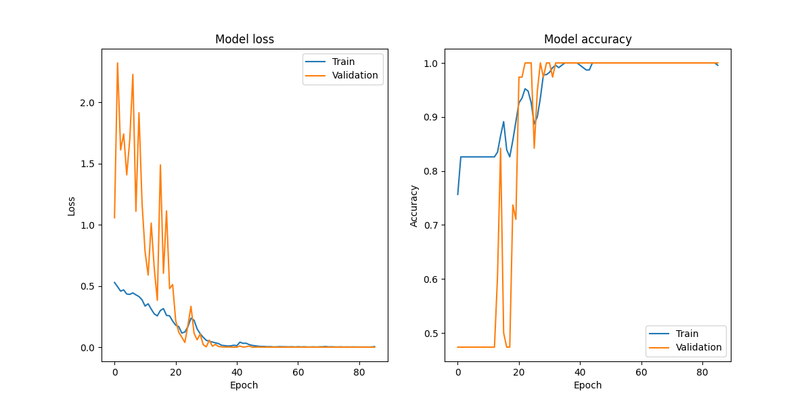
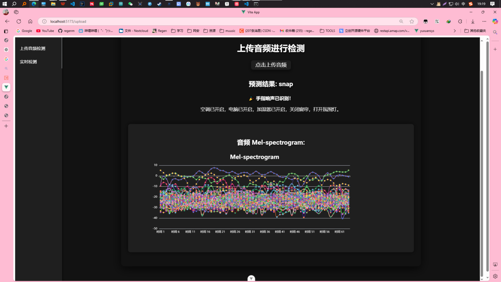
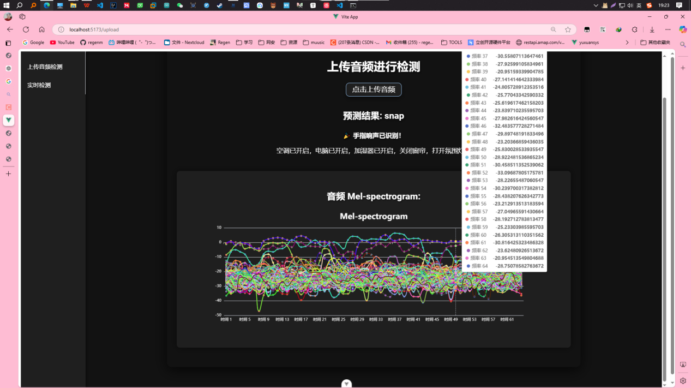
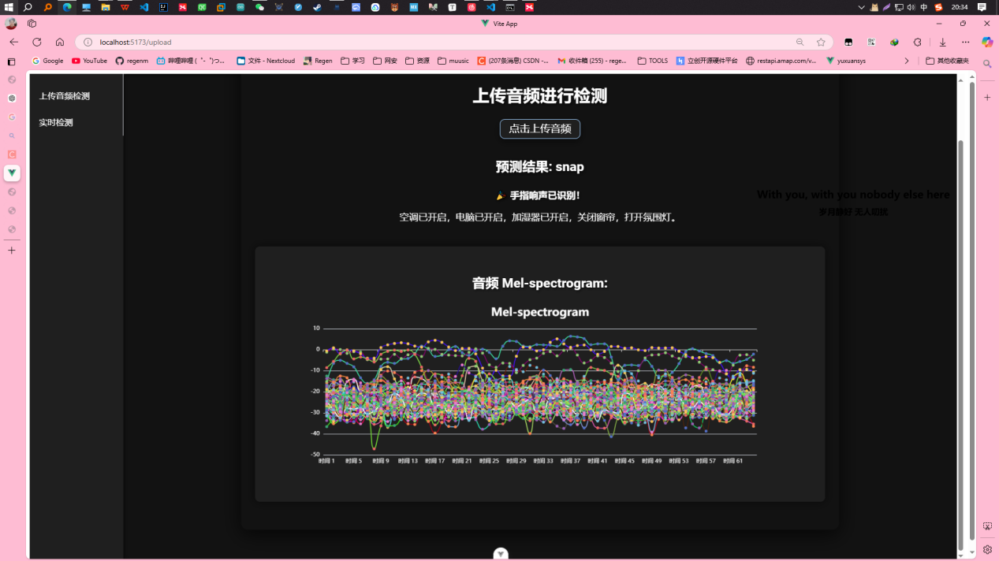

### 项目内容：

本项目开发了一个基于深度学习的实时音频识别系统，通过音频信号分析来判断是否是手指响声。项目通过使用梅尔频率倒谱系数（MFCC）和梅尔谱（Mel-spectrogram）等音频特征提取方法，使得模型能够准确识别手指响声。系统基于Flask后端和Vue前端，结合WebSocket技术实现了实时音频数据的流式传输与动态展示。

### 项目职责：

- **音频采集**：负责使用`python-sounddevice`库进行实时音频采集，并将数据保存为`.wav`格式。
- **数据预处理**：处理音频数据并提取特征，使用`librosa`库生成Mel-spectrogram。
- **深度学习模型训练**：设计并训练卷积神经网络（CNN）模型，进行手指响声的分类。
- **系统设计与实现**：将深度学习模型与物联网系统集成，使用Flask进行后端开发，Vue.js作为前端，实时展示识别结果。
- **前端展示**：前端通过WebSocket与后端通信，实时显示手指响声检测结果，并能控制智能家居设备。

### 项目技术栈：

- **后端**：Flask（Python）作为服务器框架，用于处理前端请求并返回音频识别结果。
- **前端**：Vue.js，负责展示实时音频识别结果，使用WebSocket进行实时数据传输。
- **深度学习框架**：TensorFlow/Keras，用于创建和训练卷积神经网络（CNN）模型。
- **特征提取**：librosa库用于提取梅尔频率倒谱系数（MFCC）和梅尔谱（Mel-spectrogram）特征。
- **音频采集**：使用`python-sounddevice`库进行实时音频录制。

### 项目结果：

- **音频识别准确率**：项目展示了通过卷积神经网络进行音频分类，系统能够准确区分手指响声与非手指响声。
- **实时展示与控制**：前端界面实时展示识别结果，如“手指响声 detected”或“非手指响声 detected”，并可以触发智能家居设备的操作。
- **数据可视化**：通过ECharts，展示音频事件的统计信息、频率分布等，帮助用户了解音频事件的发生情况。

### 实现步骤：

1. **数据集的获取与录音**：使用`python-sounddevice`进行音频录制，录音数据存储为`.wav`文件，保存为“手指响声”和“非手指响声”两个分类。
2. **数据预处理**：使用`librosa`进行音频特征提取，生成Mel-spectrogram特征并进行标准化处理。
3. **模型训练**：创建一个卷积神经网络（CNN）模型，输入Mel-spectrogram特征，进行音频分类。
4. **前端展示**：通过WebSocket将后端的预测结果实时传输至Vue前端，并展示给用户。
5. **智能家居控制**：系统能够根据识别结果控制设备（如灯光、音响等）。
