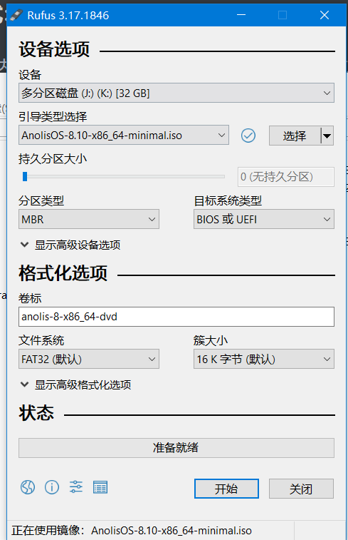
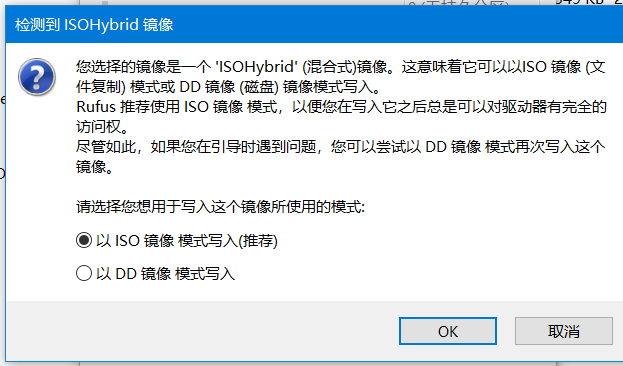

> 写这篇博客的起因是在服务器实体机上装Anolis8.10minimal，试过很多不同的镜像都会卡在网络选择以及源选择上，又因为是新的服务器，交换机IP还没配没网所以卡住。之所以会出现这种问题，是因为我在刻录镜像时使用的是默认的**iso**模式而不是**dd**模式（ultraIso是raw），导致文件结构发生了改变。

# iso镜像烧录





在安装操作系统（如 Windows、Linux 发行版或服务器系统）时，选择合适的 ISO 烧录方式至关重要。不同的刻录方法会影响 **引导兼容性、安装成功率**，甚至导致玄学问题（如 `dracut emergency shell`）。


| **方式**              | **适用场景**              | **优点**                  | **缺点**                    |
| :-------------------- | :------------------------ | :------------------------ | :-------------------------- |
| **`dd`/RAW 模式**     | Linux 服务器、特殊硬件    | 100% 兼容，保留原始结构   | U 盘无法直接存取剩余空间    |
| **Rufus ISO 模式**    | Windows/Ubuntu 等主流系统 | 可编辑、U 盘可复用        | 可能破坏非标准 ISO 的引导   |
| **UltraISO USB-HDD+** | 老旧 Legacy BIOS 电脑     | 兼容部分旧机器            | 不支持 UEFI，可能损坏元数据 |
| **直接解压到 FAT32**  | 几乎不推荐                | 仅适用于极少数 WinPE 工具 | 99% 无法引导                |

------

## **1. 关键概念解析**

### **（1）`dd`/RAW 模式：最可靠的底层写入**

- **原理**：逐字节复制 ISO 到 U 盘，完全保留引导扇区、分区表和文件系统。
- **适用场景**：
    - 龙蜥 (Anolis)、CentOS、RHEL 等企业级 Linux
    - 华为/戴尔服务器等特殊硬件
    - Arch Linux、Gentoo 等非标准引导的发行版

**操作方法：**

```bash
dd if=anolis.iso of=/dev/sdX bs=4M status=progress oflag=sync  # Linux/macOS
```

（Windows 可用 Rufus 的 **DD 镜像模式** 或 UltraISO 的 **RAW 写入**）

------

### **（2）Rufus ISO 模式：平衡易用性与兼容性**

- **原理**：提取 ISO 内容，重新生成 FAT32/NTFS 文件系统和引导记录。
- **适用场景**：
    - Windows 10/11 安装
    - Ubuntu、Fedora 等主流 Linux 桌面版

**⚠️ 风险点**：

- 对非 Hybrid ISO（如某些定制镜像）可能破坏 `initramfs` 路径，导致安装失败。

------

### **（3）UltraISO USB-HDD+：旧设备的妥协方案**

- **仅限 Legacy BIOS 机器**，UEFI 电脑可能无法识别。
- **慎用**：部分 Linux ISO 会因元数据损坏导致安装源丢失（如龙蜥提示“必须配置源”）。

## **2. 其他概念解析**

### **1. 分区类型（Partition Scheme）**

#### **MBR vs GPT**

| **特性**     | **MBR (Master Boot Record)**   | **GPT (GUID Partition Table)**  |
| :----------- | :----------------------------- | :------------------------------ |
| **兼容性**   | 仅支持 Legacy BIOS（老旧电脑） | 支持 UEFI 和现代硬件            |
| **磁盘容量** | 最大 2TB                       | 支持 2TB 以上磁盘               |
| **分区数量** | 最多 4 个主分区                | 理论上无限分区                  |
| **适用场景** | Windows 7 及更早系统           | Windows 10+/Linux 服务器/新硬件 |

**烧录工具中的选择：**

- Rufus/UltraISO 会提示选择 **MBR** 或 **GPT**，需匹配目标机器的启动模式（BIOS/UEFI）。
- **错误选择后果**：U盘无法被识别为启动设备，提示 "No bootable device"。

------

### **2. 持久化分区（Persistence）**

#### **什么是持久化？**

- 在Live USB（如Ubuntu安装盘）中保留用户数据和设置的功能，重启后不会丢失。
- **实现方式**：在U盘上划分一个独立分区存储变更数据。

#### **分区大小设置原则**

| **用途**             | **推荐大小** | **说明**                              |
| :------------------- | :----------- | :------------------------------------ |
| 轻度使用（终端配置） | 2GB-4GB      | 足够保存基础软件包和配置文件          |
| 开发环境             | 8GB-16GB     | 需容纳开发工具和依赖库                |
| 完整桌面体验         | 16GB+        | 允许安装大型软件（如VS Code、Docker） |

**技术实现（以Ubuntu为例）：**

```
# 使用mkusb工具创建持久化分区
sudo mkusb -p ubuntu-22.04.iso
```

> 📌 注意：Windows系统无法原生支持Linux持久化分区。

------

### **3. 文件系统（FAT32 vs NTFS vs exFAT）**

#### **FAT32：兼容性之王**

| **特性**         | **说明**                                            |
| :--------------- | :-------------------------------------------------- |
| **最大文件大小** | 4GB（无法存放超过此大小的单个文件，如Win10原版ISO） |
| **优点**         | 所有操作系统和固件（包括树莓派、服务器BMC）都能识别 |
| **缺点**         | 不支持文件权限、日志等高级功能                      |

**适用场景：**

- UEFI启动盘（强制要求FAT32）
- 需要跨平台读写的情况（Windows/Mac/Linux）

#### **NTFS/exFAT：大文件支持**

| **文件系统** | **优势**          | **局限性**              |
| :----------- | :---------------- | :---------------------- |
| NTFS         | 支持日志、大文件  | 部分Linux设备需额外驱动 |
| exFAT        | 跨平台、无4GB限制 | 老旧BIOS可能无法识别    |

**烧录工具中的选择逻辑：**

图表

代码


------

### **4. 簇大小（Cluster Size/Allocation Unit Size）**

#### **什么是簇？**

- 文件系统分配存储空间的最小单位，类似"数据块"。
- **例如**：即使文件只有1KB，若簇大小为32KB，仍会占用32KB空间。

#### **不同簇大小的影响**

| **簇大小** | **空间利用率** | **读写速度** | **适用场景**             |
| :--------- | :------------- | :----------- | :----------------------- |
| 4KB        | 高             | 较慢         | 存放大量小文件（如文档） |
| 32KB       | 中             | 较快         | 通用场景（平衡选择）     |
| 64KB+      | 低             | 最快         | 大型媒体文件/游戏安装    |

**烧录工具中的设置建议：**

- **Windows安装盘**：默认32KB（平衡速度与兼容性）
- **Linux LiveUSB**：4KB（优化小文件读取）
- **错误选择后果**：U盘性能下降或浪费存储空间。
