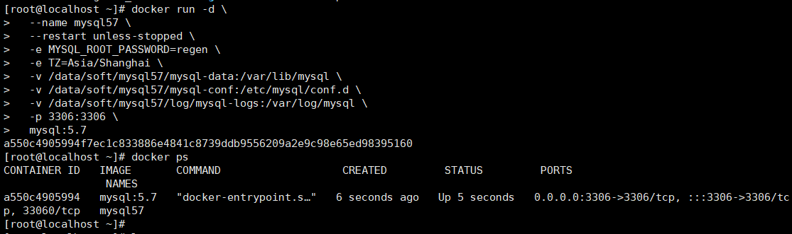

# jira、confluence、bitbucket、crowd部署

> **版本信息**
>
> * jira:7.13
> * confluence:6.10.0
> * bitbucket:7.0.0
> * crowd:3.4.4
> * mysql:5.7

## 1. 准备工作

* 准备安装包
    * `atlassian-jira-software-7.13.0-x64.bin`
    * `atlassian-confluence-6.10.0-x64.bin`
    * `atlassian-bitbucket-7.0.0-x64.bin`
    * `atlassian-crowd-3.4.4.tar.gz`
* 准备agent
    * `atlassian-agent-v1.2.3.tar.gz`
* 准备mysql Jar包
    * `mysql-connector-java-5.1.49.tar.gz`

## 2. 起数据库

### docker起数据库

```bash
docker run -d \
  --name mysql57 \
  --restart unless-stopped \
  -e MYSQL_ROOT_PASSWORD=regen \
  -e TZ=Asia/Shanghai \
  -v /data/soft/mysql57/mysql-data:/var/lib/mysql \
  -v /data/soft/mysql57/mysql-conf:/etc/mysql/conf.d \
  -v /data/soft/mysql57/log/mysql-logs:/var/log/mysql \
  -p 3306:3306 \
  mysql:5.7
```



### 建库

```bash
-- 创建jira库
CREATE DATABASE jira CHARACTER SET utf8 COLLATE utf8_bin;
-- 创建confluence库
CREATE DATABASE confluence CHARACTER SET utf8 COLLATE utf8_bin;
-- 创建bitbucket库
CREATE DATABASE bitbucket CHARACTER SET utf8 COLLATE utf8_bin;
-- 创建crowd库
CREATE DATABASE crowd CHARACTER SET utf8 COLLATE utf8_bin;

-- 这里mysql和jira是在同一个服务器，所以使用了localhost，如果不在同一个服务器，可以使用 % 来代替localhost

CREATE USER 'jira'@'localhost' IDENTIFIED BY 'Regen123';
CREATE USER 'confluence'@'localhost' IDENTIFIED BY 'Regen123';
CREATE USER 'bitbucket'@'localhost' IDENTIFIED BY 'Regen123';
CREATE USER 'crowd'@'localhost' IDENTIFIED BY 'Regen123';

-- 给权限
GRANT ALL PRIVILEGES ON jira.* TO 'jira'@'localhost';

GRANT  ALL PRIVILEGES ON confluence.* TO 'confluence'@'localhost';

GRANT ALL PRIVILEGES ON bitbucket.* TO 'bitbucket'@'localhost';

GRANT ALL PRIVILEGES ON crowd.* TO 'crowd'@'localhost';

-- 刷新
FLUSH PRIVILEGES;
```


## 3. 安装jira 7.13

* 到`.bin`文件目录下

```bash
chmod +x atlassian-jira-software-7.13.0-x64.bin # 赋予执行权限
./atlassian-jira-software-7.13.0-x64.bin        # 执行安装脚本
```

* 默认安装之后

```bash
service jira stop
```

* 添加 mysql-connector Jar包

```bash
tar -xvxf mysql-connector-java-5.1.49.tar.gz
cd mysql-connector-java-5.1.49
cp mysql-connector-java-5.1.49.jar  /opt/atlassian/jira/atlassian-jira/WEB-INF/lib
```


* 进行pojie

> [qinyuxin99/atlassian-agent: jiraPJ工具](https://github.com/qinyuxin99/atlassian-agent)

1. 解压agent工具

```
tar xzvf atlassian-agent-v1.2.3.tar.gz
```

2. 找到atlassian-agent.jar的路径`/data/regen/jira/atlassian-agent-v1.2.3/atlassian-agent.jar`
3. 增加java启动项

```bash
vim /opt/atlassian/jira/bin/setenv.sh 
# 增加以下行
export JAVA_OPTS="-javaagent:/data/regen/jira/atlassian-agent-v1.2.3/atlassian-agent.jar ${JAVA_OPTS}"
```

4. 启动jira以后生成license

复制web平台（`IP:8080`）的序列号

在atlassian-agent.jar文件所在目录下执行：

```bash
java -jar atlassian-agent.jar -p jira -m aaa@bbb.com -n my_name -o https://zhile.io -s ABCD-1234-EFGH-5678
```

即可生成license，填入即可正常使用。

## 4.安装confluence 6.10.0

* 到`.bin`文件目录下

```bash
chmod +x atlassian-confluence-6.10.0-x64.bin # 赋予执行权限
./atlassian-confluence-6.10.0-x64.bin        # 执行安装脚本
```

* 默认安装之后

```bash
service confluence stop
```

* 添加 mysql-connector Jar包

```bash
# 到mysql-connector Jar包下
cp mysql-connector-java-5.1.49.jar /opt/atlassian/confluence/confluence/WEB-INF/lib
```

* 进行pojie

这里使用之前相同的agent jar包以及路径即可

2. 增加java启动项

```bash
vim /opt/atlassian/confluence/bin/setenv.sh 
# 增加以下行
export JAVA_OPTS="-javaagent:/data/regen/jira/atlassian-agent-v1.2.3/atlassian-agent.jar ${JAVA_OPTS}"
```

4. 启动confluence以后生成license

复制web平台（`IP:8090`）的序列号

在atlassian-agent.jar文件所在目录下执行：

需要更换-p参数为conf

>  -p,--product <arg>        License product, support:
>                            [crowd: Crowd]
>                            [questions: Questions plugin for Confluence]
>                            [crucible: Crucible]
>                            [capture: Capture plugin for JIRA]
>                            [conf: Confluence]
>                            [training: Training plugin for JIRA]
>                            [*: Third party plugin key, looks like:
>                            com.foo.bar]
>                            [bitbucket: Bitbucket]
>                            [tc: Team Calendars plugin for Confluence]
>                            [bamboo: Bamboo]
>                            [fisheye: FishEye]
>                            [portfolio: Portfolio plugin for JIRA]
>                            [jc: JIRA Core]
>                            [jsd: JIRA Service Desk]
>                            [jira: JIRA Software(common jira)]

```bash
java -jar atlassian-agent.jar -p conf -m aaa@bbb.com -n my_name -o https://zhile.io -s ABCD-1234-EFGH-5678
```

即可生成license，填入即可正常使用。

## 5.安装bitbucket 7.0.0

* 到`.bin`文件目录下

```bash
chmod +x atlassian-bitbucket-7.0.0-x64.bin # 赋予执行权限
./atlassian-bitbucket-7.0.0-x64.bin        # 执行安装脚本
```

* 默认安装之后

```bash
service bitbucket stop
```

* 添加 mysql-connector Jar包

```bash
# 到mysql-c下onnector Jar包下
cp mysql-connector-java-5.1.49.jar /opt/atlassian/bitbucket/7.0.0/app/WEB-INF/lib/

```


* 进行pojie

这里使用之前相同的agent jar包以及路径即可

2. 增加java启动项

```bash
vim /opt/atlassian/bitbucket/7.0.0/bin/_start-webapp.sh
 
# 找到JAVA_OPTS，在其下面添加一行
export JAVA_OPTS="-javaagent:/data/regen/jira/atlassian-agent-v1.2.3/atlassian-agent.jar ${JAVA_OPTS}"
```

4. 启动bitbucket以后生成license

复制web平台（`IP:7990`）的序列号

在atlassian-agent.jar文件所在目录下执行：

需要更换-p参数为bitbucket

>  -p,--product <arg>        License product, support:
>                            [crowd: Crowd]
>                            [questions: Questions plugin for Confluence]
>                            [crucible: Crucible]
>                            [capture: Capture plugin for JIRA]
>                            [conf: Confluence]
>                            [training: Training plugin for JIRA]
>                            [*: Third party plugin key, looks like:
>                            com.foo.bar]
>                            [bitbucket: Bitbucket]
>                            [tc: Team Calendars plugin for Confluence]
>                            [bamboo: Bamboo]
>                            [fisheye: FishEye]
>                            [portfolio: Portfolio plugin for JIRA]
>                            [jc: JIRA Core]
>                            [jsd: JIRA Service Desk]
>                            [jira: JIRA Software(common jira)]

```bash
java -jar atlassian-agent.jar -p bitbucket -m aaa@bbb.com -n my_name -o https://zhile.io -s ABCD-1234-EFGH-5678
```

即可生成license，填入即可正常使用。

## 6.安装crowd 3.4.4

* 解压安装包

```bash
tar -zxvf atlassian-crowd-3.4.4.tar.gz
mv atlassian-crowd-3.4.4.tar.gz
```

* 添加 mysql-connector Jar包

```bash
# 到mysql-connector Jar包下
cp mysql-connector-java-5.1.49.jar /opt/crowd/atlassian-crowd-3.4.4/apache-tomcat/lib
```

* 进行pojie

这里使用之前相同的agent jar包以及路径即可

2. 增加java启动项

```bash
vim /opt/crowd/atlassian-crowd-3.4.4/apache-tomcat/bin/setenv.sh 
 
# 找到CATALINA_OPTS，注释它，并在其下面添加一行

#CATALINA_OPTS="-javaagent:/opt/crowd/atlassian-agent.jar $CATALINA_OPTS"
export JAVA_OPTS="-javaagent:/data/regen/jira/atlassian-agent-v1.2.3/atlassian-agent.jar ${JAVA_OPTS}"
```

4. 启动bitbucket以后生成license

复制web平台（`IP:8095`）的序列号

在atlassian-agent.jar文件所在目录下执行：

需要更换-p参数为crowd

>  -p,--product <arg>        License product, support:
>                          [crowd: Crowd]
>                          [questions: Questions plugin for Confluence]
>                          [crucible: Crucible]
>                          [capture: Capture plugin for JIRA]
>                          [conf: Confluence]
>                          [training: Training plugin for JIRA]
>                          [*: Third party plugin key, looks like:
>                          com.foo.bar]
>                          [bitbucket: Bitbucket]
>                          [tc: Team Calendars plugin for Confluence]
>                          [bamboo: Bamboo]
>                          [fisheye: FishEye]
>                          [portfolio: Portfolio plugin for JIRA]
>                          [jc: JIRA Core]
>                          [jsd: JIRA Service Desk]
>                          [jira: JIRA Software(common jira)]

```bash
java -jar atlassian-agent.jar -p crowd -m aaa@bbb.com -n my_name -o https://zhile.io -s ABCD-1234-EFGH-5678
```

即可生成license，填入即可正常使用。
