# jira、confluence、bitbucket、基于crowd实现sso

> ​	单点登录英文全称Single Sign On，简称就是SSO。它的解释是：**在多个应用系统中，只需要登录一次，就可以访问其他相互信任的应用系统。**

> 版本信息：
>
> * jira:7.13
> * confluence:6.10.0
> * bitbucket:7.0.0
> * crowd:3.4.4
> * mysql:5.7

​	在我使用的版本中，jira和confluence可以实现基于IP的单点登录，但是bitbucket不行，仅支持基于二级域名的单点登录。

​	如果是基于IP可参考https://blog.csdn.net/weixin_38621072/article/details/117622297?fromshare=blogdetail&sharetype=blogdetail&sharerId=117622297&sharerefer=PC&sharesource=weixin_47657945&sharefrom=from_link

​	基于域名更加规范合理，我**最终也使用了域名**的方式。

可以使用**两种**域名解析，

1. 如果是有自己的公有域名，则可以在对应域名服务商控制台添加解析即可，例如
    1. jira.regenglogs.fun               --->192.168.99.203
    2. confluence.regenglogs.fun  --->192.168.99.203
    3. bitbucket.regenglogs.fun     --->192.168.99.203
    4. crowd.regenglogs.fun          --->192.168.99.203

> 我的服务都在一台主机所以解析相同。

2. 如果没有域名则可以添加本地解析，客户端修改hosts文件即可
    1. windows客户端：
        1. 编辑`C:\Windows\System32\drivers\etc\hosts`
        
            ```
            ## Added by Docker Desktop
            #172.16.30.128 host.docker.internal
            #172.16.30.128 gateway.docker.internal
            # To allow the same kube context to work on the host and the container:
            #127.0.0.1 kubernetes.docker.internal
            # End of section
            192.168.99.203 jira.regenblogs.fun
            192.168.99.114 confluence.regenblogs.fun
            192.168.99.203 bitbucket.regenblogs.fun
            192.168.99.114 crowd.regenblogs.fun
            #-------------------------------------------------------
            ```
        
            
        
    2. Linux：
        1. 编辑`/etc/hosts`
        
            ```
            127.0.0.1   localhost localhost.localdomain localhost4 localhost4.localdomain4
            ::1         localhost localhost.localdomain localhost6 localhost6.localdomain6
            
            192.168.99.203 jira.regenblogs.fun
            192.168.99.114 confluence.regenblogs.fun
            192.168.99.203 bitbucket.regenblogs.fun
            192.168.99.114 crowd.regenblogs.fun
            ```
        
            


## 1. 实现crowd集成jira、confluence、bitbucket

> 实现SSO的前提是三个软件都连接到了crowd。

### Crowd准备操作

1. 新建三个application分别为jira、confluence、bitbucket

    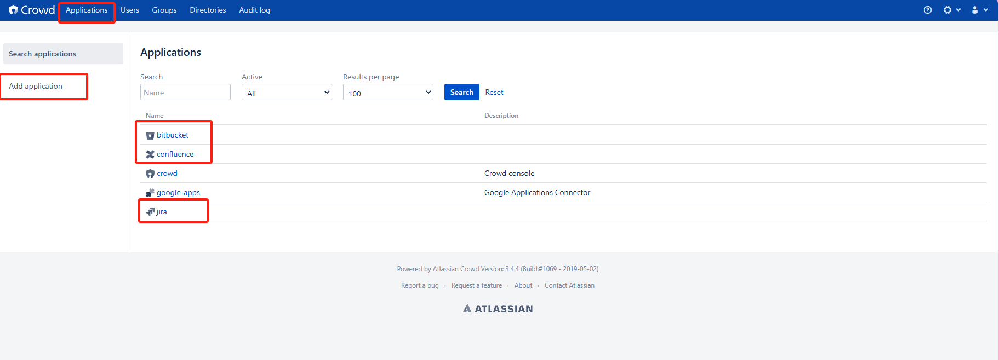

2. 新建一个用户目录`user directory`

    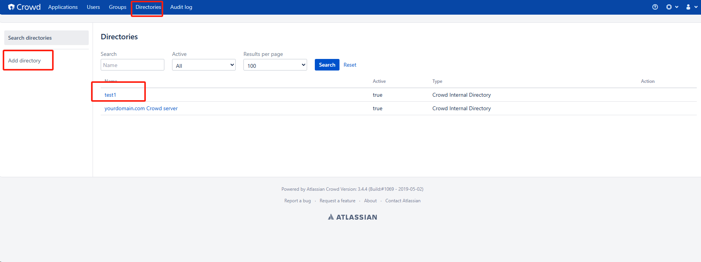

3. 新建一个用户组用于测试`user group`

    

4. 新建两个用户用于测试。

    > 一个提前作为所有平台的管理员，否则实现好了sso以后会禁用原管理员账户
    >
    > 一个作为普通用户进行测试

    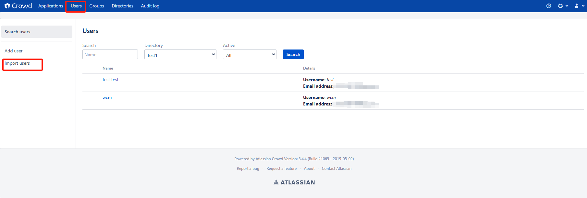

5. 在各个应用内设置好允许访问的IP和域名

    这里只放jira的配置

    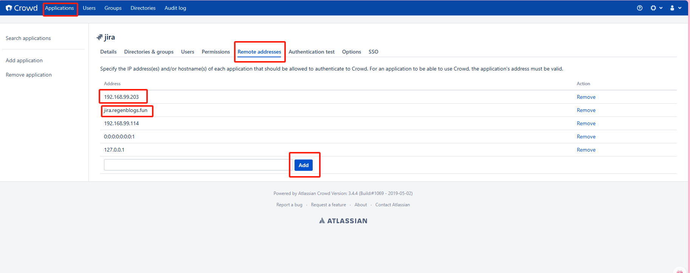

### jira 集成crowd

在用户管理中添加crowd

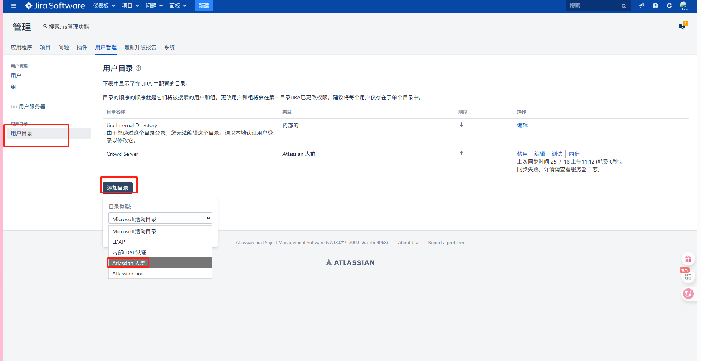

* 测试：

1. 测试服务器连接

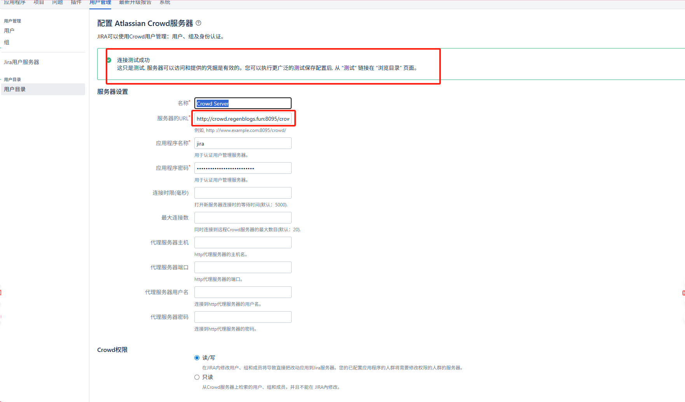

2. 测试用户

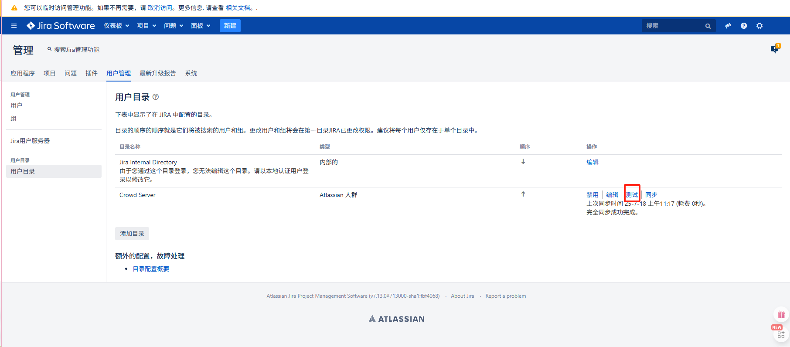

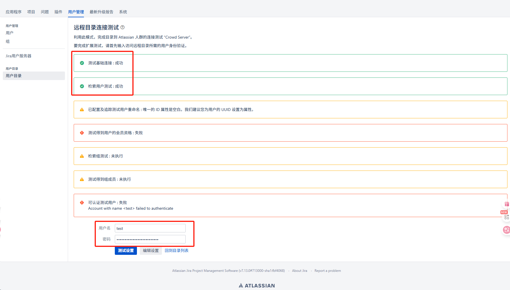

### confluence集成crowd

​	与jira集成crowd操作基本一致

### bitbucket集成crowd

​	与jira集成crowd操作基本一致

### Crowd的SSO设置

> 这一步设置了能够通过SSO登录的二级域名，子域名通过该域名来实现SSO

1. 进入crowd general 设置

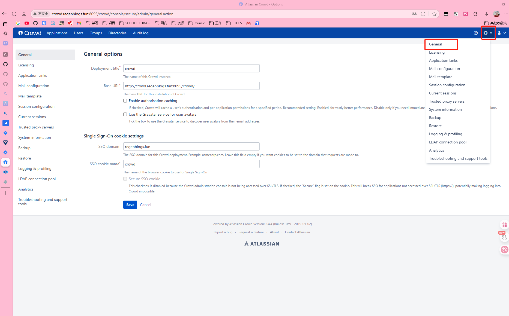

2. 设置子域名、cookie名字以及base url，确保都是域名而不是IP。

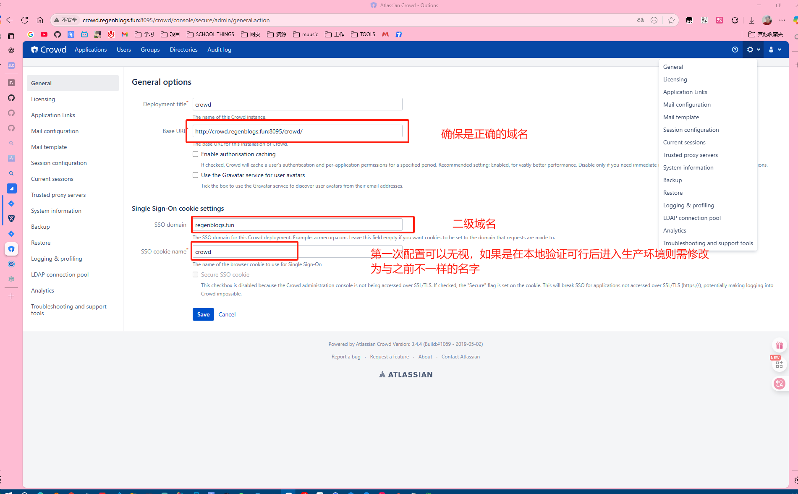

## 2. 实现SSO

> 在我使用的版本中，如果允许sso登录，则会停用jira、confluence、bitbucket的管理员账户，因此在实现SSO之前建议给Crowd中的某个用户增加所有的权限便于管理。否则将失去管理员账号。如果忘记添加可以看文末解决方式
>
> 配置方法有两种，一种是直接在各个平台为该用户增加最大权限，一种是在各个平台增加一个最大权限用户组，并将该用户添加到该组。
>
> * 第一种方式（直接在各个平台为该用户增加最大权限）实现方式：
>
>     这里仅以jira为例，其余过程基本一致。
>
> 1. 打开用户管理
> 2. 搜索crowd用户并且添加到对应权限组
>
> * 第二种方式（最大权限用户组，添加该用户）实现方式：

### jira实现SSO的配置过程

#### 1. 修改认证配置文件`seraph-config.xml`

```bash
vim /opt/atlassian/jira/atlassian-jira/WEB-INF/classes/seraph-config.xml
```

找到

```xml
<!-- CROWD:START - If enabling Crowd SSO integration uncomment the following SSOSeraphAuthenticator and comment out the JiraSeraphAuthenticator below -->
    <!-- 
    <authenticator class="com.atlassian.jira.security.login.SSOSeraphAuthenticator"/>
    -->
    <!-- CROWD:END -->

    <!-- CROWD:START - The authenticator below here will need to be commented out for Crowd SSO integration -->

    <authenticator class="com.atlassian.jira.security.login.JiraSeraphAuthenticator"/>

<!-- CROWD:END -->
```

将以下内容取消注释

```xml
    <!-- 
    <authenticator class="com.atlassian.jira.security.login.SSOSeraphAuthenticator"/>
    -->
```

改为

```xml
    <authenticator class="com.atlassian.jira.security.login.SSOSeraphAuthenticator"/>
```

并注释

```xml
        <!-- 
    <authenticator class="com.atlassian.jira.security.login.JiraSeraphAuthenticator"/>
        -->
```

#### 2. 修改或者增加`crowd.properties`文件

在路径`/opt/atlassian/jira/atlassian-jira/WEB-INF/classes`下创建`crowd.properties`，写入，内容根据实际情况改写，主要是域名、IP之类的需要修改。

```bash
application.name                        jira
application.password                    Regen123
application.login.url                   http://localhost:8080

crowd.server.url                        http://localhost:8095/crowd/services/
crowd.base.url                          http://localhost:8095/crowd/

session.isauthenticated                 session.isauthenticated
session.tokenkey                        session.tokenkey
session.validationinterval              200
session.lastvalidation                  session.lastvalidation
```

#### 3. 重启jira

```bash
# 使用jira安装脚本安装的
service jira stop
service jira start
# 自己解压的或者文件迁移过来的
cd /opt/atlassian/jira/bin
./stop-jira.sh
./start-jira.sh
```

### confluence实现SSO的配置过程、与jira类似

#### 1. 修改认证配置文件`seraph-config.xml`

```bash
vim /opt/atlassian/confluence/confluence/WEB-INF/classes/seraph-config.xml
```

> 这里已经修改好。

找到

```xml
    <!-- Default Confluence authenticator, which uses the configured user management for authentication. -->
        <!--    
    <authenticator class="com.atlassian.confluence.user.ConfluenceAuthenticator"/>
        -->
    <!-- Custom authenticators appear below. To enable one of them, comment out the default authenticator above and uncomment the one below. -->

    <!-- Authenticator with support for Crowd single-sign on (SSO). -->
    <authenticator class="com.atlassian.confluence.user.ConfluenceCrowdSSOAuthenticator"/>

```

将以下内容取消注释

```xml
    <!-- 
     <authenticator class="com.atlassian.confluence.user.ConfluenceCrowdSSOAuthenticator"/>
    -->
```

改为

```xml
    <authenticator class="com.atlassian.confluence.user.ConfluenceCrowdSSOAuthenticator"/>
```

并注释

```xml
        <!-- 
   <authenticator class="com.atlassian.confluence.user.ConfluenceAuthenticator"/>
        -->
```

#### 2. 修改或者增加`crowd.properties`文件

在路径`/opt/atlassian/confluence/atlassian-jira/WEB-INF/classes`下创建`crowd.properties`，写入，内容根据实际情况改写，主要是域名、IP之类的需要修改。

```bash
application.name                        confluence
application.password                    Regen123
application.login.url                   http://localhost:8080

crowd.server.url                        http://localhost:8095/crowd/services/
crowd.base.url                          http://localhost:8095/crowd/

session.isauthenticated                 session.isauthenticated
session.tokenkey                        session.tokenkey
session.validationinterval              200
session.lastvalidation                  session.lastvalidation
```

#### 3. 重启confluence

```bash
# 使用confluence安装脚本安装的
service jira stop
service jira start
# 自己解压的或者文件迁移过来的
cd /opt/atlassian/confluence/bin
./stop-confluence.sh
./start-confluence.sh
```

### Bitbucket实现SSO的配置过程

#### 1. 修改`bitbucket.properties`

在数据目录中找到`bitbucket.properties`，一般在`/var`下，也可能被移动或修改，可通过find查找

```bash
vim  /var/atlassian/application-data/bitbucket/shared/bitbucket.properties
```

增加一行`plugin.auth-crowd.sso.enabled=true`

```bash
#>*******************************************************
#> Migrated to database at jdbc:mysql://192.168.99.114:3306/bitbucket?characterEncoding=utf8&useUnicode=true
#> Updated on 2025-07-10T14:31:05.562+08:00
#>*******************************************************
jdbc.driver=com.mysql.jdbc.Driver
jdbc.url=jdbc:mysql://192.168.99.114:3306/bitbucket?characterEncoding=utf8&useUnicode=true
jdbc.user=bitbucket
jdbc.password=bitbucket

# 增加以下项目
plugin.auth-crowd.sso.enabled=true
```

#### 2. 重启

```bash
# 使用bitbucket安装脚本安装的
service jira stop
service jira start
# 自己解压的或者文件迁移过来的
cd /opt/atlassian/bitbucket/7.0.0/bin
./stop-bitbucket.sh  
./start-bitbucket.sh  
```


如果流程顺利并且项目干净的话至此应该已经实现了基于Crowd的SSO登录。

## 问题解决

### 1. jira、confluence、bitbucket忘记添加crowd中的某个用户作为管理员。或者想要通过初始管理员账户登录对应网站

* 解决方式其实就是逆向的sso配置

#### 1. 修改认证配置文件`seraph-config.xml`

```bash
vim /opt/atlassian/jira/atlassian-jira/WEB-INF/classes/seraph-config.xml
```

找到

```xml
<!-- CROWD:START - If enabling Crowd SSO integration uncomment the following SSOSeraphAuthenticator and comment out the JiraSeraphAuthenticator below -->
    
    <authenticator class="com.atlassian.jira.security.login.SSOSeraphAuthenticator"/>
    
    <!-- CROWD:END -->

    <!-- CROWD:START - The authenticator below here will need to be commented out for Crowd SSO integration -->
	<!--
    <authenticator class="com.atlassian.jira.security.login.JiraSeraphAuthenticator"/>
	-->
<!-- CROWD:END -->
```

改为

```xml
<!-- CROWD:START - If enabling Crowd SSO integration uncomment the following SSOSeraphAuthenticator and comment out the JiraSeraphAuthenticator below -->
    <!-- 
    <authenticator class="com.atlassian.jira.security.login.SSOSeraphAuthenticator"/>
    -->
    <!-- CROWD:END -->

    <!-- CROWD:START - The authenticator below here will need to be commented out for Crowd SSO integration -->

    <authenticator class="com.atlassian.jira.security.login.JiraSeraphAuthenticator"/>

<!-- CROWD:END -->
```

#### 2. 修改数据库中的表

> 这里是为了激活jira/confluence的internal 账户，同时禁用crowd用户，用初始的管理员登录。
>
> 通过数据库连接软件例如navicat等等进行连接，或者直接进数据库修改也可以。

1. 找到对应数据库的`cwd_directory`表并修改

> 一般情况下会有两条项目，`active`字段用于控制用户目录是否生效，将internal目录改为T，crowd改为F即可。
>
> 有些版本是0或1，原理相同。

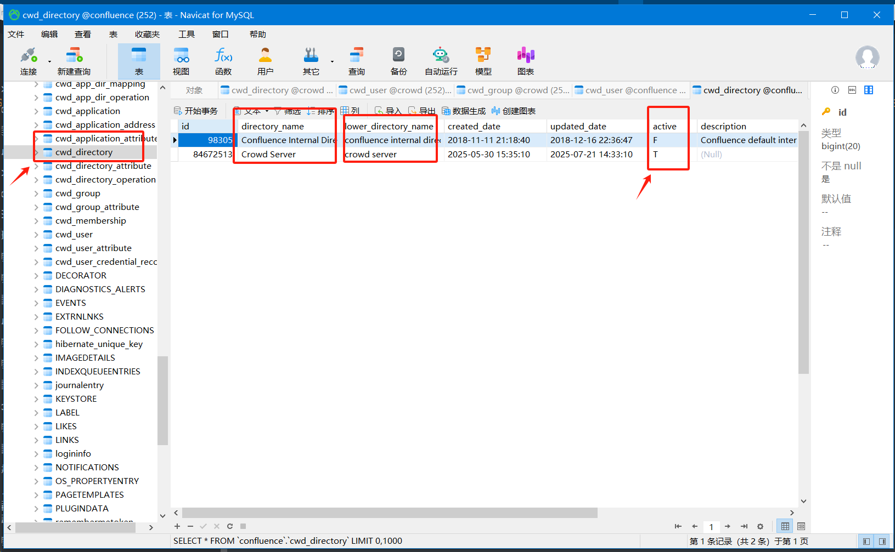

### 2. 忘记jira、confluence、bitbucket管理员密码

> 数据库中的加密方式都是{PKCS5S2}，如果是别的则用对应的。老版本可能会使sha1
>
> 这里统一改为`{PKCS5S2}ltrb9LlmZ0QDCJvktxd45WgYLOgPt2XTV8X7av2p0mhPvIwofs9bHYVz2OXQ6/kF`
>
> 对应密码是**Ab123456**
>
> 如果你想客制化的自己改为admin或者123456。可以用PKCS5S2加密一下这些字符串，但我并不推荐这么做，太过简单**可能**会过不了密码策略，并导致就算你改成功了也登录不上。

1. 先去实现上面第一点**1. jira、confluence、bitbucket忘记添加crowd中的某个用户作为管理员。或者想要通过初始管理员账户登录对应网站**的步骤
2. 找到`cwd_user`表，找到管理员账户，一般是第一个。

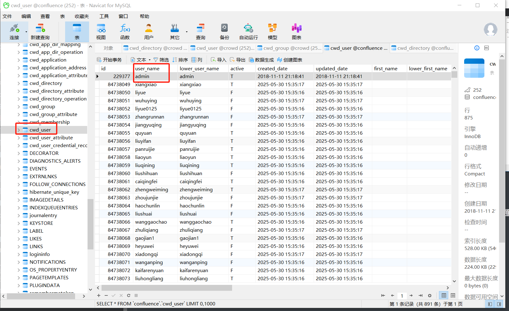

3. 找到`credntial`字段

修改为`{PKCS5S2}ltrb9LlmZ0QDCJvktxd45WgYLOgPt2XTV8X7av2p0mhPvIwofs9bHYVz2OXQ6/kF`并保存生效即可。

4. 这里也给出数据库的操作方式（可选）

```bash
docker exec -it mysql57 bash  # 可选
mysql -uroot -p # 或者 对应的数据库角色例如：mysql -ujira -p
# 输入对应用户密码
USE jiradb;  # 使用对应平台的数据库
UPDATE cwd_user
SET credential='{PKCS5S2}ltrb9LlmZ0QDCJvktxd45WgYLOgPt2XTV8X7av2p0mhPvIwofs9bHYVz2OXQ6/kF'
WHERE user_name='admin' AND directory_id=1;
```

5. 重启即可。

### 3. 忘记crowd管理员密码

> 简化版的**忘记jira、confluence、bitbucket管理员密码**，只需修改数据库对应字段即可。

1. 找到`cwd_user`表，找到管理员账户，一般是第一个。

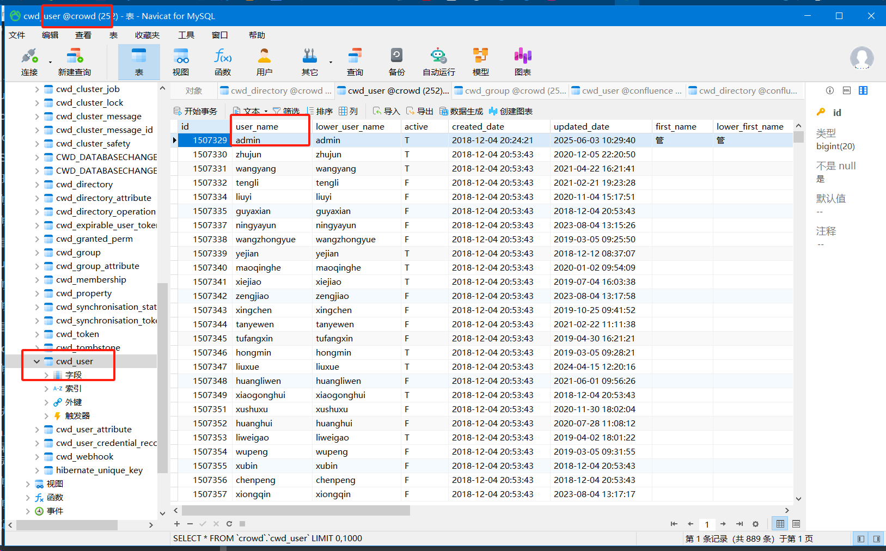

3. 找到`credntial`字段

修改为`{PKCS5S2}ltrb9LlmZ0QDCJvktxd45WgYLOgPt2XTV8X7av2p0mhPvIwofs9bHYVz2OXQ6/kF`并保存生效即可。

4. 这里也给出数据库的操作方式（可选）

```bash
docker exec -it mysql57 bash  # 可选
mysql -uroot -p # 或者 对应的数据库角色例如：mysql -ucrowd -p
# 输入对应用户密码
USE crowd;  # 使用对应平台的数据库
UPDATE cwd_user
SET credential='{PKCS5S2}ltrb9LlmZ0QDCJvktxd45WgYLOgPt2XTV8X7av2p0mhPvIwofs9bHYVz2OXQ6/kF'
WHERE user_name='admin' AND directory_id=1;
```

5. 重启即可。

### 4. 能够连接上crowd但是配置好SSO后仍然无法实现SSO，但是可以正常登录crowd。

> 如果是测试环境，没有真正的DNS服务器，使用的是本地解析则可能会出现。

> 简单解释下这SSO流程。以登录jira后自动登录confluence为案例。
>
> 1. ### **用户登录 JIRA**
>
>     - 浏览器提交用户名密码到 JIRA
>     - JIRA 调用 Crowd API 校验用户
>
>     ------
>
>     ### **2. Crowd 返回校验结果**
>
>     - 校验通过后，Crowd 返回用户信息
>     - 同时向浏览器发送 Crowd SSO Cookie（如：crowd.token_key）
>
>     ------
>
>     ### **3. 用户访问 Confluence**
>
>     - 浏览器带着同一个 Crowd SSO Cookie 请求 Confluence
>     - Confluence 收到请求后，通过 Crowd API 验证 cookie 有效性
>
>     ------
>
>     ### **4. 验证通过**
>
>     - Confluence 根据返回的用户信息在本地创建会话
>     - 用户免登录直接访问成功
>
>     ------
>
>     ### **核心原理：**
>
>     - 所有系统都通过 Crowd Server 做用户统一认证
>     - Crowd 签发的 SSO Cookie 设置在主域名（如 .suitbim.com）
>     - 浏览器自动携带 cookie 实现跨系统免登录

这其中每一步出现错误都无法实现SSO。

1. 第1、2步骤不太可能出现问题。

2. 第3步中，confluence服务器收到请求后需要向crowd服务器发送验证，这是服务器到服务器的对话，这其中的网络连接可能会出现问题。

    > 在开始的时候我们在客户端配置好了客户端的本地域名解析，例如Win10的C:\Windows\System32\drivers\etc\hosts文件，这意味着每次从客户端向服务器的请求能正常解析到服务器，然而服务器中配置的`/etc/hosts`文件可能没有这个域名到IP的解析，导致第3步骤出现错误，进而导致sso失败。

解决方式就是在`/etc/hosts`中添加一个 本地crowd域名解析

```bash
192.168.99.114 crowd.regenblogs.fun
```

