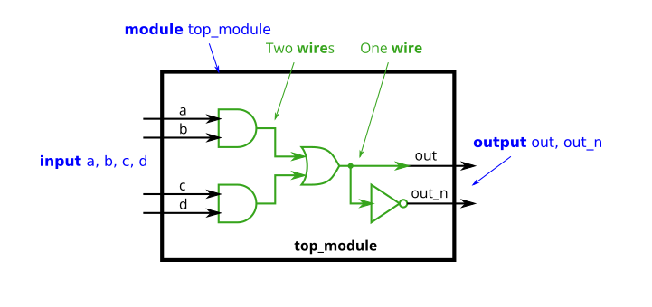
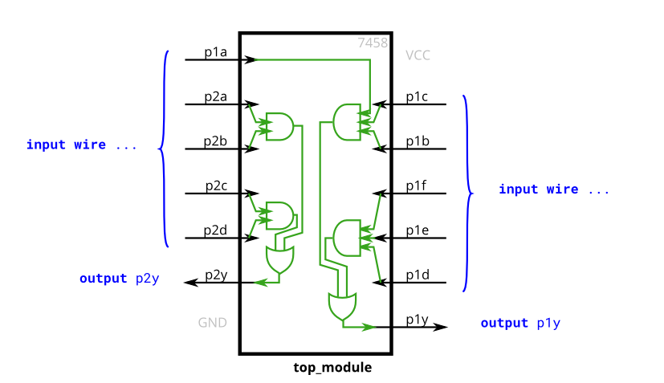
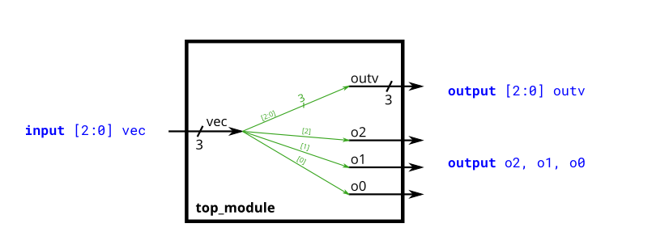
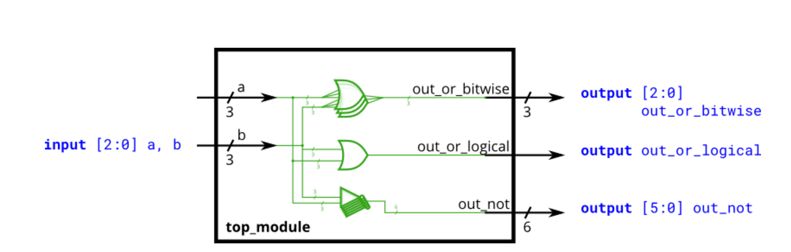

# Verilog Language

 基于HDLbits

## Basics

* **bitwise** and **logical**

    * bitwise-NOT (`~`) and logical-NOT (`!`)

        > ### Bitwise-NOT (`~`)
        >
        > - **Operation**: The bitwise-NOT operator performs a bitwise inversion on its operand. This means that each bit of the operand is flipped; `0` becomes `1` and `1` becomes `0`.
        > - **Usage**: It is used when you need to invert the bits of a binary number or a vector.
        >
        > ### Logical-NOT (`!`) 
        >
        > - **Operation**: The logical-NOT operator evaluates the logical value of its operand. It converts `0` to `1` and any non-zero value to `0`.
        > - **Usage**: It is used when you want to negate a condition or expression. This is typically used in control flow statements like `if` or `while`.

    * bitwise-AND (`&`) and logical-AND (`&&`)

### Norgate

```verilog
module top_module( 
    input a, 
    input b, 
    output out );
    assign out=~(a|b);
endmodule
```


### Xnorgate

```verilog
module top_module( 
    input a, 
    input b, 
    output out );
    assign out=~(a^b);
endmodule
```

### Wire decl



```verilog
`default_nettype none
module top_module(
    input a,
    input b,
    input c,
    input d,
    output out,
    output out_n   ); 
wire a_and_b,c_and_d;
    assign a_and_b=a&b;
    assign c_and_d=c&d;
    assign out=a_and_b| c_and_d;
    assign out_n=~out;
endmodule
```

### 7458



```verilog
module top_module ( 
    input p1a, p1b, p1c, p1d, p1e, p1f,
    output p1y,
    input p2a, p2b, p2c, p2d,
    output p2y );
wire and_1,and_2,and_3,and_4;
    assign and_1=p2a&p2b,
    and_2=p1a&p1b&p1c,
    and_3=p2d&p2c,
    and_4=p1f&p1d&p1e;
    assign p2y=and_1|and_3,p1y=and_2|and_4;
endmodule
```


## Vectors

### Vector 0



```verilog
module top_module ( 
    input wire [2:0] vec,
    output wire [2:0] outv,
    output wire o2,
    output wire o1,
    output wire o0  ); // Module body starts after module declaration
assign outv=vec;
    assign o0=vec[0];
    assign o1=vec[1];
    assign o2=vec[2];
endmodule
```

### Vector 1

#### Declaring Vectors

```verilog
wire [7:0] w;         // 8-bit wire
reg  [4:1] x;         // 4-bit reg
output reg [0:0] y;   // 1-bit reg that is also an output port (this is still a vector)
input wire [3:-2] z;  // 6-bit wire input (negative ranges are allowed)
output [3:0] a;       // 4-bit output wire. Type is 'wire' unless specified otherwise.
wire [0:7] b;         // 8-bit wire where b[0] is the most-significant bit.
```

Build a combinational circuit that splits an input half-word (16 bits, [15:0] ) into lower [7:0] and upper [15:8] bytes.

#### Module Declaration

```
`default_nettype none     // Disable implicit nets. Reduces some types of bugs.
module top_module( 
    input wire [15:0] in,
    output wire [7:0] out_hi,
    output wire [7:0] out_lo );
```

```verilog
`default_nettype none     // Disable implicit nets. Reduces some types of bugs.
module top_module( 
    input wire [15:0] in,
    output wire [7:0] out_hi,
    output wire [7:0] out_lo );
    assign out_lo=in[7:0];
    assign out_hi=in[15:8];
    
endmodule
```

### Vector 2

A 32-bit vector can be viewed as containing 4 bytes (bits [31:24], [23:16], etc.). Build a circuit that will reverse the *byte* ordering of the 4-byte word.

```
AaaaaaaaBbbbbbbbCcccccccDddddddd => DdddddddCcccccccBbbbbbbbAaaaaaaa
```

This operation is often used when the [endianness](https://en.wikipedia.org/wiki/Endianness) of a piece of data needs to be swapped, for example between little-endian x86 systems and the big-endian formats used in many Internet protocols.

```verilog
module top_module( 
    input [31:0] in,
    output [31:0] out );//

    // assign out[31:24] = ...;
    assign out[31:24]=in[7:0];
    assign out[23:16]=in[15:8];
    assign out[15:8]=in[23:16];
    assign out[7:0]=in[31:24];
endmodule
```

### Vectorgates



```verilog
module top_module( 
    input [2:0] a,
    input [2:0] b,
    output [2:0] out_or_bitwise,
    output out_or_logical,
    output [5:0] out_not
);
assign out_or_bitwise=a|b;
assign out_or_logical = |(a | b);
assign out_not[2:0]=~a;
assign out_not[5:3]=~b;
endmodule

```

### Gates4

```verilog
module top_module( 
    input [3:0] in,
    output out_and,
    output out_or,
    output out_xor
);
assign out_and=&in;
    assign out_or=|in;
    assign out_xor=^in;
endmodule

```


### Vector3

```verilog

```


## Modules


## Procedures


## Other features

