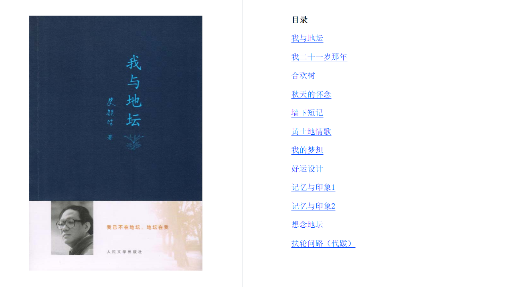

# 《我与地坛》

## 史铁生

第一次看的时候只是浅浅的被触动，近来书荒再次拿起这本书，读第一段的时候眼睛就莫名其妙地湿润了。我一个字一个字的读，慢慢地读，地铁上的嘈杂早已消失不见，仿佛按下了禁音键。太阳在远处落下，此时读到

> 但是太阳，它每时每刻都是夕阳也都是旭日。当它熄灭着走下山去收尽苍凉残照之际，正是它在另一面燃烧着爬上山巅布散烈烈朝辉之时。那一天，我也将沉静着走下山去，扶着我的拐杖。有一天，在某一处山洼里，势必会跑上来一个欢蹦的孩子，抱着他的玩具。
>
> 当然，那不是我。
>
> 但是，那不是我吗？

我感受到了一种与作者的联系，与世界的联系。

> 我真想告诫所有长大了的男孩子，千万不要跟母亲来这套倔强，羞涩就更不必，我已经懂了可我已经来不及了。

>但是太阳，它每时每刻都是夕阳也都是旭日。当它熄灭着走下山去收尽苍凉残照之际，正是它在另一面燃烧着爬上山巅布散烈烈朝辉之时。那一天，我也将沉静着走下山去，扶着我的拐杖。有一天，在某一处山洼里，势必会跑上来一个欢蹦的孩子，抱着他的玩具。
>当然，那不是我。
>但是，那不是我吗？
>宇宙以其不息的欲望将一个歌舞炼为永恒。这欲望有怎样一个人间的姓名，大可忽略不计。

>  我常觉得这中间有着宿命的味道：仿佛这古园就是为了等我，而历尽沧桑在那儿等待了四百多年。
> 它等待我出生，然后又等待我活到最狂妄的年龄上忽地残废了双腿。四百多年里，它一面剥蚀了古殿檐头浮夸的琉璃，淡褪了门壁上炫耀的朱红，坍圮了一段段高墙又散落了玉砌雕栏，祭坛四周的老柏树愈见苍幽，到处的野草荒藤也都茂盛得自在坦荡。这时候想必我是该来了。十五年前的一个下午，我摇着轮椅进入园中，它为一个失魂落魄的人把一切都准备好了。那时，太阳循着亘古不变的路途正越来越大，也越红。在满园弥漫的沉静光芒中，一个人更容易看到时间，并看见自己的身影。

> 这样想了好几年，最后事情终于弄明白了：一个人，出生了，这就不再是一个可以辩论的问题，而只是上帝交给他的一个事实；上帝在交给我们这件事实的时候，已经顺便保证了它的结果，所以死是一件不必急于求成的事，死是一个必然会降临的节日。这样想过之后我安心多了，眼前的一切不再那么可怕。

>  多年来我头一次意识到，这园中不单是处处都有过我的车辙，有过我的车辙的地方也都有过母亲的脚印。

> 什么意义都不是，就掉进昆德拉所说的“生命不能承受之轻”。你是一个什么呢？生命算是个什么玩意儿呢？轻得称不出一点儿重量你可就要消失。我向L讨回那件东西，归途中的惶茫因年幼而无以名状，如今想来，分明就是为了一个“轻”字：珍宝转眼被处理成垃圾，一段生命轻得飘散了，没有了，以为是什么原来什么也不是，轻易、简单、灰飞烟灭。一段生命之轻，威胁了生命全面之重，惶茫往灵魂里渗透：是不是生命的所有段落都会落此下场啊？人的根本恐惧就在这个“轻”字上，比如歧视和漠视，比如嘲笑，比如穷人手里作废的股票，比如失恋和死亡。轻，最是可怕。

>  一代人与一代人的历史是不同的，这是代沟的永恒保障。沟不是坏东西，有山有水就有沟，地球上如果都是那么平展展的，虽然希望那都是良田但事实那很可能全是沙漠。

>约翰逊什么时候愿意回来，我们都会欢迎他，不管他做错了什么事，他都是牙买加的儿子。”这几句话让我感动至深。难道我们不该对灵魂有了残疾的人，比对肢体有了残疾的人，给予更多的同情和爱吗？

> 所谓好运，所谓幸福，显然不是一种客观的程序，而完全是心灵的感受，是强烈的幸福感罢了。幸福感，对了。没有痛苦和磨难你就不能强烈地感受到幸福，对了。那只是舒适只是平庸，不是好运不是幸福，这下对了。

>  你热爱音乐，古典的交响乐，现代的摇滚乐，温文尔雅的歌剧清唱剧，粗犷豪放的民谣村歌，乃至悠婉凄长的叫卖，孤零萧瑟的风声，温馨闲适的节日的音讯，你都听得心醉神迷，听得怆然而沉寂，听出激越和威壮，听到玄缈与空冥，你真幸运，生存之神秘注入你的心中使你永不安规守矩。

>我希望，我把这个梦写出来，我的黑夜从此也有了皈依了。

>  历史的每一瞬间，都有无数的历史蔓展，都有无限的时间延伸。我们生来孤单，无数的历史和无限的时间因破碎而成片断。互相埋没的心流，在孤单中祈祷，在破碎处眺望，或可指望在梦中团圆。记忆，所以是一个牢笼。印象是牢笼以外的天空。

