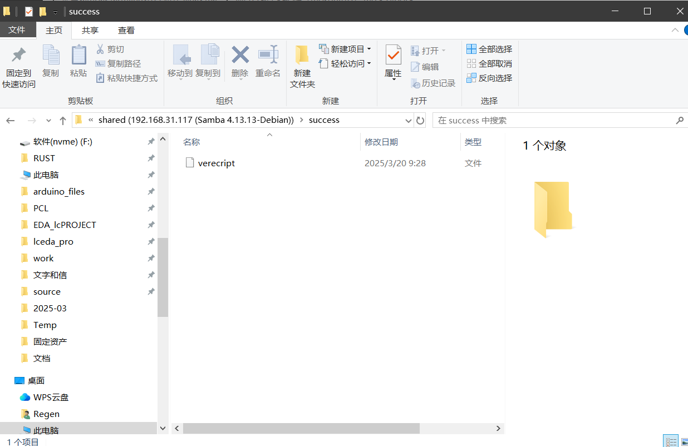
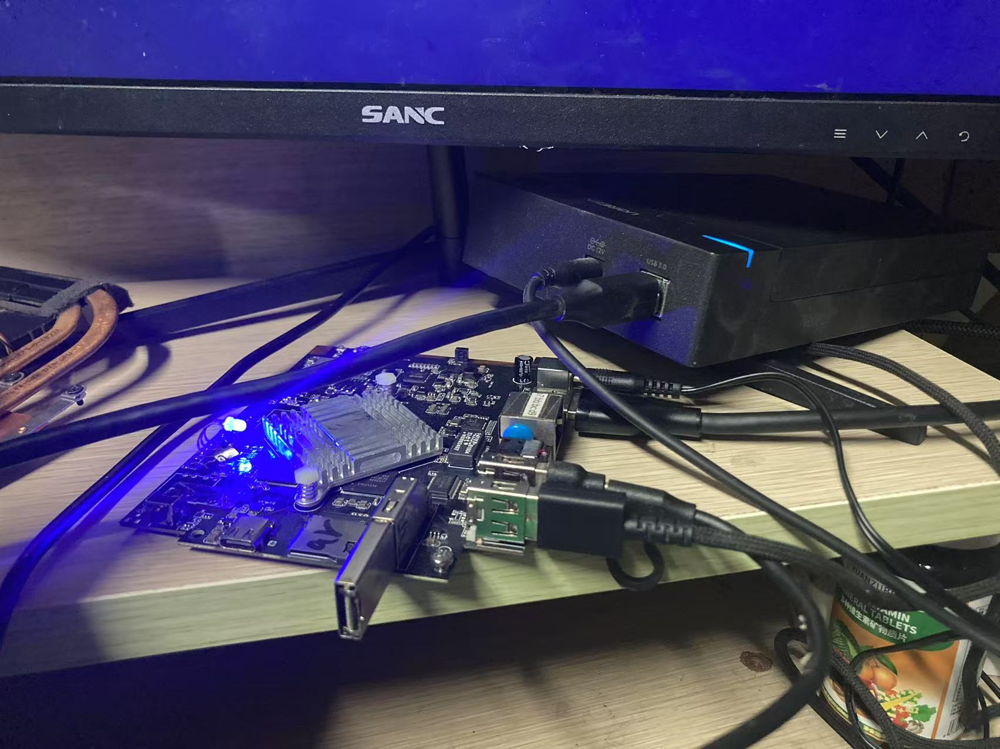
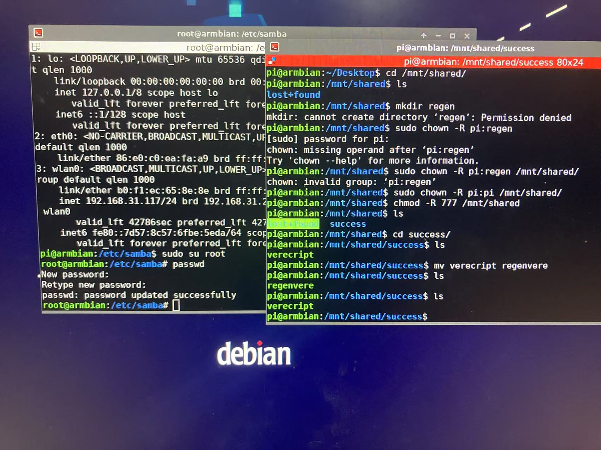
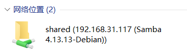

# 使用samba将armlinux小主机作为nas

## 	先上结果！







​	arm小主机为rk3399 4+32g（70块钱捡的二手），作为nas主控完全够用。

## 部署过程

​	本来想把自己那块2t的机械硬盘改为共享盘，可惜里面已经有300多g的图片了，因为涉及到了修改文件系统需要格式化所以先拿手头上的sata ssd做测试。没想到这个ssd挂了（悲），于是换成了最后的32g限制u盘了。

### 步骤-Liunx端

#### 1. 准备工作

 1. 插入U盘。

 2. ssh连接。

 3. 清空U盘并创建ext4文件系统。

    1. 找到插入的U盘

        `lsblk`可以找到插入的硬盘（会显示硬盘大小以及种类，例如我的就是sda 29.3g）

    2. 清空U盘并创建ext4文件系统。

        `sudo mkfs.ext4 /dev/sdb1`

 4. 创建一个用于共享的根文件夹并挂载U盘

    `sudo mkdir /mnt/shared`

    `sudo mount /dev/sda /mnt/shared`

 5. 赋予系统用户这个文件夹读写权限

    ```bash
    sudo chown -R pi:pi /mnt/shared  # 更改所有者为 regen
    sudo chmod -R 770 /mnt/shared          # 设置读写执行权限
    ```

    

#### 2. 安装以及配置Samba

1. 安装

```bash
sudo apt update
sudo apt upgrade
sudo apt install samba -y
```

2. 配置

    我这边是基于vscode的ssh扩展进行编辑配置的（非常好用）。

    `code /etc/samba/`

    然后编辑`smb.conf`，在末尾加上

    ```bash
    [shared]
       path = /mnt/shared
       browseable = yes
       writable = yes
       read only = no
       guest ok = no
       valid users = pi   # 当前Linux系统用户ID
       force create mode = 0660
       force directory mode = 2770
    ```

    保存后退出，然后配置一下密码。

    `sudo smbpasswd -a pi`输入两次想要设置的密码即可。

### 使用-Windows

很简单，win +R 输入

```bash
\\IP\shared
```

再输入账号密码即可。

需要注意的是samba的账号必须是Linux系统的用户。

### 然后就可以愉快的使用了！



