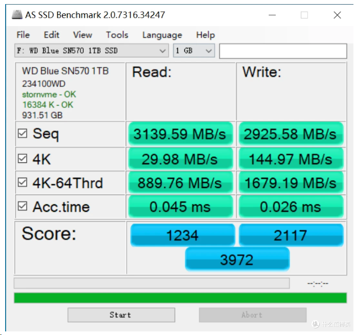

# 固态硬盘捡漏笔记

> 学习并且总结。

以最近的捡的垃圾为例，价格为110。

?????????截个图就降了1%健康度可还行

## 固态硬盘架构

### slc、mlc、tlc、qlc

### **1. 固态硬盘架构（NAND闪存类型）**

不同类型的NAND闪存直接影响SSD的**寿命、速度和价格**：

| **类型** | **每Cell存储位数** | **寿命（P/E cycles）** | **速度** | **价格** | **适用场景**       |
| :------- | :----------------- | :--------------------- | :------- | :------- | :----------------- |
| **SLC**  | 1 bit              | 50,000~100,000         | 最高     | 最贵     | 企业级、极端负载   |
| **MLC**  | 2 bits             | 3,000~10,000           | 高       | 较贵     | 高端消费级、工作站 |
| **TLC**  | 3 bits             | 500~3,000              | 中等     | 主流     | 普通用户、游戏     |
| **QLC**  | 4 bits             | 100~1,000              | 较低     | 最便宜   | 轻度使用、存储盘   |

**关键点**：

- **SLC/MLC**：适合高负载（数据库、视频编辑），但价格高。
- **TLC**：性价比最高，主流选择（如三星980 PRO、西数SN850）。
- **QLC**：适合低预算、大容量存储（如Intel 660p），但寿命短。

## 固态硬盘性能指标

| **参数**            | **单位** | **高端NVMe SSD（PCIe 4.0）** | **主流NVMe SSD（PCIe 3.0）** | **SATA SSD**      | **适用场景**                 |
| :------------------ | :------- | :--------------------------- | :--------------------------- | :---------------- | :--------------------------- |
| **SEQ读/写**        | MB/s     | 7,000 / 6,500                | 3,500 / 3,000                | 550 / 500         | 大文件传输（视频/游戏安装）  |
| **4K随机读/写**     | MB/s     | 60 / 180                     | 40 / 120                     | 30 / 80           | 系统响应、软件启动、游戏加载 |
| **4K-64Thrd读/写**  | MB/s     | 1,400 / 1,550                | 800 / 900                    | 100 / 150         | 多任务/虚拟机/数据库高并发   |
| **AccTime（延迟）** | µs       | 读: ~10 / 写: ~20            | 读: ~15 / 写: ~25            | 读: ~50 / 写: ~80 | 操作跟手度（游戏/实时编辑）  |

### 典型PCIE4.0固态性能测试

* 三星980pro 1T

* SN570 1T

## 固态硬盘参数指标

> NVMe 协议在控制器里专门定义了一个 **Log Page 0x02**（称为“SMART / Health Information Log”），固定长度 512 字节，用于报告设备健康状况。
>  这个 log page 通过 NVMe 命令 `Get Log Page` 获取。

以上面的硬盘为案例：

| ID   | 名称                     | 原始值           | 十进制    | 说明                                                         |
| ---- | ------------------------ | ---------------- | --------- | ------------------------------------------------------------ |
| 01   | 严重警告标志             | `000000000000`   | 0         | 没有警告，bit 0~4 都是0                                      |
| 02   | 综合温度                 | `000000000136`   | 0x136=310 | 按 NVMe 标准单位是 K，310-273=**37°C**（CrystalDiskInfo也显示37°C） |
| 03   | 可用备用空间             | `000000000064`   | 100       | 剩余可用备用空间 100%，非常健康                              |
| 04   | 可用备用空间阈值         | `00000000000A`   | 10        | 阈值 10%，低于就会触发告警                                   |
| 05   | 已用寿命百分比           | `000000000048`   | 72        | 表示 NAND 写入或擦写循环寿命已用 72%，还剩28%                |
| 06   | 读数据单位计数           | `00000001A1E30A` | 27466442  | 每单位=512,000字节，总读≈ 27466442×512,000=14,065,870,400,000字节≈**≈12.77TB** |
| 07   | 写数据单位计数           | `000000195BE26`  | 26586950  | ≈26586950×512,000=≈13,613,222,400,000字节≈**≈12.36TB**       |
| 08   | 主机读命令计数           | `000000139310F3` | 205795443 | 主机向 SSD 发出的读命令次数                                  |
| 09   | 主机写命令计数           | `0000015369EAC`  | 223971756 | 主机向 SSD 发出的写命令次数                                  |
| 0A   | 控制器忙碌时间           | `0000000009AC`   | 2476 分钟 | ≈41小时（SSD实际处于繁忙状态的总时长）                       |
| 0B   | 启动/关闭循环计数        | `0000000017C36`  | 97334     | 上电+关机次数                                                |
| 0C   | 通电时间（小时）         | `000000001E7F`   | 7807小时  | ≈325天                                                       |
| 0D   | 不安全关机计数           | `000000015612`   | 87442     | ⚠ 极高：代表87442次掉电或非正常关机（不一定坏，但风险大）    |
| 0E   | 媒体与数据完整性错误计数 | `00000000000`    | 0         | 没有检测到硬件级坏块或丢失                                   |
| 0F   | 错误日志条目数           | `000000000B83`   | 2947      | SSD控制器内部记录的错误信息次数                              |

## 固态硬盘挑选技巧总结

> 偏个人向

1. 全新盘(参数几乎都是0)默认垃圾，直接pass。
2. 看0E:媒体与数据完整性错误计数，爆了也直接pass。
3. 看03，太低直接pass，低于20直接pass。
4. 判断架构slc、mlc、tlc、qlc

#### **不同NAND类型的P/E Cycle对比**

| **NAND类型** | **P/E Cycles（典型值）** | **理论寿命举例（512GB SSD）** |
| :----------- | :----------------------- | :---------------------------- |
| **SLC**      | 50,000~100,000           | 可写入25,000~50,000TB         |
| **MLC**      | 3,000~10,000             | 1,500~5,000TB                 |
| **TLC**      | 500~3,000                | 250~1,500TB                   |
| **QLC**      | 100~1,000                | 50~500TB                      |

>  **注**：实际寿命还受**写入放大（WA）**、**温度**、**主控算法**影响。

#### **计算SSD总寿命（TBW）？**

- **公式**：

    TBW=SSD容量×P/E Cycles×写入放大系数（WA）1024TBW=SSD容量×P/E Cycles×1024写入放大系数（WA）

    - **写入放大（WA）**：通常1.2~3.0（随机写入越多，WA越高）。
    - **示例**：
        1TB TLC SSD（P/E=1,000，WA=1.5）的TBW = 1024×1000×1.51024=1,500TB1024×1000×10241.5​=1,500*TB*。

5. 对比写入量判断

我的架构是tlc，是不是都无所谓了，写入量比较少，虽然不安全关机多，但是个人感觉无所谓，可能是当移动硬盘用的多。看着心烦的话不看就行了qwq
