# 节奏型武器库

<iframe src="//player.bilibili.com/player.html?isOutside=true&aid=1852844021&bvid=BV1Mp421977n&cid=1496964053&p=1" scrolling="no" border="0" frameborder="no" framespacing="0" allowfullscreen="true"></iframe>

【【吉他就该这么玩】节奏太单调？学会它你能弹所有流行歌！扫弦&分解节奏型汇总 伴奏武器库】 https://www.bilibili.com/video/BV1Mp421977n/?share_source=copy_web&vd_source=7a16ec5db4e5a23503ea8070ff118363

## 分解和弦

使用的和弦

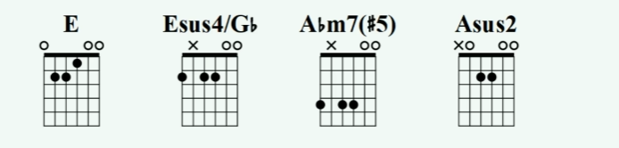

* 节奏型

### 

1. 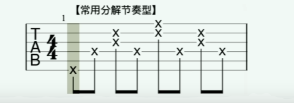

2. 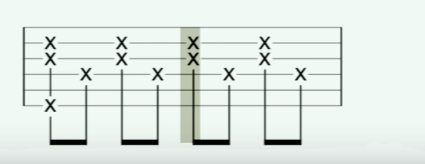

3. 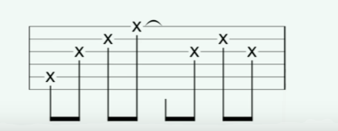

4. 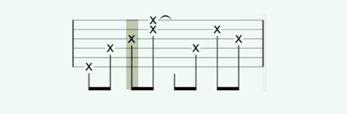

5. 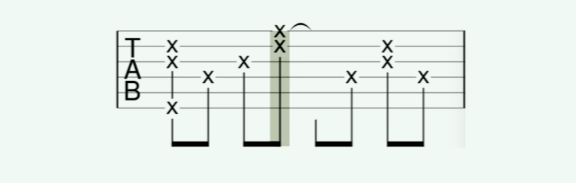

6. 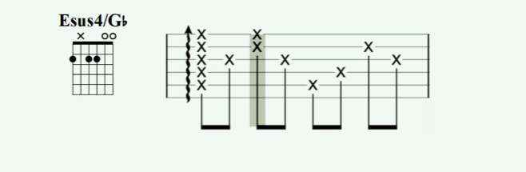

7. 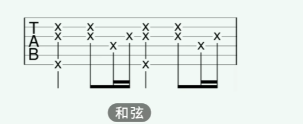

8. 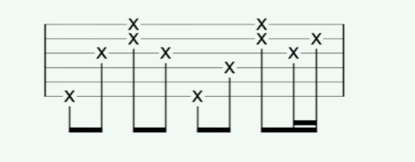

9. 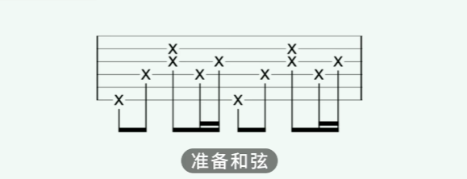

10. 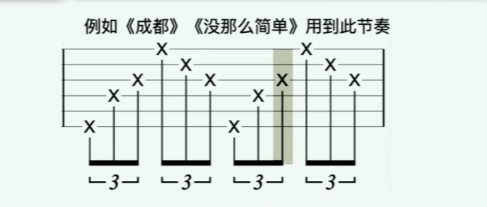

11. 

12. 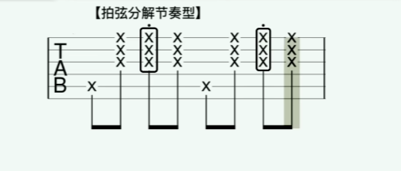

13. 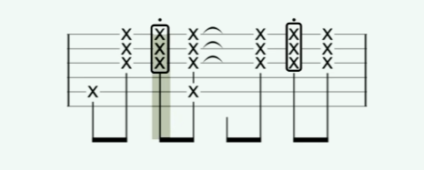

14. 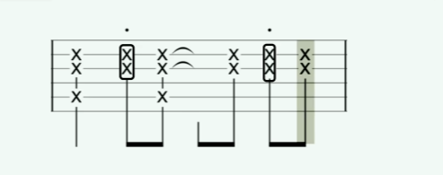

15. 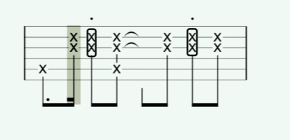

16. 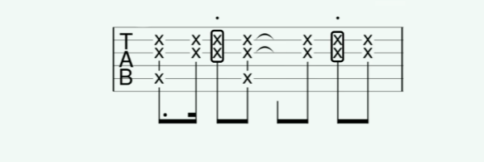

17. 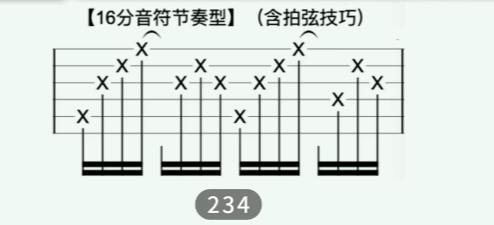

18. 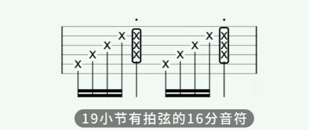

19. 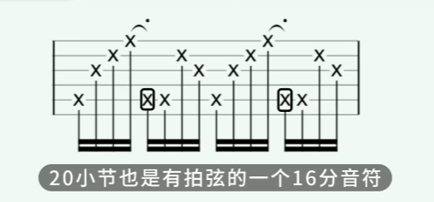

    

## 扫弦节奏型

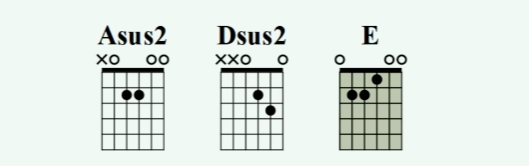

1. 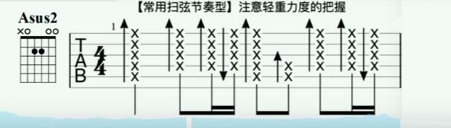

2. 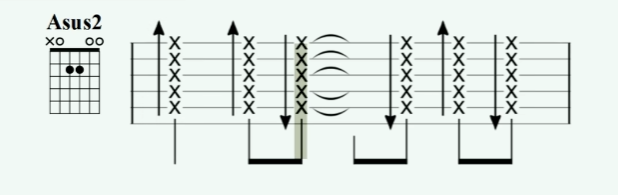

3. 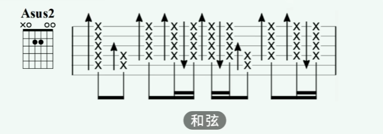

4. 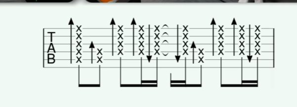

5. 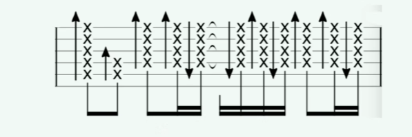

6. 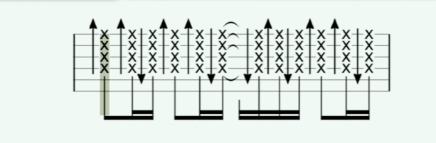

7. 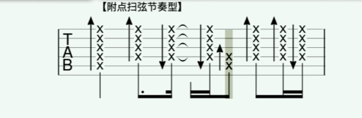

8. 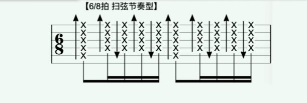

9. 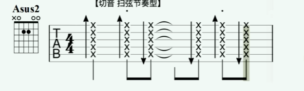

10. 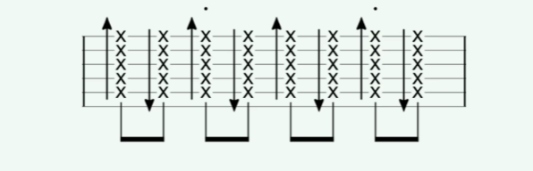

11. 

    
