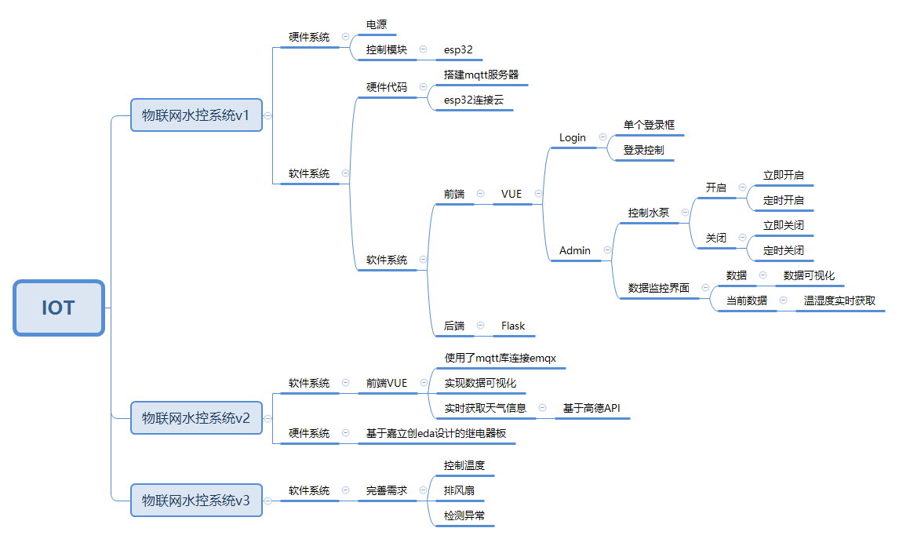

# 技术栈

## 1. 软件系统

* Flask+VUE+MySQL
* Python脚本使用Mqtt协议传送命令以及数据

## 2. 硬件系统

* esp8266连接WIFI以及MQ服务器
* 220v水泵

# 实现过程

## 1. esp8266连接emqx服务器

* CA认证关键代码

```cpp

// WiFi and MQTT client initialization
BearSSL::WiFiClientSecure espClient;
PubSubClient mqtt_client(espClient);

// SSL certificate for MQTT broker
// Load DigiCert Global Root G2, which is used by EMQX Public Broker: broker.emqx.io
static const char ca_cert[]
PROGMEM = R"EOF(
-----BEGIN CERTIFICATE-----
***********ca CRT***********

-----END CERTIFICATE-----
)EOF";

```


## 2. esp8266收发指令并进行作业

* 将payload输出到字符数组，在进行对比后分支操作


```cpp

const char *mqtt_start = "start";
const char *mqtt_stop = "stop";

void mqttCallback(char *topic, byte *payload, unsigned int length) {
    Serial.print("Message received on topic: ");
    Serial.print(topic);
    Serial.print("]: ");
    char judge[5];
    for (int i = 0; i < length; i++) {
        if(i>=12){
            judge[i-12]=payload[i];
        }
        Serial.print((char) payload[i]);
    }
    if(judgeEqual(judge,mqtt_start,5)){
      Serial.print("ssssssssssssssssssssssssssssssssuccessful");
        digitalWrite(16, HIGH);  // turn the LED on (HIGH is the voltage level)                    // wait for a second
    }
        if(judgeEqual(judge,mqtt_stop,4)){
      Serial.print("ssssssssssssssssssssssssssssssssuccessful");
        digitalWrite(16, LOW);  // turn the LED on (HIGH is the voltage level)                    // wait for a second
    }
    Serial.println();
}
bool judgeEqual(char *str1,const char *str2,int length){

  for(int i=0;i<length;i++){
    if(str1[i]!=str2[i]) return false;
  }
  return true;
}
```


## 3. 搭建服务器并部署

* 无数据库的Flak+Vue项目部署

    1. 服务器的准备阶段 

        ```bash
        sudo apt install nginx -y # 安装nginx
        sudo aot install python3 python3-pip3 -y
        sudo pip3 install paho-mqtt Flask Flask-CORS
        ```

    2. 打包阶段

        ```bash
        cd frontend
        scp -r dist/ root@123.456.789.000:/var/www/vue-app
        spc -r backend/ root@123.456.789.000:/var/www/flask-app
        ```

        

    3. 启动阶段

    ```bash
    cd /etc/nginx/sites-available/default
    code .
    
    
    
    # 设置
    server {
        listen 80;
        server_name _;
    
        # 处理 Vue 前端
        location / {
            root /var/www/vue-app;   # Vue 静态文件的路径
            try_files $uri $uri/ /index.html;
        }
    
        # 处理 Flask 后端 API 请求
        location /api/ {
            proxy_pass http://127.0.0.1:5000;  # Flask 应用运行在本地的 5000 端口
            proxy_set_header Host $host;
            proxy_set_header X-Real-IP $remote_addr;
            proxy_set_header X-Forwarded-For $proxy_add_x_forwarded_for;
            proxy_set_header X-Forwarded-Proto $scheme;
        }
    }
    
    ```
    
    

## 4. 编写命令发送脚本，其他功能脚本

见下

# 进度追踪


## 前端基本功能完成

* 登录

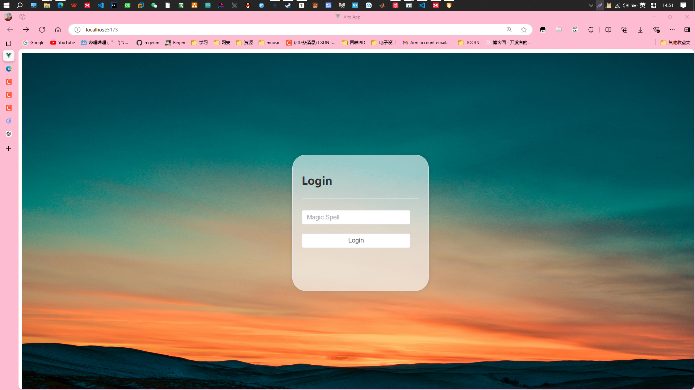

* 先实现基本的点灯功能（开关）

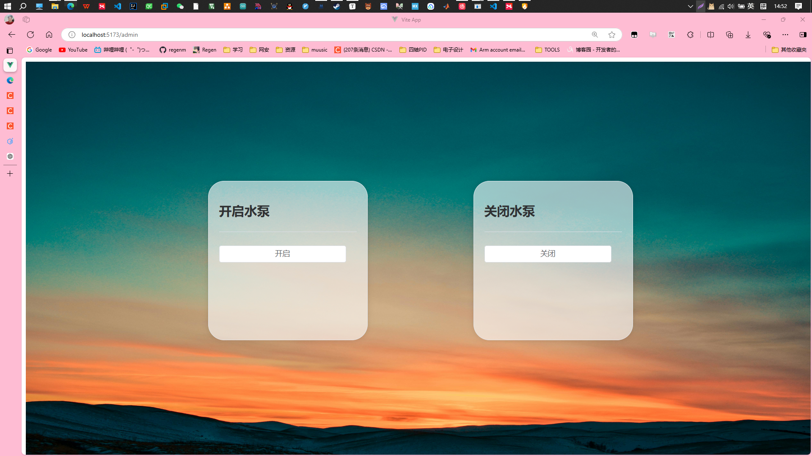


## 后端功能

* 提供密码认证

​	因为是私人使用，所以只在后端检验密码

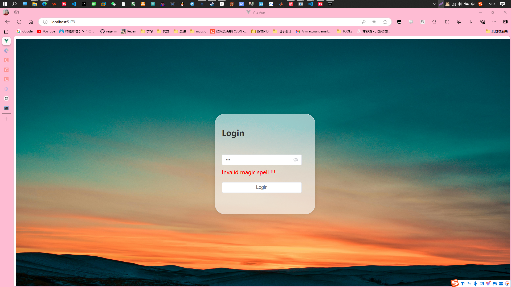


* 获取命令信息

## 


## 脚本运行

前后端都做得基本大差不差了。接下来开始Mqtt基于Python的脚本。

* 简单脚本的运行

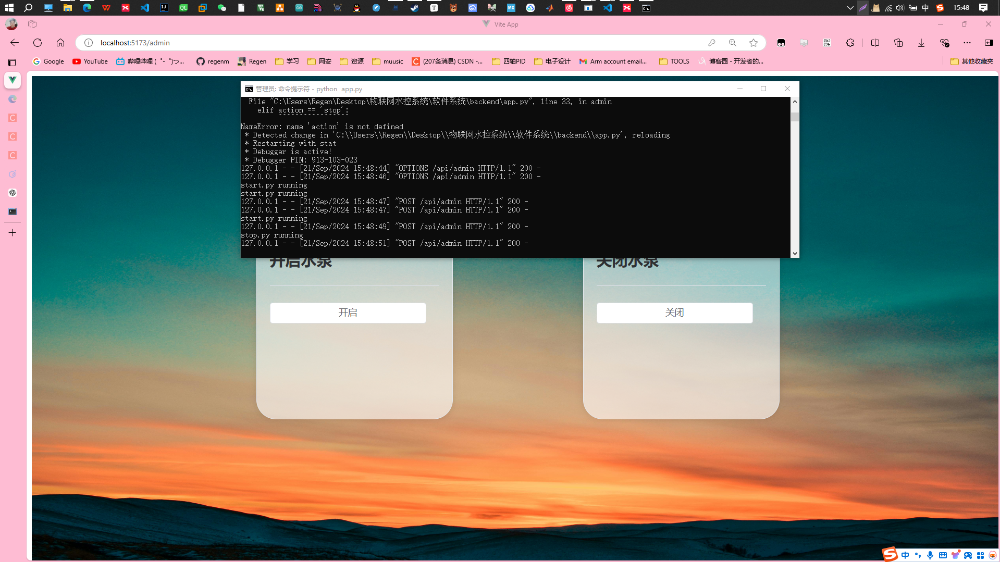

* 最终脚本的运行

* 很烦mqtt的版本问题 记得选择version

* mqtt脚本直接运行可以成功，但是使用`subprocess`会失败就是因为版本问题。

以下是两种情况都能运行的代码

```python
# mqtt_publish.py
import paho.mqtt.client as mqtt
import ssl
import time
import json

print("mqtt_publish.py running")

def on_connect(client, userdata, flags, rc):
    print("Connected with result code " + str(rc))
    message = "{\n\"  msg\": \"start\"\n}"
    client.publish("/esp8266/test", message)
    print(f"Published: {message}")
    time.sleep(1)  # Wait a second before sending the next message


# Create an MQTT client instance without callback_api_version
client = mqtt.Client(mqtt.CallbackAPIVersion.VERSION1,client_id="", clean_session=True, userdata=None, protocol=mqtt.MQTTv311,)

client.on_connect = on_connect

client.tls_set(ca_certs="emqxsl-ca.crt", certfile=None, keyfile=None, tls_version=ssl.PROTOCOL_TLSv1_2)

broker_address = "url"
broker_port = 8883
username = "regen"
password = "123456"

client.username_pw_set(username, password)
client.connect(broker_address, broker_port, keepalive=60)
client.loop_start()

time.sleep(6)  # Wait a little longer to ensure all messages are sent

client.loop_stop()
client.disconnect()

```

* 成功截图


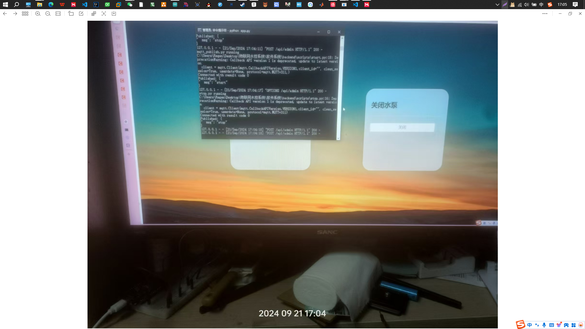

## Final!!!!!!部署到服务器


* 发现一个神器`remote-ssh`，一个vscode插件，可以直接连接服务器，使用vscode进行部署和编辑。


* 部署flask后端
    1. 只需要传源代码，一开始不小心把虚拟环境也传上去了qwq
    2. 使用 `gunicorn` 启动 Flask 应用
* 部署前端VUE
    1. 使用打包工具`npm run build`
    2. 使用nginx进行的代理

## 结果

每个人都可以访问网站 [WaterPump](142.171.33.151)来控制水泵了！

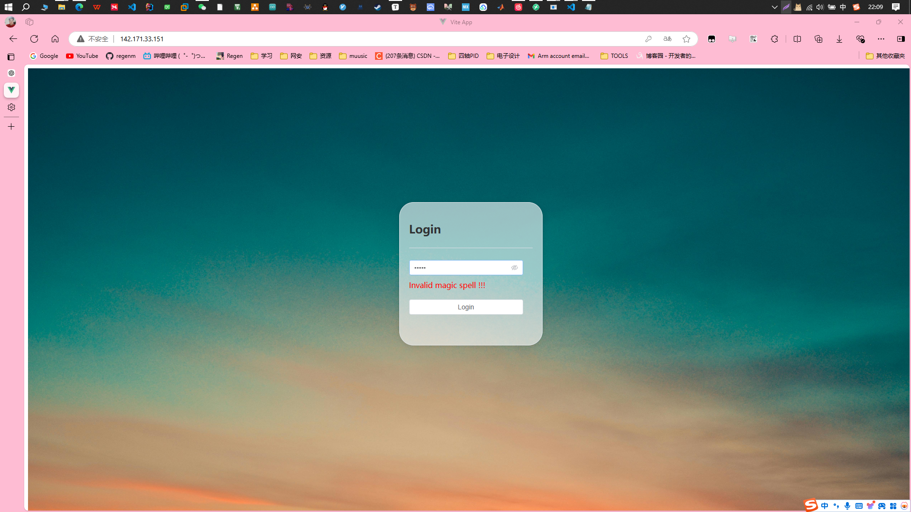

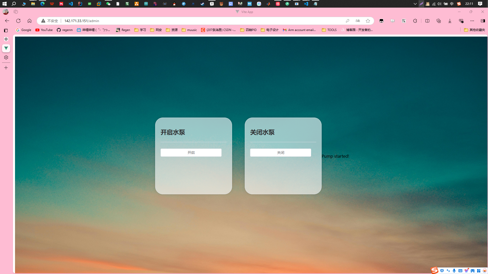


# 报错

1. VUE前端没有加入登录认证导致每个人都可以`IP/admin`进入后台，登录界面形同虚设
2. Linux(ubuntu)使用`subprocess`运行脚本需要加python版本`python3`
3. mqtt库函数参数需要加`CallbackAPIVersion`
4. 使用emqx服务器集群的CA认证

# 总结


​	这一次没有采用自己搭建的mqtt服务器，使用的是emqx的免费服务器集群，说实话有点麻烦，需要ca认证才能连接上。早知道就用自己之前搭建的服务器了。不过学到了新的东西，也是蛮不错的。	

​	接下来试试加上别的传感器，再写个dashboard，方便展示数据和发送命令。


# 升级----> V2.0

​	加入数据可视化显示以及实时显示当前数据的功能。


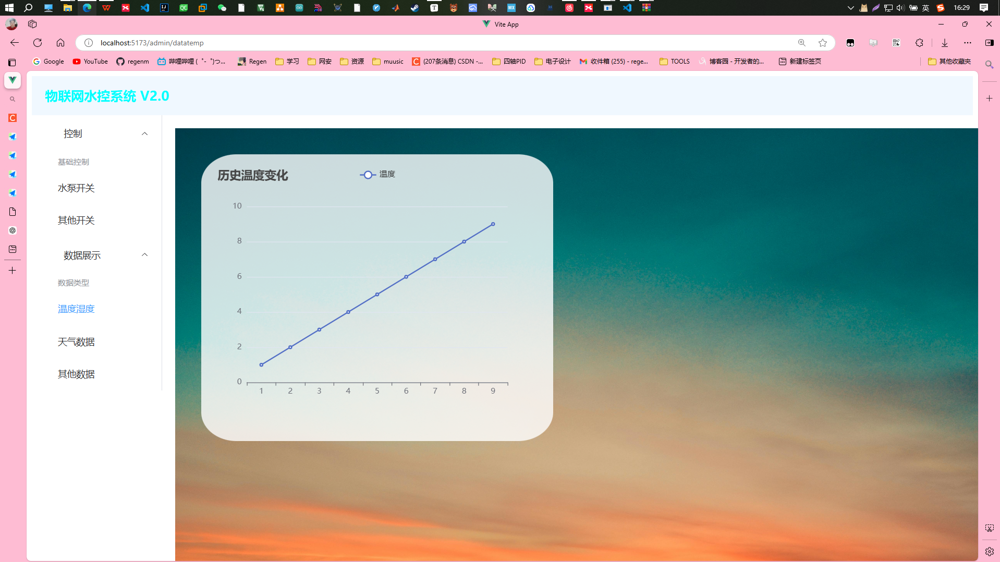

## 功能实现

### 1. 获取当地天气等数据

* **实现方法**

    ​	尝试使用现有的api，例如高德。

#### 高德api的使用    

> 1. 打开并注册[高德开放平台](https://lbs.amap.com/)
> 2. 进入[高德开发平台的控制台](https://console.amap.com/dev/key/app)
> 3. 创建**web服务**应用并获取 API Key
>
> 

```http
https://restapi.amap.com/v3/weather/weatherInfo?city=110101&key=<用户key>
```

 1. 参数的选择

    | **参数名** | **含义**         | **规则说明**                                                 | **是否必须** | **缺省值** |
    | ---------- | ---------------- | ------------------------------------------------------------ | ------------ | ---------- |
    | key        | 请求服务权限标识 | 用户在高德地图官网 [申请 web 服务 API 类型 KEY](https://lbs.amap.com/dev/) | 必填         | 无         |
    | city       | 城市编码         | 输入城市的 adcode，adcode 信息可参考 [城市编码表](https://lbs.amap.com/api/webservice/download) | 必填         | 无         |
    | extensions | 气象类型         | 可选值：base/allbase:返回实况天气all:返回预报天气            | 可选         | 无         |
    | output     | 返回格式         | 可选值：JSON,XML                                             | 可选         | JSON       |

 2. 返回案例结果，浦东新区为案例

    ```json
    {
        "status": "1",
        "count": "1",
        "info": "OK",
        "infocode": "10000",
        "lives": [
            {
                "province": "上海",
                "city": "浦东新区",
                "adcode": "310115",
                "weather": "阴",
                "temperature": "19",
                "winddirection": "西北",
                "windpower": "≤3",
                "humidity": "77",
                "reporttime": "2024-10-20 15:33:12",
                "temperature_float": "19.0",
                "humidity_float": "77.0"
            }
        ]
    }
    ```

#### 前端展示


### 2. 获取传感器数据（实时更新）

#### 思路

1. 使用Flask制作api。每次刷新即重新发送请求获取传感器数据。
2. 服务器获取到的数据存进MySQL数据库，然后每次请求则返回数据库最新数据
3. 使用实时通信技术，前端直接使用mqtt库，获取数据
    1. WebSocket
    2. ServerSentEvents


### 3. 数据可视化（折线图等方式）

已经崩溃了。

下图是VUE+MQTT.js的效果，可以直接从emqx获取数据，省去了get后端api的步骤，实时更新。

* 遇到的报错
    1. mqtt.js包版本问题
    2.  WebSocket over SSL 连接不上emqx
    3. 数据json化
    4. 官方项目和自己的项目各种包版本不同
* 涨的知识
    1. 一般前端使用WebSocket获取数据，后端用mqtts获取数据。
    2. github可以直接使用codespace！直接一步调试太厉害了。

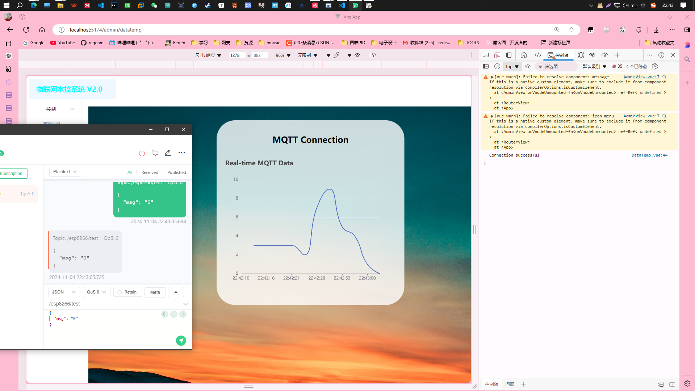


# 升级----> V3.0 

增加其他功能

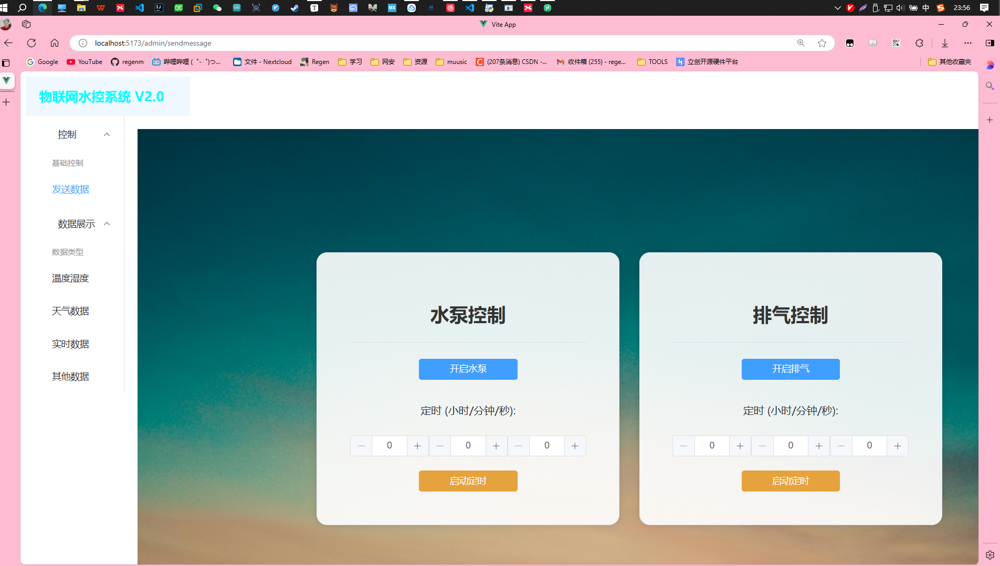


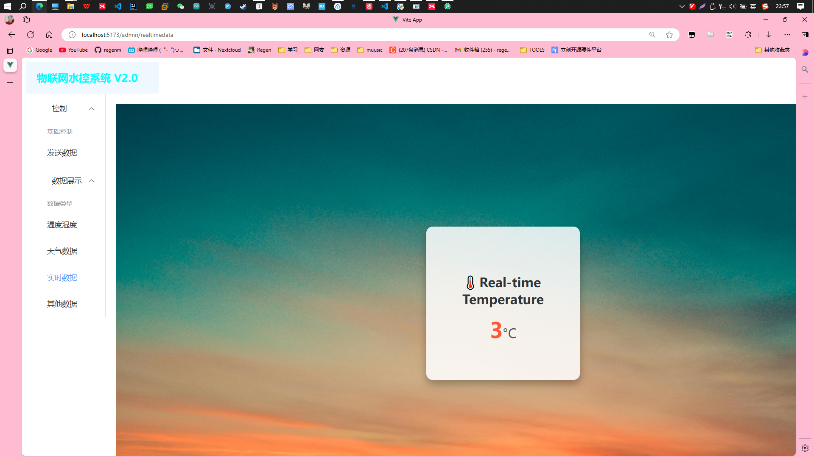

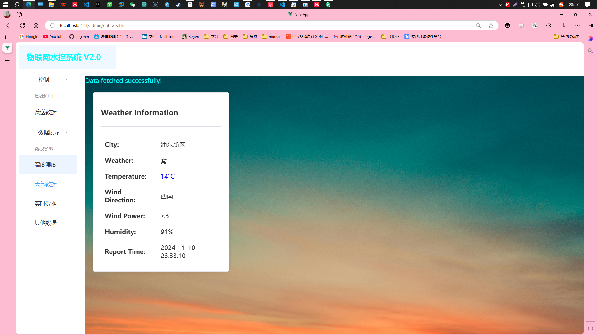
