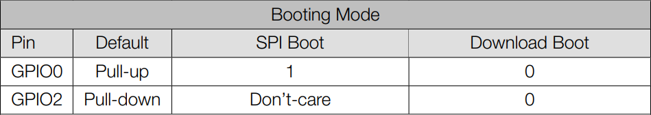
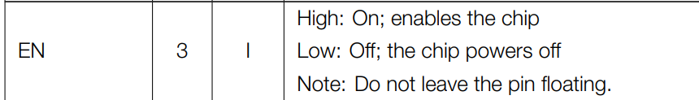
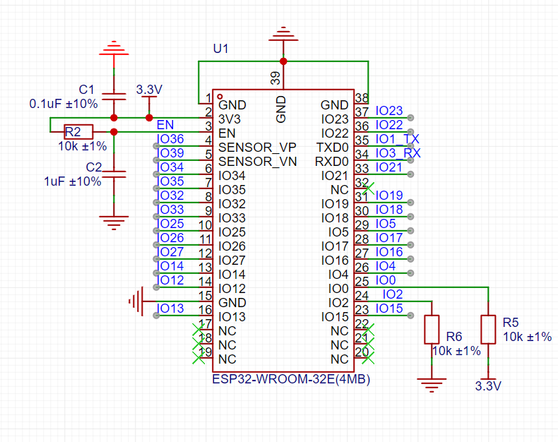
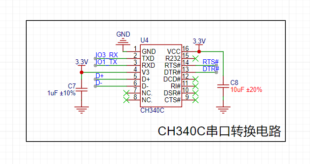
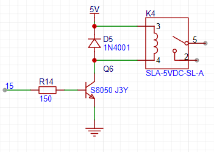

硬件部分实现记录

# PCB&电路图

## esp32-wroom-32E

### 下载电路

* 串口烧录
    * IO1（tx）&IO3（rx）：与CH340C连接

* 自动烧录

    * 烧录条件

        

    * 原理图

        

## CH340C

* RXD & TXD 串口输入输出

* D+ & D- USB  输入

* VCC

    > Positive power input terminal, requires an external 
    >
    > 0.1uF power decoupling capacitor. 
    >
    > 去耦电容（Decoupling Capacitor）是电子电路设计中常用的一种电容，主要用于稳定电源电压，减少电源噪声和干扰，确保电路的正常工作。

* V3 

    > When the power supply voltage is 3.3V, connect 
    >
    > VCC to input the external power supply. When the 
    >
    > power supply voltage is 5V, connect an external 
    >
    > decoupling capacitor with a capacity of 0.1uF. 
    >
    >  

*  **RTS# & DTR#**

    > 进行esp32的自动下载电路

    * DTR#

        > MODEM contact output signal, data terminal ready, 
        >
        > active low (high) 

    *  RTS# 

        > MODEM contact output signal, request to send, 
        >
        > active low (high) 

## 继电器模块

## PCB

 
