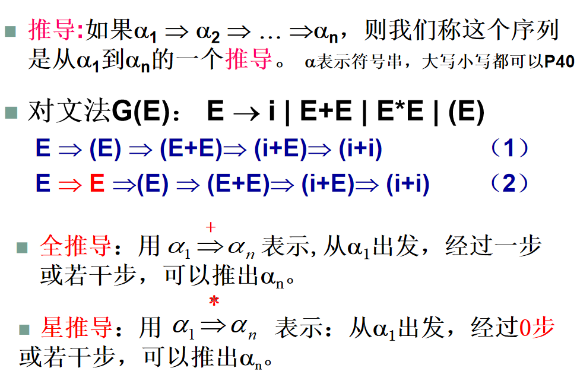
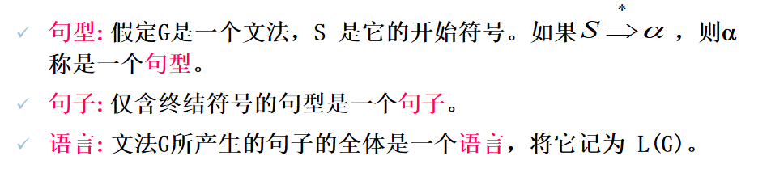
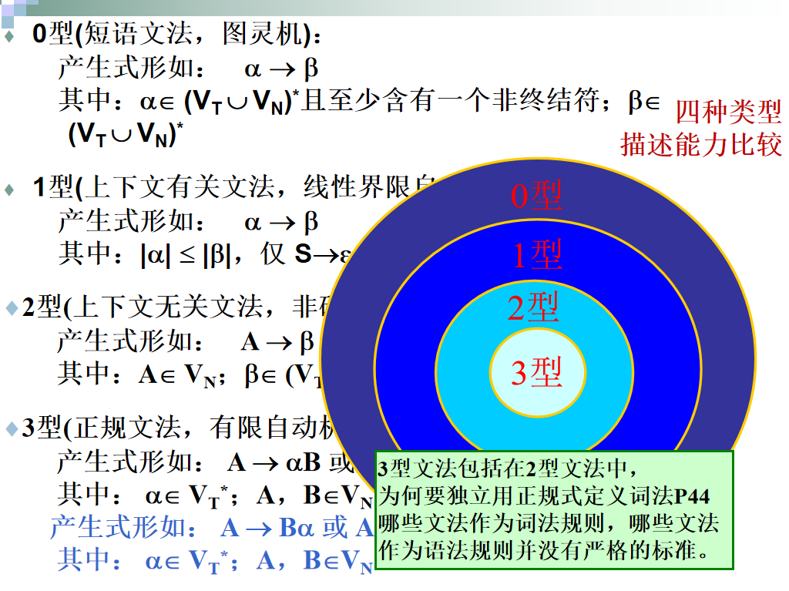
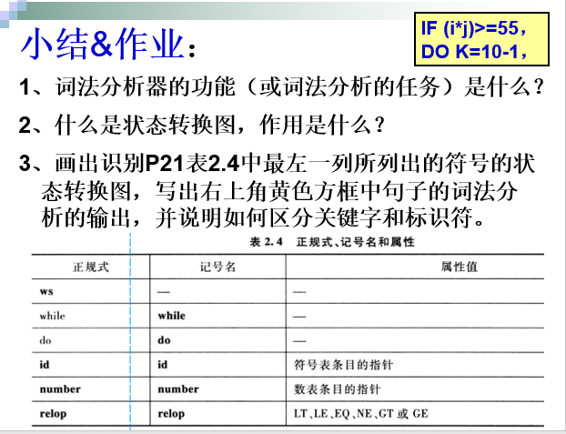
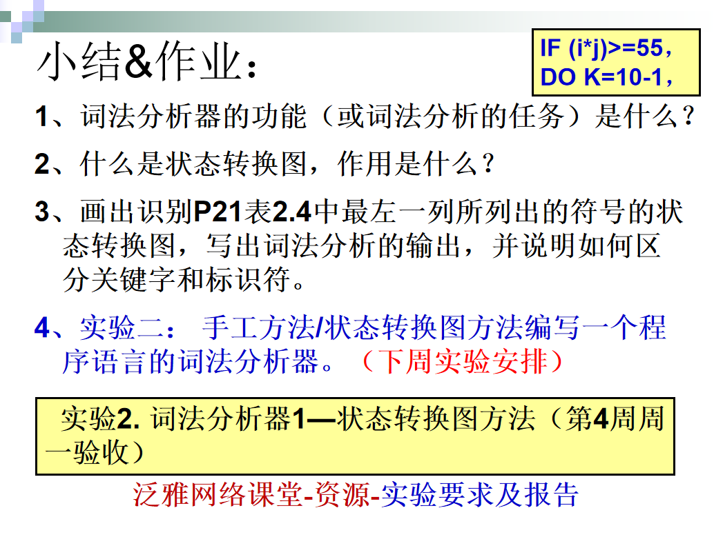
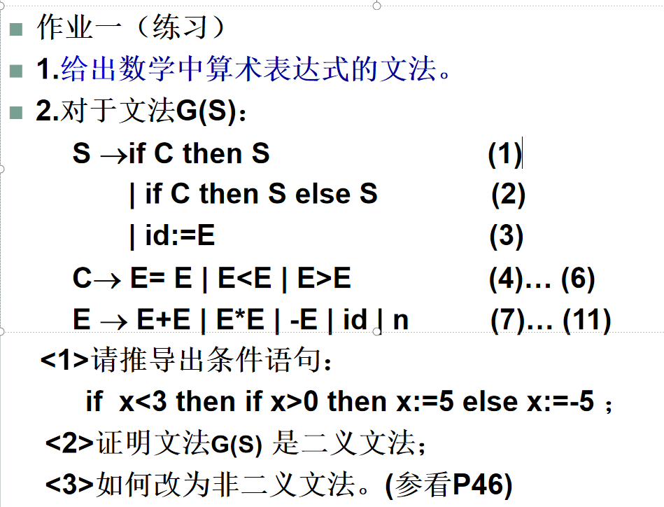
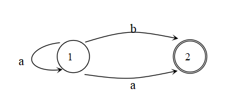

# **编译原理课程笔记**

# 第一章 引论

## 编译器概述 

* 翻译器:
    *  把某一种语言程序(称为源语言程序)等价地转换成另一种语言程序(称为目标语言程序)的程序
* 解释器：
    * 把源语言（高级语言）写的源程序作为输入，但不产生目标程序，而是边解释边执行源程序
* 编译器：
    * 把一种高级语言程序等价地转换成另一种低级语言程序(汇编语言或机器语言程序)的程序

### 编译前端与后端

* 编译前端：
    * 与源语言有关，如词法分析，语法分析，语义分析与中间代码产生，与机器无关的优化
* 编译后端：
    * 与目标机有关，与目标机有关的优化，目标代码产生

### 编译过程

1. 词法分析
2. 语法分析
3. 语义分析
4. 中间代码产生
5. 优化
6. 目标代码产生

#### 词法分析

任务: 输入源程序，对构成源程序的字符串进行扫描和分解，识别出一个个单词符号。依循的原则：构词规则描述工具：有限自动机

#### 语法分析

任务:在词法分析的基础上，根据语言的语法规则把单词符号串分解成各类语法单位。依循的原则：语法规则,语法树描述工具：上下文无关文法

#### 语义分析和中间代码产生

任务:对各类不同语法范畴按语言的语义进行初步翻译。--声明语句和操作语句依循的原则：语义规则中间代码:三元式，四元式，树形结构等

#### 优化

任务：对于前阶段产生的中间代码进行加工变换，以期在最后阶段产生更高效的目标代码。依循的原则：程序的等价变换规则

#### 目标代码产生

任务: 把中间代码变换成特定机器上的目标代码。依赖于硬件系统结构和机器指令的含义目标代码三种形式:绝对指令代码: 可直接运行 汇编指令代码: 需要进行汇编可重新定位指令代码: 需要连接装配

## 编译技术的应用

编译技术广泛应用于计算机领域核心场景：  
1. **程序开发**：将高级语言（C/Java/Python）编译为机器码或字节码，支撑编程语言生态；解释器实现动态执行；  
2. **性能优化**：通过代码精简、内联扩展、循环优化提升效率，JIT技术（如Java/JavaScript）实现运行时加速；  
3. **跨平台支持**：交叉编译生成多平台目标代码，虚拟机（如JVM）通过中间码实现“一次编写，到处运行”；  
4. **静态分析**：检测代码漏洞、内存泄漏，支撑IDE智能提示与代码规范检查；  
5. **硬件与嵌入式**：编译Verilog/VHDL生成电路，为物联网设备生成低功耗固件；  
6. **安全防护**：代码混淆防止反编译，静态分析识别恶意代码；  
7. **领域专用**：实现SQL、正则表达式等DSL，提升领域开发效率。  
此外，编译技术还用于代码生成工具、并行计算框架（如CUDA）和教育研究领域，是软件与硬件协同的核心纽带。（199字）

# 第二章 词法分析

## 词法分析的任务

​	从左至右逐个字符地对源程序进行扫描，产生一个个单词符号。

* 词法分析器(Lexical Analyzer) 又称扫描器(Scanner)：
    * 是执行词法分析的程序


## 词法分析器构造

### 方法一:   通过状态转换图编写词法分析器

* 词法分析器手工编制方法

* 词法分析器的功能和输出形式
    * 功能:输入源程序、输出单词符号

#### 状态转换图

* 状态转换图是一张有限方向图。
    1. 结点代表状态，用圆圈表示。
    2. 状态之间用代箭头的弧线连结，弧线上的标记(字符或其他)代表射出结点状态下可能出现的输入字符或字符类。
    3. 一张转换图只包含有限个状态，其中有一个为初态，至少要有一个终态双圆圈


# 第三章 语法分析

​	要进行语法分析，必须对语言的语法结构进行描述。

1. 采用正规式可以描述语言的单词符号、有限自动机进行词法识别；
2. 用上下文无关文法来描述语法规则。

## 文法

​	描述语言的语法结构的形式规则

## 上下文无关文法

> 一个上下文无关文法G是一个四元式  
>
> G=(VT，VN，S，P)，其中
>
> VT：终结符集合(非空)
>
> VN：非终结符集合(非空)，且VT ∩ VN=∅
>
> S：文法的开始符号，S∈VN
>
> P：产生式集合(有限)，每个产生式形式为
>
> P→α， P∈VN， α ∈(VT ∪ VN)*
>
> 开始符S至少必须在某个产生式的左部出现一次。

### 推导

​	


### 句型、句子、语言



## 	形式语言类型

Chomsky于1956年建立形式语言体系，他把文法分成四种类型：0，1，2，3型。与上下文无关文法一样，它们都由四部分组成，但对产生式的限制有所不同。



## 语法树及二义性

​	反应句子结构的最好方法是树

​	对于程序设计语言，每个句子是非二义的，只对应唯一的语法树，因此可通过对该句子构造语法树来分析此句子。


​	定义：若G对同一句子产生不止一棵分析树，则称G是**二义**的。   原因：在产生句子的过程中某些直接推导有多于一种选择 

​	定义：如果一个文法存在某个句子对应两棵不同的语法树，则说这个**文法**是二义的。

# 第四章 语法制导翻译


## 主要概念

> 属性文法（基础文法）
>
> 属性
>
> 语义规则
>
> 翻译方案	

### 属性

​	**综合属性**：“自下而上”传递信息    只使用综合属性的语法制导定义--S属性定义

​	**继承属性**：“自上而下”传递信息    只使用继承属性的语法制导定义--L属性定义

## 语法制导翻译基本思想:

> ​	**属性文法**是在上下文无关文法的基础上，为每个文法符号配备若干相关的“值”，称为属性，属性与变量一样可以进行计算和传递，属性加工的过程即是语义处理的过程。
>
> ​	对文法的每个产生式配备的一组属性的计算规则，叫**语义规则**，语义分析和中间代码的产生就是根据该规则进行的，在自上而下或自下而上语法分析过程中，在适当的时候进行属性的计算，或其它语义动作（如查填符号表 、产生中间代码、发布出错信息）就可进行语法制导翻译得到中间代码。


> 通过用各种语法树分析
>
> 编译器的实现过程

# 第六章 运行时存储空间组织

> 1、运行一个程序所需的存储空间包括几部分？2、编译器的存储分配策略有哪几种?3、编译器何时采用哪种存储分配策略?
>
> 
>
> ---
>
> ### **1. 运行一个程序所需的存储空间包括几部分？**
>
> 运行一个程序所需的内存通常分为以下四部分：
>
> | 部分               | 说明                                                |
> | ------------------ | --------------------------------------------------- |
> | **代码区（Text）** | 存放编译后的机器指令，只读。                        |
> | **静态数据区**     | 存放全局变量和静态变量。                            |
> | **栈区（Stack）**  | 存放函数调用时的局部变量、参数、返回地址等。        |
> | **堆区（Heap）**   | 动态分配的内存（如 `malloc` 或 `new` 分配的内存）。 |
>
> ---
>
> ### **2. 编译器的存储分配策略有哪几种？**
>
> 主要有三种存储分配策略：
>
> | 策略         | 特点                                                         |
> | ------------ | ------------------------------------------------------------ |
> | **静态分配** | 编译时分配，适合全局/静态变量，不支持递归。                  |
> | **栈式分配** | 函数调用时在栈上分配，适合局部变量，自动释放，支持递归。     |
> | **堆式分配** | 运行时动态分配，适合不确定大小或生命周期长的数据，需手动或GC释放。 |
>
> ---
>
> ### **3. 编译器何时采用哪种存储分配策略？**
>
> | 变量类型               | 使用策略     |
> | ---------------------- | ------------ |
> | 全局变量、静态变量     | **静态分配** |
> | 局部变量、函数参数     | **栈式分配** |
> | 动态创建的对象、链表等 | **堆式分配** |
>
> ---
>
> 

## 存储分配策略

###  静态分配策略(C语言 )

​	如果在编译时能确定数据空间的大小，则可采用静态分配方法：在编译时刻为每个数据项目确定出在运行时刻的存储空间中的位置。

### 动态分配策略(C语言 )

​	如果在编译时不能确定运行时数据空间的大小，则必须采用动态分配方法。允许递归过程和动态申请释放内存。

	1. 栈式动态分配
	1. 堆式动态分配

# 第七章 中间代码生成

## 使用中间语言的好处：

	1. 复杂性界于源语言和目标语言之间
	1. 便于进行与机器无关的代码优化工作
	1. 易于移植
	1. 使编译程序的结构在逻辑上更为简单明确 

### 常用的中间语言

1. 后缀式：逆波兰表示
2. 图表示： DAG、抽象语法树
3. 三地址代码：三元式、四元式

### 中间代码的选择

​	可以是一种实际的语言也可以是编译各阶段共享的内部数据结构


## 图表示法

无循环有向图(简称DAG)

1. 对表达式中的每个子表达式，DAG中都有一个结点
2. 一个内部结点代表一个操作符，它的孩子代表操作数
3. 在一个DAG中代表公共子表达式的结点具有多个父结点


# 第八章 代码生成

目标代码一般有以下三种形式

1. 能够立即执行的机器语言代码，所有地址已经定位；
2. 待装配的机器语言模块。执行时，由连接装配程序把它们和某些运行程序连接起来，转换成能执行的机器语言代码；
3. 汇编语言代码。尚须经过汇编程序汇编，转换成可执行的机器语言代码。


# 第九章 优化

​	优化：对程序进行各种等价变换，使得从变换后的程序出发，能生成更有效的目标代码。

​	优化的目的是为了产生更高效的代码。由优化编译程序提供的对代码的各种变换必须遵循一定的原则：	

	1. 等价原则：经过优化后不应改变程序运行的结果；
	1. 有效原则：使优化后所产生的目标代码运行时间较短，占用的存储空间较小；
	1. 合算原则：应尽可能以较低的代价取得较好的优化效果。

#### 

## 窥孔优化

​	窥孔优化：

​	窥孔优化技术

	1. 冗余存取指令删除
	1. 不可达代码删除
	1. 控制流优化
	1. 强度消弱
	1. 删除无用操作

---


# **编译原理PPT作业**

## 第一章




> **1. ** 词法分析器以源程序的字符流为输入，按词法规则将其识别为一个个单词，并转换为统一的（单词类别，单词值）二元组内部表示形式。它还负责检查词法错误，如非法字符、错误关键字等，之后将单词逐个传递给语法分析器，为其提供输入单元，同时在预处理时简化源程序，提高编译效率。 
>
> **2. ** 状态转换图是由状态节点与带条件或事件标注的有向转换边构成的有向图 。它能直观展现系统或对象的运行逻辑，清晰呈现各种状态及转换关系，在系统设计时辅助架构规划，开发中用于检测错误、辅助调试，也是团队沟通的有力工具，在算法设计与分析领域，还能描述算法执行、助力性能分析 。 
>
> **3. ** 
>
> 知识点：
>
> 1. 词法分析器、输入输出
> 2. 语法分析器
> 3. 状态转换图

## 第二章



> ### **1. 词法分析器的功能（或词法分析的任务）**
> 词法分析器是编译过程的第一个阶段，其核心任务是将字符序列转换为**标记（Tokens）**，并为后续的语法分析提供支持。具体功能包括：
>
> #### （1）**字符序列转换为标记（Tokens）**
> - 识别源程序中的**基本语法单元**（即标记），例如：
>   - **关键字**（如 `if`、`while`、`int` 等）
>   - **标识符**（变量名、函数名等）
>   - **常量**（整数、浮点数、字符串等）
>   - **运算符**（如 `+`、`-`、`*`、`/` 等）
>   - **分隔符**（如 `;`、`,`、`(`、`)` 等）
>
> #### （2）**过滤无关字符**
> - 跳过空白字符（如空格、换行、制表符）和注释，减少后续处理的复杂度。
>
> #### （3）**错误处理**
> - 检测并报告**非法字符**（如 `@` 在大多数语言中不合法）或**无法识别的字符序列**（如 `3a` 作为标识符开头）。
>
> #### （4）**符号表管理**
> - 将识别出的标识符和常量存入**符号表**，记录其名称、类型、值等信息，供后续阶段使用。
>
> #### （5）**预处理支持**
> - 对宏定义、条件编译等预处理指令进行初步处理（部分编译器中由单独的预处理器完成）。
>
> ---
>
> ### **2. 状态转换图及其作用**
> #### **状态转换图（State Transition Diagram）**
> 状态转换图是一种**有限状态自动机（Finite Automaton）**的图形表示，用于描述词法分析器如何识别记号（Tokens）。
>
> #### **组成**
> - **状态节点**：表示当前的识别状态（如初始状态、中间状态、终止状态）。
> - **转移边**：标注输入字符，表示在当前状态下读取某字符时转移到的下一个状态。
> - **起始状态**：通常用箭头指向，表示识别的起点。
> - **终止状态**：用双圈表示，表示成功识别一个记号。
>
> #### **作用**
> 1. **指导词法分析器设计**：
>    - 清晰展示如何从字符序列中逐步识别出记号（如标识符、数字、运算符）。
> 2. **处理复杂模式**：
>    - 支持正则表达式定义的模式匹配（如识别 `if` 关键字或 `a123` 标识符）。
> 3. **错误检测**：
>    - 当输入字符无法匹配任何转移边时，触发错误处理机制。
>
> #### **示例：识别标识符的状态转换图**
> ```plaintext
>        [字母或下划线]
>           ↓
>     →(0)──────→(1)←┐
>           ↑        └─[字母或数字]
>           └──────┘
> ```
> - **状态0**：初始状态。
> - **状态1**：识别标识符的中间和终止状态。
> - 规则：标识符以字母或下划线开头，后跟任意字母、数字或下划线。
>
> ---
>
> 

# 第三章 语法分析




> 1、语法分析方法有几种？有几类？如何划分?
>
> 2、自上而下语法分析所面临的困难有哪些？分别如何解决？
>
> 3、简述自上而下语法分析的基本思想。
>
> 4、从语法树的角度看自上而下语法分析得到的语法树的根节点和末端（叶）节点分别代表什么？
>
> 5、自上而下语法分析方法有几种？分别给出它们的基本思想，并简述它们之间的区别（各自的特点）

---

## **1. 语法分析方法有几种？有几类？如何划分？**

### ✅ **分类方式一：按分析方向**
语法分析方法主要分为两大类：

| 类别                  | 名称                             | 特点         |
| --------------------- | -------------------------------- | ------------ |
| 自上而下（Top-down）  | 从开始符号出发，逐步推导出输入串 | 适用于LL文法 |
| 自下而上（Bottom-up） | 从输入串出发，逐步归约到开始符号 | 适用于LR文法 |

### ✅ **分类方式二：按是否使用递归**
- **递归下降分析法**（Recursive Descent Parsing）
- **非递归预测分析法**（Non-recursive Predictive Parsing）

### ✅ **分类方式三：按是否回溯**
- **带回溯的分析法**（Backtracking Parsing）
- **不带回溯的分析法**（Predictive Parsing）

---

## **2. 自上而下语法分析所面临的困难有哪些？分别如何解决？**

### 🚧 困难一：**左递归（Left Recursion）**
- **问题**：直接使用形如 `A → Aα` 的产生式会导致无限递归。
- **解决**：
  - **消除左递归**：
    - 将左递归形式 `A → Aα | β` 改写为：
      ```
      A → βA'
      A' → αA' | ε
      ```

### 🚧 困难二：**公共前缀（Left Factoring）**
- **问题**：多个产生式以相同前缀开头，无法确定选择哪个分支。
- **解决**：
  - **提取左因子**（Left Factoring）：
    - 如将 `A → αβ | αγ` 改写为：
      ```
      A → αA'
      A' → β | γ
      ```

### 🚧 困难三：**回溯（Backtracking）**
- **问题**：在不确定选择哪个产生式时，需尝试所有可能，效率低。
- **解决**：
  - 使用**预测分析表**（Predictive Parsing Table），根据当前栈顶和输入符号直接决定使用哪个产生式，避免回溯。

---

## **3. 简述自上而下语法分析的基本思想**

### ✅ 基本思想：
**从文法的开始符号出发，试图通过一系列推导步骤，构造一个最左推导，使得最终得到的字符串与输入串匹配。**

换句话说：
- 从根节点（开始符号）开始；
- 按照文法规则一步步扩展非终结符；
- 直到所有叶子节点都为终结符，并与输入串完全一致。

### 🔍 实现方式：
- 可以是**递归的**（每个非终结符对应一个过程）；
- 或者是非递归的（使用栈和预测分析表）。

---

## **4. 从语法树的角度看自上而下语法分析得到的语法树的根节点和末端（叶）节点分别代表什么？**

### ✅ 根节点（Root Node）：
- 表示文法的**开始符号**（通常是 `S` 或 `E`）。
- 是整个语法分析过程的起点。

### ✅ 叶节点（Leaf Nodes）：
- 表示**终结符**，即输入串中的实际字符（如 `id`, `+`, `(`, `)` 等）。
- 当语法树的所有叶节点拼接起来等于输入串时，表示分析成功。

### 📌 示例：
对于表达式 `id + id`，其语法树如下：

```
       E
     / | \
    T  +  E
    |     |
   id    T
         |
        id
```

- 根节点：`E`（开始符号）
- 叶节点：`id`, `+`, `id`

---

## **5. 自上而下语法分析方法有几种？分别给出它们的基本思想，并简述它们之间的区别（各自的特点）**

### ✅ 主要方法有两种：

| 方法名称                                                     | 基本思想                                   | 特点                 | 是否需要预测表 | 是否需要消除左递归/提取左因子 | 是否带回溯 |
| ------------------------------------------------------------ | ------------------------------------------ | -------------------- | -------------- | ----------------------------- | ---------- |
| **递归下降分析法**<br>（Recursive Descent Parsing）          | 每个非终结符对应一个函数，递归调用进行推导 | 实现简单，适合教学   | ❌ 不需要       | ✅ 需要                        | ✅ 可能需要 |
| **非递归预测分析法**<br>（Non-recursive Predictive Parsing） | 使用栈和预测分析表控制推导过程             | 效率高，适合工程实现 | ✅ 需要         | ✅ 需要                        | ❌ 不需要   |

---

### 🧠 对比总结：

| 对比维度               | 递归下降分析法             | 非递归预测分析法      |
| ---------------------- | -------------------------- | --------------------- |
| **实现方式**           | 函数调用模拟推导           | 栈 + 分析表控制推导   |
| **可读性**             | 易理解，适合教学           | 较复杂，适合实际应用  |
| **效率**               | 较低（函数调用开销）       | 高效（查表 + 栈操作） |
| **灵活性**             | 手动编写每个函数           | 自动生成分析器更方便  |
| **适用范围**           | LL(1) 文法                 | LL(1) 文法            |
| **是否需要预测表**     | 否                         | 是                    |
| **是否需要预处理文法** | 是（去左递归、提左因子）   | 是                    |
| **是否带回溯**         | 可能带回溯（若无预测机制） | 不带回溯              |

---

## ✅ 总结

| 问题                 | 回答                                                         |
| -------------------- | ------------------------------------------------------------ |
| 语法分析方法有几类？ | 自上而下、自下而上两类；也可按是否递归或是否回溯细分         |
| 自上而下分析的困难   | 左递归、公共前缀、回溯；可通过消除左递归、提取左因子、使用预测表解决 |
| 基本思想             | 从开始符号出发，通过推导构造输入串                           |
| 语法树结构           | 根节点是开始符号，叶节点是输入串中的终结符                   |
| 自上而下方法种类     | 两种：递归下降分析法 和 非递归预测分析法；前者易懂但效率低，后者高效但依赖预测表 |

如需进一步了解每种方法的具体实现（如预测分析表构造、递归下降代码示例），可以继续提问！

# **编译原理自测题目**

# 第一章

> 结合常用的语言，例如JAVA、Python 、C、C++等，说明：
>
> 1．什么是编译程序
>
> \2. 什么是解释程序
>
> \3. 什么是翻译程序
>
> \4. 以上3种程序的区别
>
> 5、简述什么是编译前端和编译后端，编译前端包括编译器的哪几个阶段？
>
> **综合题**
>
> 1、 论述编译过程的每个阶段的输入及输出，以及每个阶段所采用的相关技术（P6图1.3）, 以声明语句的处理过程为例。

根据《编译原理》（第三版）教材内容，并结合常见编程语言（如 Java、Python、C、C++），我们来逐一解答你的问题：

---

## **1. 什么是编译程序？**

**定义：**  
编译程序（Compiler）是一种将高级语言源程序翻译成等价的低级语言（如汇编语言或机器语言）的程序。

**特点：**
- 编译是一次性翻译整个程序。
- 翻译后生成目标代码，可执行文件可以脱离原语言环境运行。
- 执行效率高，但开发调试周期较长。

**举例说明：**
- C、C++ 是典型的编译型语言。使用 `gcc` 或 `g++` 编译器将 `.c` 或 `.cpp` 文件编译为可执行文件（如 `.exe` 或 Linux 下的可执行文件）。
- Java 的 `.java` 文件也被编译为字节码（`.class`），由 JVM 解释或即时编译执行。

---

## **2. 什么是解释程序？**

**定义：**  
解释程序（Interpreter）是直接分析并执行高级语言源代码的程序，不生成独立的目标代码。

**特点：**
- 每次运行都要逐行解释执行。
- 调试方便，但执行速度较慢。
- 不需要编译过程，适合脚本语言和交互式编程。

**举例说明：**
- Python 默认使用解释执行方式。例如使用 `python script.py` 直接运行源代码。
- JavaScript 在浏览器中通常由 JS 引擎解释执行。

---

## **3. 什么是翻译程序？**

**定义：**  
翻译程序（Translator）是一个更广义的概念，指任何将一种语言转换为另一种语言的程序。包括：
- 编译程序（高级语言 → 低级语言）
- 汇编程序（汇编语言 → 机器语言）
- 源到源翻译程序（如将 Python 转换为 C）

**总结：**
> 编译程序是翻译程序的一种特殊形式，翻译程序是一个更大的类别。

---

## **4. 上述三种程序的区别**

| 类别     | 工作方式                     | 是否生成目标代码 | 执行效率   | 典型语言     |
| -------- | ---------------------------- | ---------------- | ---------- | ------------ |
| 编译程序 | 将源程序一次性翻译为目标代码 | ✅                | 高         | C、C++、Java |
| 解释程序 | 逐行读取并执行源程序         | ❌                | 较低       | Python、JS   |
| 翻译程序 | 广义概念，涵盖编译与汇编等   | 可能有           | 视情况而定 | 多种         |

---

## **5. 简述什么是编译前端和编译后端，编译前端包括编译器的哪几个阶段？**

### **编译前端（Front End）：**
负责处理与源语言相关的任务，主要关注语法结构和语义分析。

#### **编译前端包含的主要阶段（依据《编译原理》第三版）：**

1. **词法分析（Lexical Analysis）：**
   - 输入：字符序列
   - 输出：记号（Token）序列
   - 功能：识别关键字、标识符、运算符等基本单位

2. **语法分析（Syntax Analysis）：**
   - 输入：Token 序列
   - 输出：语法树（Parse Tree / Abstract Syntax Tree）
   - 功能：检查语法是否符合文法规则

3. **语义分析（Semantic Analysis）：**
   - 输入：语法树
   - 输出：带类型信息的中间表示
   - 功能：检查变量类型、作用域、函数调用是否合法等

4. **中间代码生成（Intermediate Code Generation）：**
   - 输入：语义分析后的结构
   - 输出：中间语言（如三地址码、四元式等）
   - 功能：生成便于优化和目标代码生成的中间表示

---

### **编译后端（Back End）：**
负责与目标机器相关的任务，主要目标是生成高效的目标代码。

#### **编译后端的主要任务包括：**

1. **代码优化（Code Optimization）：**
   - 对中间代码进行优化以提高性能（如常量折叠、死代码消除等）

2. **目标代码生成（Target Code Generation）：**
   - 将中间代码转换为目标机器指令

3. **寄存器分配（Register Allocation）：**
   - 分配寄存器以减少内存访问，提高执行效率

4. **指令选择（Instruction Selection）：**
   - 根据目标架构选择合适的机器指令

---

## ✅ 总结图示（简化流程）：

```
源程序
   ↓ 词法分析
Token流
   ↓ 语法分析
语法树
   ↓ 语义分析
中间表示（IR）
   ↓ 中间代码优化（前端）
   ↓ 目标代码生成
目标代码
   ↓ 优化（后端）
最终可执行代码
```

根据《编译原理》（第三版）教材中第1章图1.3所示的**编译过程主要阶段**，我们可以以一个典型的**声明语句**为例（如：`int x = 5;`），来系统地论述每个阶段的输入、输出以及所采用的相关技术。

---

## ✅ 一、总体流程概述（参考P6 图1.3）

```
源程序 → 词法分析 → 语法分析 → 语义分析 → 中间代码生成 → 代码优化 → 目标代码生成 → 目标程序
```

---

## ✅ 二、以声明语句 `int x = 5;` 为例，逐阶段分析

### **1. 词法分析（Lexical Analysis）**

- **输入**：字符序列  
  `"int x = 5;"`

- **输出**：记号（Token）序列  
  `[keyword(int), identifier(x), operator(=), number(5), punctuation(;)]`

- **相关技术**：
  - 正则表达式（Regular Expressions）
  - 确定有限自动机（DFA）
  - 使用工具：Flex / Lex

- **作用**：将字符序列转换为有意义的记号，便于后续处理。

---

### **2. 语法分析（Syntax Analysis）**

- **输入**：Token 序列  
  `[int, x, =, 5, ;]`

- **输出**：语法树（Parse Tree 或 Abstract Syntax Tree, AST）  
  ```
  Declaration
   ├── Type: int
   └── Assignment
       ├── Variable: x
       └── Value: 5
  ```

- **相关技术**：
  - 上下文无关文法（CFG）
  - 自顶向下解析（LL 文法）
  - 自底向上解析（LR 文法）
  - 使用工具：Yacc / Bison / ANTLR

- **作用**：验证 Token 序列是否符合语言的语法规则，并构建结构化表示。

---

### **3. 语义分析（Semantic Analysis）**

- **输入**：语法树

- **输出**：带有类型信息和符号表信息的中间表示  
  （例如添加变量类型、检查赋值类型匹配等）

- **相关技术**：
  - 类型检查（Type Checking）
  - 符号表管理（Symbol Table）
  - 属性文法（Attribute Grammar）

- **示例**：
  - 检查 `x` 是否为合法标识符
  - 检查 `5` 是否可以赋给 `int` 类型变量
  - 在符号表中插入变量 `x` 的类型为 `int`

- **作用**：确保程序在语义上是正确的，避免类型错误、未定义变量等问题。

---

### **4. 中间代码生成（Intermediate Code Generation）**

- **输入**：带语义信息的语法树或抽象语法树（AST）

- **输出**：中间代码（如三地址码、四元式、SSA 形式）  
  示例（三地址码）：
  ```
  t1 = 5
  x = t1
  ```

- **相关技术**：
  - 三地址码（Three-address code）
  - 四元式/三元式
  - 控制流图（CFG）

- **作用**：生成与目标机器无关的中间表示，便于后续优化和代码生成。

---

### **5. 代码优化（Code Optimization）**

- **输入**：中间代码（如上述三地址码）

- **输出**：优化后的中间代码  
  示例（常量折叠）：
  ```
  x = 5
  ```

- **相关技术**：
  - 常量传播与折叠（Constant Folding）
  - 死代码消除（Dead Code Elimination）
  - 公共子表达式消除（Common Subexpression Elimination）
  - 循环优化（Loop Optimization）

- **作用**：提高程序执行效率，减少资源消耗。

---

### **6. 目标代码生成（Target Code Generation）**

- **输入**：优化后的中间代码  
  `x = 5`

- **输出**：目标机器指令（如汇编代码或机器码）  
  示例（x86 汇编）：
  ```
  movl $5, x
  ```

- **相关技术**：
  - 指令选择（Instruction Selection）
  - 寄存器分配（Register Allocation）
  - 指令调度（Instruction Scheduling）

- **作用**：将中间代码翻译为目标平台上的可执行指令。

---

### **7. 表格管理（Symbol Table Management）**

- **贯穿整个编译过程**
- **作用**：
  - 记录变量名、函数名、类型、作用域等信息
  - 支持语义分析、代码生成等阶段使用

---

### **8. 错误处理（Error Handling）**

- **贯穿整个编译过程**
- **作用**：
  - 检测并报告词法、语法、语义错误
  - 尽可能恢复并继续编译，给出多个错误提示

---

## ✅ 三、总结表格（以 `int x = 5;` 为例）

| 阶段         | 输入                  | 输出             | 主要技术             |
| ------------ | --------------------- | ---------------- | -------------------- |
| 词法分析     | 字符串 `"int x = 5;"` | Token 序列       | DFA、正则表达式      |
| 语法分析     | Token 序列            | 语法树 / AST     | CFG、LL/LR 分析      |
| 语义分析     | 语法树                | 带类型信息的 AST | 类型检查、符号表     |
| 中间代码生成 | AST                   | 三地址码         | IR 构建              |
| 代码优化     | 中间代码              | 优化后的中间代码 | 常量折叠、死代码消除 |
| 目标代码生成 | 优化后的中间代码      | 汇编或机器码     | 指令选择、寄存器分配 |
| 表格管理     | 所有阶段              | 符号表           | 哈希表、作用域链     |
| 错误处理     | 各阶段输入            | 错误信息         | 错误恢复、错误提示   |

---

## ✅ 四、结语

通过以上对 `int x = 5;` 编译过程的逐阶段分析，可以看出编译器是一个高度模块化的系统，各阶段协同工作，最终将高级语言转化为高效的机器代码。理解这些阶段及其关键技术，有助于深入掌握《编译原理》课程的核心内容。

如果你需要我为你整理成 **思维导图** 或 **PPT提纲**，也可以告诉我，我可以帮你进一步整理用于复习或汇报。

# 第二章

> 1、词法分析器常用的构造方法有哪几种？
>
> 2、判断如下图所示的有限自动机是NFA还是DFA，并判断它能识别何种字符串，给出它对应的状态转换表。
>
> 


### **一、词法分析器常用的构造方法**

词法分析器（Lexical Analyzer）是编译器的第一个阶段，其主要任务是将源程序的字符序列转换为记号（Token）序列。词法分析器的构造方法主要有以下几种：

---

#### **1. 手工编写词法分析器**
- **描述**：开发人员手动编写代码来识别和处理输入字符流。
- **优点**：
  - 灵活性高，可以针对特定语言进行定制化设计。
  - 对于简单的语言或特殊情况，手工实现可能更高效。
- **缺点**：
  - 编写复杂，容易出错。
  - 维护成本高，难以扩展。

---

#### **2. 使用正则表达式**
- **描述**：利用正则表达式定义词法规则，然后通过正则表达式匹配引擎自动识别记号。
- **优点**：
  - 表达能力强，适合描述复杂的模式。
  - 开发效率高，易于维护。
- **缺点**：
  - 正则表达式可能不够灵活，难以处理某些复杂的上下文依赖问题。
  - 性能可能不如手工优化的词法分析器。

---

#### **3. 使用工具生成词法分析器**
- **描述**：使用专门的工具自动生成词法分析器。常见的工具有：
  - **Flex**（Fast Lexical Analyzer）：基于正则表达式的词法分析器生成器。
  - **Lex**：早期的词法分析器生成器，与 Yacc 配合使用。
  - **ANTLR**：支持语法和词法分析的综合工具，也可以单独用于词法分析。
- **优点**：
  - 自动化程度高，减少手写代码的工作量。
  - 生成的词法分析器通常性能较好。
- **缺点**：
  - 工具的学习曲线可能较陡峭。
  - 对于非常规语言，可能需要额外的配置或扩展。

---

#### **4. 基于有限自动机（Finite Automaton）**
- **描述**：通过构建确定有限自动机（DFA）或非确定有限自动机（NFA），并将其转化为词法分析器。
- **优点**：
  - 理论基础清晰，易于理解。
  - 可以精确控制词法分析的过程。
- **缺点**：
  - 手动构建 DFA 或 NFA 的过程较为繁琐。
  - 需要一定的理论知识。

---

#### **5. 混合方法**
- **描述**：结合上述方法，例如先用工具生成初步的词法分析器，再根据需求进行手动调整。
- **优点**：
  - 结合了工具的自动化优势和手工的灵活性。
- **缺点**：
  - 需要开发者具备较高的技术水平。

---


# 第三章

> \1. 什么是上下文无关文法，上下文无关文法由哪几部分组成。
>
> \2.  什么是LL（1）文法。
>
> \3.  预测分析器模型由哪些部分组成。
>
> \4.  LR分析器模型由哪些部分组成。
>
> 5．自上而下语法分析的基本思想。
>
> 6．自下而上语法分析的基本思想

1. **上下文无关文法（CFG）**是一种形式文法，其产生式规则具有形式 $ A \rightarrow \alpha $，其中 $ A $ 是非终结符，$ \alpha $ 是由终结符和非终结符组成的字符串。它由四部分组成：  
   - **非终结符集合（V）**：有限的变量集合，表示语法结构（如语句、表达式）。  
   - **终结符集合（Σ）**：与非终结符集合不相交的有限符号集合（如关键字、运算符）。  
   - **产生式规则集合（P）**：定义非终结符如何替换为其他符号的规则。  
   - **起始符号（S）**：唯一的初始非终结符，代表整个语言的结构 。  

2. **LL(1)文法**是一种适用于自顶向下语法分析的文法类型。其分析表中每个表项最多包含一个产生式，且能通过向前查看一个输入符号（即“1”）确定当前应使用的产生式规则 。  

3. **预测分析器模型**由以下部分组成：  
   - **栈**：存储待处理的非终结符和匹配的终结符。  
   - **输入**：待分析的符号序列。  
   - **预测分析程序**：根据当前栈顶符号和输入符号选择产生式规则。  
   - **分析表M**：指导分析过程的二维表格，行对应非终结符，列对应终结符。  
   - **输出**：生成的语法分析树或错误信息 。  

4. **LR分析器模型**由以下部分组成：  
   - **输入**：待分析的符号序列。  
   - **栈**：记录已处理状态和符号的历史。  
   - **分析表**：包含动作（移进/归约）和转移函数的表格。  
   - **动作函数（ACTION）**：决定当前状态下的操作（如移进、归约）。  
   - **转移函数（GOTO）**：指导状态转移 。  

5. **自上而下语法分析**的基本思想是从起始符号出发，逐步应用产生式规则推导出输入串。分析过程通过递归下降或预测分析的方式，尝试构建与输入匹配的最左推导 。  

6. **自下而上语法分析**的基本思想是从输入符号串出发，逐步归约到起始符号。通过移进输入符号到栈中，并在栈顶发现可归约的“句柄”时，用对应的产生式左部替换该句柄，最终完成语法分析 。

# 第四章

> 1、 简述语法制导翻译的基本思想
>
> 2、 文法符号的属性有哪两类，两类属性的计算过程是怎样的？

1. **语法制导翻译的基本思想**是：在语法分析的过程中，根据每个产生式所附带的语义规则来计算与文法符号相关的属性值。这些属性用于描述语法结构的语义信息，例如变量的类型、表达式的值等。通过这种方式，可以将语法结构和其对应的语义（如中间代码生成、类型检查等）紧密结合，从而实现对程序的翻译或处理。

2. **文法符号的属性**通常分为两类：
   - **综合属性（Synthesized Attributes）**：这类属性的值是由当前文法符号的子节点（即该非终结符的产生式右部的符号）的属性计算而来的。综合属性通常是自底向上的计算方式，在语法分析树的叶子节点开始计算，并逐步向上传播到根节点。
   - **继承属性（Inherited Attributes）**：这类属性的值是由当前文法符号的父节点或兄弟节点传递下来的。继承属性的计算通常是自顶向下的方式，在语法分析过程中从上层节点向下传递到下层节点。

具体来说，综合属性由产生式右部的符号的属性推导而来，而继承属性则是由当前符号的上下文（如父节点或相邻的兄弟节点）提供。


# 第六章

> 1、JAVA、Python 、C、C++语言的编译系统应该采用哪种存储分配策略，并简述理由。
>
> 2、编译系统常见的存储分配策略有几种？它们都适合于什么性质的语言？


1. **JAVA、Python、C、C++语言的编译系统应该采用的存储分配策略**如下：  
   - **Java**：采用**堆式和栈式相结合的存储分配策略**。因为Java支持面向对象编程，其对象通常在堆上动态创建，而方法调用中的局部变量则在栈上分配。  
   - **Python**：主要使用**堆式存储分配**。Python是一种动态类型语言，其变量在运行时才能确定大小和类型，因此需要灵活的堆内存管理来支持动态数据结构。  
   - **C**：采用**静态和栈式存储分配相结合的策略**。全局变量和静态变量在程序的数据段中进行静态分配，而函数调用中的局部变量则在栈上分配。  
   - **C++**：采用**静态、栈式和堆式三者结合的存储分配策略**。全局变量和静态变量采用静态分配，局部变量在栈上分配，而动态创建的对象则使用堆式分配。

2. **编译系统常见的存储分配策略**有以下几种：  
   - **静态存储分配**：在编译时就能确定每个数据目标在运行时刻的存储空间需求，适用于生命周期固定且大小不变的数据结构，如全局变量和静态变量。这种策略适合像C语言这样的静态类型语言。  
   - **栈式存储分配**：用于支持过程调用和递归，变量的生命周期与函数调用相关，在进入函数时分配，退出函数时释放。它适合具有块结构和嵌套作用域的语言，例如C和C++。  
   - **堆式存储分配**：提供灵活的内存管理方式，变量或对象的生命周期由程序员显式控制（如通过`malloc`/`free`或`new`/`delete`），适合支持动态数据结构或面向对象特性的语言，如Java和Python。  。

# 第七章

> **简答题**
>
> 一．给出下面表达式的语法树和有向无环图DAG。
>
> （1）P201图7.2
>
> （2）c=a*(b-c)+ d* (b-c)
>
> （3）c=(a+b)*(c+d)-(a+b+c)

# 第八章


> 1、简述编译过程中代码优化必须遵循的原则
>
> 2、对中间代码中基本块的优化和循环优化都是与机器无关的代码优化吗？请给出3-5种对中间代码优化的方法。

1. **编译过程中代码优化必须遵循的原则**是：优化必须严格遵循“不能改变原有程序语义”的原则，即优化后的程序必须与原程序在功能上完全等价，同时尽可能提高程序的执行效率或减少资源占用。  

2. **对中间代码中基本块的优化和循环优化通常是与机器无关的代码优化**。因为这类优化主要针对程序的逻辑结构和算法层面，不涉及具体目标机器的指令集或硬件特性。 
   **常见的中间代码优化方法**包括：  
   - **局部公共子表达式消除**：在基本块内避免重复计算已计算过的表达式，提升效率。  
   - **局部无用代码消除**：删除基本块中仅存储但未使用的变量或计算结果。  
   - **循环不变代码外提**：将循环中不随迭代变化的计算移到循环体外，减少冗余计算。  
   - **循环展开**：通过复制循环体代码减少分支判断次数，提高执行速度。  
   - **复写传播**：利用变量间的赋值关系替换冗余赋值，简化代码逻辑。


