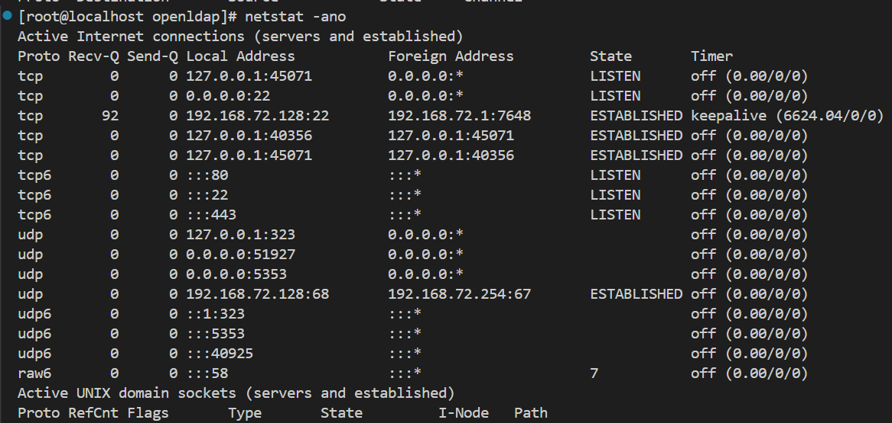
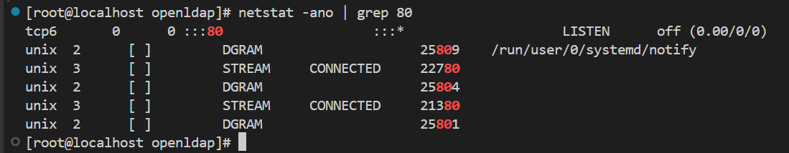
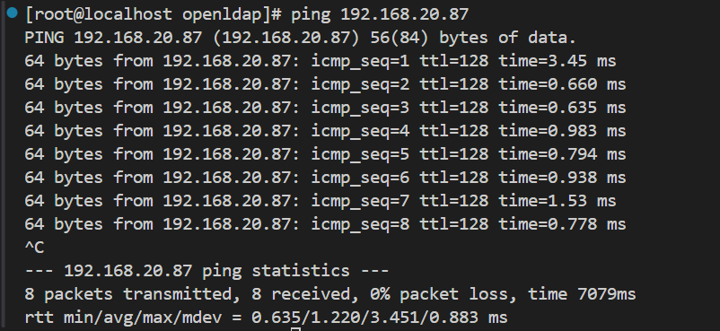
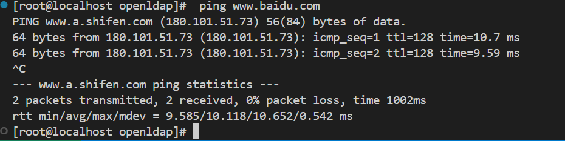
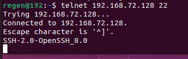
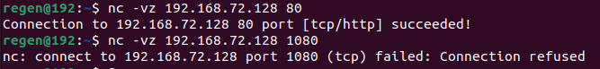

# 测试云端主机策略是否生效

​		在云服务器控制台，例如阿里云等服务商设置好安全组策略，开放对应的TCP、UDP端口号，出入权限。

## 1. 服务端检查

### 1. 检查已开放端口

```bash
ss -tulnp
```

```bash
netstat -ano
```

| `-a` | 显示所有连接和监听端口（All）          |
| ---- | -------------------------------------- |
| `-n` | 以数字形式显示地址和端口（不解析域名） |
| `-o` | 显示与每个连接关联的进程 ID（PID）     |



### 2. 如果太多可以进行过滤端口，仅查看目标端口

```
netstat -ano | grep 80
```



### 3. 如果显示为空则为空闲，可以进行部署服务。

## 2. 客户端检查

### 1. 首先测试网络连通性

```bash
ping 192.168.20.87
```



如果不通则可测试其他已知网站排除自身网络问题

```
 ping www.baidu.com
```



### 2. 进行对应端口的测试，根据服务不同分别测试tcp协议、udp协议

* 检测**TCP**服务端口是否开启

> * **Telnet**
>
> Telnet 是一个经典的网络测试和远程连接工具，主要用于通过 **TCP** 协议与远程主机建立连接。它最初用于远程登录服务器的终端（默认端口为 23），但由于其不加密、不安全的特性，现在已基本被 SSH 替代。如今，Telnet 更常用于测试网络端口是否开放，例如测试某台主机的 HTTP（80）、HTTPS（443）、SMTP（25）或数据库服务端口是否可达。使用方式通常是在命令行中输入 `telnet [IP或域名] [端口号]`，如 `telnet www.example.com 80`，若连接成功则说明该端口可访问。Telnet 只能用于测试 TCP 端口，不能测试 UDP，而且在 Windows 中使用前需要手动启用该功能。虽然 Telnet 简单易用，但由于其功能较为基础和安全性低，现代系统中常用 `nc`（netcat）、`curl` 或 `nmap` 等工具来替代 Telnet 进行更复杂或更安全的网络测试。

```
telnet 192.168.72.128
```




可以看到连接成功了，说明`192.168.72.128:80`和`192.168.72.128:22`有服务存在并且端口已经开放。


可以看到`1080`和`443`都无法连接，说明目标主机无服务或者防火墙拒绝了连接，但是通过上面服务器端的`netstat`命令可以知道这些端口是无服务，而不是防火墙导致。

* 检测UDP端口服务是否开启

> **nc**
>
> `nc`（netcat）是一款功能强大的网络工具，被称为“网络界的瑞士军刀”，常用于测试端口连通性、调试网络服务、传输文件和搭建简单的 TCP/UDP 服务器。它支持 TCP 和 UDP 协议，可以用来检查远程主机的端口是否开放（如 `nc -vz IP 端口`），也可以监听本地端口等待连接（如 `nc -l 端口`），甚至可以通过重定向实现文件传输。相比 `telnet`，`nc` 功能更强、更灵活，适用于更多网络调试场景。多数 Linux 发行版默认已安装 `nc`，如果没有可以通过软件包管理器快速安装。

* TCP端口

```bash
 nc -vz 192.168.72.128 80
```



可以看到连接成功了，说明`192.168.72.128:80`有tcp服务存在并且端口已经开放。

* UDP端口

```bash
 nc -vzu 192.168.72.128 45690
```


可以看到连接成功了，说明`192.168.72.128:45690`有udp服务存在并且端口已经开放。
