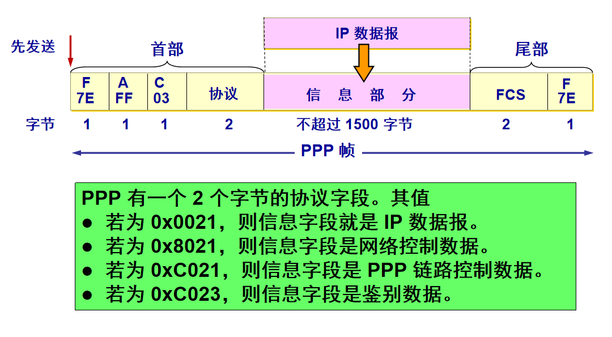
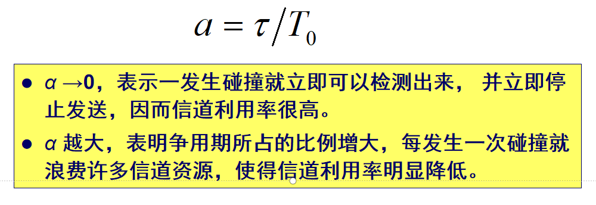
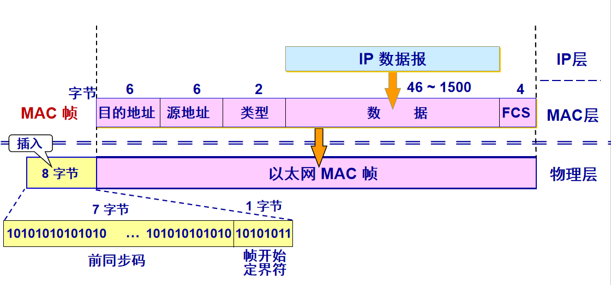
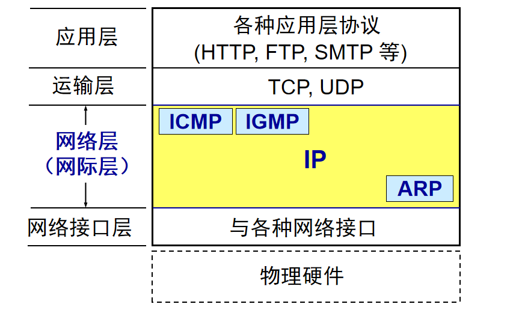
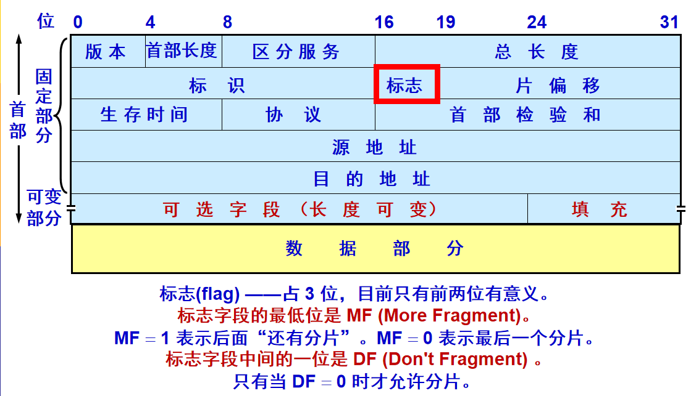
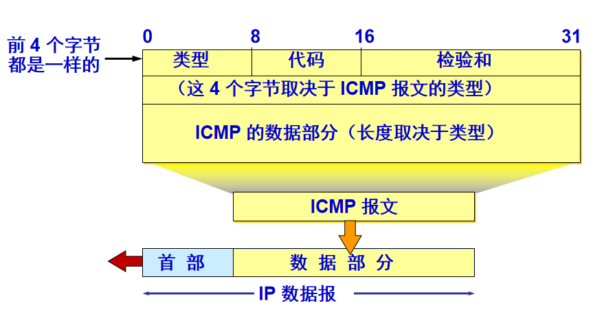

基于计算机网络第八版，用于考试。

# 概述

* 1983年，ARPANET采用TCP/IP，标志着互联网诞生

* **ISP**   互联网服务提供者 ISP (Internet Service Provider)
* **IXP**  互联网交换点，允许两个网络直接相连并快速交换分组。
    * 常采用工作在数据链路层的网络交换机。
* **万维网 (World Wide Web, 简称 WWW)**   全球性的信息空间，人们可以通过互联网访问和共享信息

## 互联网的组成

网络协议三要素

1. 语法
2. 语义
3. 同步

1. **边缘部分**

    ​	由所有连接在互联网上的主机组成。这部分是用户直接使用的，用来进行通信（传送数据、音频或视频）和资源共享。

2. **核心部分**

    ​	由大量网络和连接这些网络的路由器组成。这部分是为边缘部分提供服务的（提供连通性和交换）。

### 边缘部分

* **端系统**  用户直接使用的设备和应用程序，它们包括个人电脑、手机、服务器等终端设备，用于发送或接收数据。端系统通过网络传输数据，与其他设备通信，实现互联网服务的交互。

端系统中运行的程序之间的通信方式分为

1. 客户服务器方式（C/S 方式）
    * 客户 (client) 和服务器 (server) 都是指通信中所涉及的两个应用进程。
    * 客户-服务器方式所描述的是进程之间服务和被服务的关系。
    * 客户是服务的请求方，服务器是服务的提供方。
    * **客户端特点**
        1.  被用户调用后运行，在打算通信时主动向远地服务器发起通信（请求服务）。因此，客户程序必须知道服务器程序的地址。
        2. 不需要特殊的硬件和很复杂的操作系统
    * **服务端特点**
        1. 可同时处理多个远地或本地客户的请求。
        2. 系统启动后即自动调用并一直不断地运行着，被动地等待并接受来自各地的客户的通信请求。因此，服务器程序不需要知道客户程序的地址。
        3. 需要强大的硬件和高级的操作系统支持
2. 对等方式（P2P 方式）   即 Peer-to-Peer方式  
    * **特点**
        1. 对等连接方式从本质上看仍然是使用客户服务器方式，只是对等连接中的每一个主机既是客户又是服务器。
        2. 对等连接工作方式可支持大量对等用户（如上百万个）同时工作。

### 核心部分

**特点**

* 是互联网中最复杂的部分
* 要向网络边缘中的大量主机提供连通性
* 在网络核心部分起特殊作用的是：路由器(router)
* 路由器是实现分组交换 (packet switching) 的关键构件，其任务是转发收到的分组，这是网络核心部分最重要的功能。

#### 电路交换

​		**面向连接，利用率很低**

电路交换分为三个阶段：

1. 建立连接：建立一条专用的物理通路，以保证双方通话时所需的通信资源在通信时不会被其他用户占用；
2. 通信：主叫和被叫双方就能互相通电话；
3. 释放连接：释放刚才使用的这条专用的物理通路（释放刚才占用的所有通信资源）。

#### 分组交换

**以分组为单位传输，采用存储转发技术。**

1. 在发送端，先把较长的报文划分成较短的、固定长度的数据段。
2. 每一个数据段前面添加上首部构成分组(packet)。
3. 每一个分组的首部都含有地址（诸如目的地址和源地址）等控制信息。
4. 分组交换网中的结点交换机根据收到的分组首部中的地址信息，把分组转发到下一个结点交换机。
5. 每个分组在互联网中独立地选择传输路径。
6. 用这样的存储转发方式，最后分组就能到达最终目的地。

**路由器处理分组的过程**

1. 把收到的分组先放入缓存（暂时存储）；
2. 查找转发表，找出到某个目的地址应从哪个端口转发；
3. 把分组送到适当的端口转发出去。 

**优点**

| **高效** | 在分组传输的过程中**动态分配**传输带宽，对通信链路是逐段占用。 |
| -------- | :----------------------------------------------------------- |
| **灵活** | 为每一个分组**独立**地选择最合适的转发路由****。**           |
| **迅速** | 以分组作为传送单位，可以**不先建立连接**就能向其他主机发送分组。 |
| **可靠** | 保证可靠性的网络协议；分布式多路由的分组交换网，使网络有很好的生存性。 |

**问题**

1. 分组在各结点存储转发时需要排队，这就会造成一定的时延。 

2. 分组必须携带的首部（里面有必不可少的控制信息）也造成了一定的开销。 

若要连续传送大量的数据，且其**传送时间远大于连接建立时间，则电路交换的传输速率较快**。报文交换和分组交换不需要预先分配传输带宽，在传送突发数据时可提高整个网络的信道利用率。由于一个分组的长度往往远小于整个报文的长度，因此**分组交换比报文交换的时延小，同时也具有更好的灵活性。**

## 计算机网络类别

* 个域网PAN（ Personal Area Network ）
    * 能在便携式消费电器与通信设备之间进行短距离通信的网络
    * 覆盖范围一般在10米半径以内，如蓝牙耳机等
* 局域网LAN（Local Area Network）
    * 局部地区形成的区域网络，如企业网络
    * 分布地区范围有限，可大可小，大到一栋建筑、小到办公室内的组网电脑WLAN接入，打印机共享等等
* 城域网MAN（Metropolitan Area Network ）
    * 范围覆盖一个城市的网络
* 广域网WAN（Wide Area Network）
    * 覆盖很大地理区域，乃至覆盖地区和国家

## 计算机网络的性能

1. 速率

    1. 数据的传送速率，它也称为数据率 (data rate)或比特率 (bit rate)。速率的单位是 bit/s，或 kbit/s、Mbit/s、 Gbit/s 等。例如 4  1010 bit/s 的数据率就记为 40 Gbit/s。
    2. 速率往往是指额定速率或标称速率，非实际运行速率。

2. 带宽

    1. 在单位时间内网络中的某信道所能通过的“最高数据率”。单位是 bit/s ，即 “比特每秒”。    

3. 吞吐率

    1. 单位时间内通过某个网络（或信道、接口）的数据量。
    2. 吞吐量受网络的带宽或网络的额定速率的限制。

4. 时延

    1. 数据（一个报文或分组，甚至比特）从网络（或链路）的一端传送到另一端所需的时间。

    2. 组成部分

        1. 发送时延

            1. 从发送数据帧的第一个比特算起，到该帧的最后一个比特发送完毕所需的时间。
            2. 

        2. 传播时延

            

        3. 处理时延

            1. 主机或路由器在收到分组时，为处理分组（例如分析首部、提取数据、差错检验或查找路由）所花费的时间。

        4. 排队时延

            1. 分组在路由器输入输出队列中排队等待处理所经历的时延。
            2. 排队时延的长短往往取决于网络中当时的通信量。

    3. **总时延**  = 	   发送时延  		+ 传播时延  		+ 处理时延  		+ 排队时延

5. 时延带宽积

    1. 

6. 9 往返时间 RTT

    1. 从发送方发送数据开始，到发送方收到来自接收方的确认，总共经历的时间。
    2. 包括各中间结点的处理时延、排队时延以及转发数据时的发送时延。

7. 利用率

    1. 信道利用率
        1. 某信道有百分之几的时间是被利用的（有数据通过）。
        2. 当某信道的利用率增大时，该信道引起的时延也就迅速增加。
    2. 网络利用率
        1. 全网络的信道利用率的加权平均值。

## 计算机网络的体系结构

### 计算机网络的分层

* 优点
    1. 各层之间是独立的。
    2. 灵活性好。
    3. 结构上可分割开。
    4. 易于实现和维护。
    5. 能促进标准化工作。

* 缺点
    1. 降低效率。
    2. 有些功能会在不同的层次中重复出现，因而产生了额外开销。

### 五层协议的体系结构

1. 应用层
2. 运输层
3. 网络层
4. 数据链路层
5. 物理层

* **对等层**  任何两个同样的层次把数据（即数据单元加上控制信息）通过水平虚线直接传递给对方。这就是所谓的“对等层”(peer layers)之间的通信。
* **协议数据单元 PDU**   对等层次之间传送的数据单位
* **实体**  表示任何可发送或接收信息的硬件或软件进程。
* **协议**  是控制两个对等实体进行通信的规则的集合。

* **服务访问点 SAP**  同一系统相邻两层的实体进行交互的地方

#  物理层

​	物理层考虑的是**怎样才能在连接**各种计算机的传输媒体上传输**比特流数据**，而不是指具体的传输媒体。尽可能地屏蔽掉不同传输媒体和通信手段的差异。

## 数据通信

### 数据通信系统模型

* **数据通信系统包括三大部分：**
    1. 源系统（或发送端、发送方）
    2. 传输系统（或传输网络）
    3. 目的系统（或接收端、接收方）

### 有关信道的几个基本概念

> 1. **数据 (data)** —— 运送消息的实体。
> 2. **信号 (signal)** —— 数据的电气的或电磁的表现。 
> 3. **模拟信号 (analogous signal)** —— 代表消息的参数的取值是连续的。 
> 4. **数字信号 (digital signal)** —— 代表消息的参数的取值是离散的。 
> 5. **码元 (code)** —— 在使用时间域（或简称为时域）的波形表示数字信号时，代表不同离散数值的基本波形。

>1. **信道** —— 一般用来表示向某一个方向传送信息的媒体。
>2. **单向通信**（单工通信）——只能有一个方向的通信而没有反方向的交互。
>3. **双向交替通信**（半双工通信）——通信的双方都可以发送信息，但不能双方同时发送(当然也就不能同时接收)。
>4. **双向同时通信**（全双工通信）——通信的双方可以同时发送和接收信息。 
>5. **基带信号（即基本频带信号）**—— 来自信源的信号。像计算机输出的代表各种文字或图像文件的数据信号都属于基带信号。
>6. 基带信号往往包含有较多的低频成分，甚至有直流成分，而许多信道并不能传输这种低频分量或直流分量。因此必须对基带信号进行调制 (modulation)。   
>
>* **调制**
>    1. **基带调制**：仅对基带信号的波形进行变换，使它能够与信道特性相适应。变换后的信号仍然是基带信号。把这种过程称为编码 (coding)。
>    2. **带通调制**：使用载波 (carrier)进行调制，把基带信号的频率范围搬移到较高的频段，并转换为模拟信号，这样就能够更好地在模拟信道中传输（即仅在一段频率范围内能够通过信道） 。**带通信号 ：**经过载波调制后的信号。

**常用编码方式**

> 1. **不归零制：**正电平代表 1，负电平代表 0。
> 2. **归零制：**正脉冲代表 1，负脉冲代表 0。
> 3. **曼彻斯特编码：**位周期中心的向上跳变代表 0，位周期中心的向下跳变代表 1。但也可反过来定义。**具有自同步能力**
> 4. **差分曼彻斯特编码：**在每一位的中心处始终都有跳变。位开始边界有跳变代表 0，而位开始边界没有跳变代表 。**具有自同步能力**

**基本的带通调制方法**

* 最基本的二元制调制方法
    1. 调幅(AM)：载波的振幅随基带数字信号而变化。 
    2. 调频(FM)：载波的频率随基带数字信号而变化。
    3. 调相(PM) ：载波的初始相位随基带数字信号而变化。

### 信道的极限容量

​	码元传输的速率越高，或信号传输的距离越远，或传输媒体质量越差，在信道的输出端的波形的失真就越严重。 

* **限制码元在信道上的传输速率的因素有以下两个：**

    1. 信道能够通过的频率范围

        1. **奈氏准则**

            

            理想低通信道”即指理想的能让部分低频率信号通过的信道。W是理想低通信道的带宽,单位为赫(Hz);Baud是波特,是码元传输速率的单位,1波特为每秒传送1个码元.

    2. 信噪比

        1. 信噪比就是信号的平均功率和噪声的平均功率之比。
        2. 
        3. **香农公式**  带宽受限且有高斯白噪声干扰的信道的极限、无差错的信息传输速率
        4. 
            1. 信噪比越大，则信息的极限传输速率就越高。 	
            2. 只要信息传输速率低于信道的极限信息传输速率，就一定可以找到某种办法来实现无差错的传输。

## 物理层下面的传输媒体

​	传输媒体也称为传输介质或传输媒介，它就是数据传输系统中在发送器和接收器之间的物理通路。

### 导引型传输媒体

​	电磁波被导引沿着固体媒体（铜线或光纤）传播。

**案例**

1. 双绞线
    1. 模拟传输和数字传输
    2. 通信距离一般为几到十几公里
    3. 分为屏蔽双绞线 STP (Shielded Twisted Pair)和非屏蔽双绞线 UTP (Unshielded Twisted Pair) 
2. 同轴电缆
    1. 抗干扰特性，传输较高速率的数据。
3. 光缆
    1. 多模光纤	可以存在多条不同角度入射的光线在一条光纤中传输。这种光纤就称为多模光纤。
    2. 单模光纤    若光纤的直径减小到只有一个光的波长，则光纤就像一根波导那样，它可使光线一直向前传播，而不会产生多次反射。这样的光纤称为单模光纤。
    3. 通信容量非常大。
    4. 传输损耗小，中继距离长。
    5. 抗雷电和电磁干扰性能好。
    6. 无串音干扰，保密性好。
    7. 体积小，重量轻。

### 非导引型传输媒体

​	电磁波的传输常称为无线传输，自由空间称为“非导引型传输媒体”。

## 信道复用技术

​	复用 (multiplexing) 是通信技术中的基本概念。它允许用户使用一个共享信道进行通信，降低成本，提高利用率。

### 频分复用、时分复用和统计时分复用

#### 频分复用  FDM

	1. 将整个带宽分为多份，用户在分配到一定的频带后，在通信过程中自始至终都占用这个频带。
	1. 频分复用的所有用户在同样的时间占用不同的带宽资源（请注意，这里的“带宽”是频率带宽而不是数据的发送速率）

#### 时分复用  TDM

	1. 时分复用则是将时间划分为一段段等长的时分复用帧（TDM 帧）。每一个时分复用的用户在每一个 TDM 帧中占用固定序号的时隙。
	1. 每一个用户所占用的时隙是周期性地出现（其周期就是 TDM  帧的长度）
	1. 时分复用的所有用户是在不同的时间占用同样的频带宽度。 

* 使用时分复用系统传送计算机数据时，由于计算机数据的突发性质，用户对分配到的子信道的利用率一般是不高的。

####  统计时分复用  STDM

STDM 帧不是固定分配时隙，而是按需动态地分配时隙。因此统计时分复用可以提高线路的利用率。

### 波分复用  WDM

 	波分复用就是光的频分复用。使用一根光纤来同时传输多个光载波信号。

### 码分复用  CDM

​	常用的名词是码分多址 CDMA     (Code Division Multiple Access)。

​	各用户使用经过特殊挑选的不同码型，因此彼此不会造成干扰。

​	这种系统发送的信号有很强的抗干扰能力，其频谱类似于白噪声，不易被敌人发现。 

​	**码片序列**

* 每一个比特时间划分为 m 个短的间隔，称为码片 (chip)。
* 码片序列实现了扩频

## 数字传输系统

​	与模拟通信相比，数字通信在抗干扰性，保密性方面有明显的优势。

* **脉冲编码调制PCM**

终端用户（如电话的语音信号）的模拟数据转换成数字数据，以适合主干线的传输。

## 宽带接入技术

### ADSL技术

* **非对称数字用户线 ADSL (Asymmetric Digital Subscriber Line)** 
* ADSL 技术就把 0~4 kHz 低端频谱留给传统电话使用，而把原来没有被利用的高端频谱留给用户上网使用。
* DSL 的传输距离取决于数据率和用户线的线径（用户线越细，信号传输时的衰减就越大）。

* **特点**
    * 上行和下行带宽做成不对称的。
    * ADSL 在用户线（铜线）的两端各安装一个 ADSL 调制解调器。

# 数据链路层

数据链路层使用的信道主要有以下两种类型：

1. **点对点信道。**这种信道使用一对一的点对点通信方式。
2. **广播信道。**这种信道使用一对多的广播通信方式，因此过程比较复杂。广播信道上连接的主机很多，因此必须使用专用的共享信道协议来协调这些主机的数据发送。 

## 使用点对点信道的数据链路层

###  数据链路和帧

* **链路 (link)** 是一条无源的点到点的物理线路段，中间没有任何其他的交换结点。

* **数据链路 (data link)** 除了物理线路外，还必须有通信协议来控制这些数据的传输。若把实现这些协议的硬件和软件加到链路上，就构成了数据链路。

###  三个基本问题

#### 封装成帧

​	在一段数据的前后分别添加首部和尾部，然后就构成了一个帧。

​	首部和尾部的一个重要作用就是进行**帧定界。**

#### 透明传输

​	如果数据中的某个字节的二进制代码恰好和 SOH 或 EOT 一样，数据链路层就会错误地“找到帧的边界”。

* **解决透明传输问题**
    * **字节填充** (byte stuffing) 或**字符填充** (character stuffing)。
    * 

#### 差错控制 

​	在传输过程中可能会产生比特差错：1 可能会变成 0 而 0 也可能变成 1。

* **误码率 BER (Bit Error Rate)。** 在一段时间内，传输错误的比特占所传输比特总数的比率

* **循环冗余检验**
    * 原理
        * 在发送端，先把数据划分为组。假定每组 k 个比特。 
        * 设待传送的一组数据 M = 101001（现在 k = 6）。我们在 M 的后面再添加供差错检测用的 n 位冗余码一起发送。
        * 用二进制的模 2 运算进行 2n 乘 M 的运算，这相当于在 M 后面添加 n 个 0。
        * 得到的 (k + n) 位的数除以事先选定好的长度为 (n + 1) 位的除数 P，得出商是 Q 而余数是 R，余数 R 比除数 P 少 1 位，即 R 是 n 位。 
        * 将余数 R 作为冗余码拼接在数据 M 后面发送出去。

## 点对点协议 PPP

### 特点

1. 简单
2. 封装成帧
3. 透明性
4. 多种网络层协议
5. 多种类型链路 
6. 差错检测 

### 帧格式

### 字符填充

1. 将信息字段中出现的每一个 0x7E 字节转变成为 2 字节序列 (0x7D, 0x5E)。 
2. 若信息字段中出现一个 0x7D 的字节, 则将其转变成为 2 字节序列 (0x7D, 0x5D)。
3. 若信息字段中出现 ASCII 码的控制字符（即数值小于 0x20 的字符），则在该字符前面要加入一个 0x7D 字节，同时将该字符的编码加以改变。  

### 工作状态

* 当用户拨号接入 ISP 时，路由器的调制解调器对拨号做出确认，并建立一条物理连接。
* PC 机向路由器发送一系列的 LCP 分组（封装成多个 PPP 帧）。
* 这些分组及其响应选择一些 PPP 参数，并进行网络层配置，NCP 给新接入的 PC 机分配一个临时的 IP 地址，使 PC 机成为因特网上的一个主机。
* 通信完毕时，NCP 释放网络层连接，收回原来分配出去的 IP 地址。接着，LCP 释放数据链路层连接。最后释放的是物理层的连接。
* 可见，PPP 协议已不是纯粹的数据链路层的协议，它还包含了物理层和网络层的内容。

## 使用广播信道的数据链路层

### 局域网的数据链路层

#### 局域网的特点

* 网络为一个单位所拥有；
* 地理范围和站点数目均有限。 

#### 优点

1. 有广播功能，从一个站点可很方便地访问全网。局域网上的主机可共享连接在局域网上的各种硬件和软件资源。 
2. 便于系统的扩展和逐渐地演变，各设备的位置可灵活调整和改变。
3. 提高了系统的可靠性、可用性和残存性。

**局域网的数据链路层的两个子层**

1. 逻辑链路控制 LLC (Logical Link Control)子层；
2. 媒体接入控制 MAC (Medium Access Control)子层。

不管采用何种协议的局域网，对 LLC 子层来说都是透明的。

网络接口板又称为**通信适配器** (adapter) 或网络接口卡 NIC (Network Interface Card)，或“网卡”。 

**适配器的重要功能**：

1. 进行串行/并行转换。对数据进行缓存。
2. 在计算机的操作系统安装设备驱动程序。
3. 实现以太网协议。  

###  CSMA/CD 协议

CSMA/CD 含义：载波监听多点接入 / 碰撞检测  (Carrier Sense Multiple Access with Collision Detection) 。

载波监听”是指每一个站在发送数据之前先要检测一下总线上是否有其他计算机在发送数据，如果有，则暂时不要发送数据，以免发生碰撞。 

#### 特性

1. 使用 CSMA/CD 协议的以太网不能进行全双工通信而只能进行双向交替通信（半双工通信）。
2. 每个站在发送数据之后的一小段时间内，存在着遭遇碰撞的可能性。 
3. 这种发送的不确定性使整个以太网的平均通信量远小于以太网的最高数据率。  

#### **要点**

(1) 准备发送。但在发送之前，必须先检测信道。

(2) 检测信道。若检测到信道忙，则应不停地检测，一直等待信道转为空闲。若检测到信道空闲，并在 96 比特时间内信道保持空闲（保证了帧间最小间隔），就发送这个帧。

(3) 检查碰撞。在发送过程中仍不停地检测信道，即网络适配器要边发送边监听。这里只有两种可能性：

​	①发送成功：在争用期内一直未检测到碰撞。这个帧肯定能够发送成功。发送完毕后，其他什么也不做。然后回到 (1)。

​	②发送失败：在争用期内检测到碰撞。这时立即停止发送数据，并按规定发送人为干扰信号。适配器接着就执行指数退避算法，等待 r 倍 512 比特时间后，返回到步骤 (2)，继续检测信道。但若重传达 16 次仍不能成功，则停止重传而向上报错。

### 使用集线器的星形拓扑

**10BASE-T**

1. 10 Mbit/s 
2. 距离不超过 100 m。

**集线器的特点**

1. 集线器是使用电子器件来模拟实际电缆线的工作，因此整个系统仍然像一个传统的以太网那样运行。
2. 使用集线器的以太网在逻辑上仍是一个总线网，各工作站使用的还是 CSMA/CD 协议，并共享逻辑上的总线。 
3. 集线器很像一个多接口的转发器，工作在物理层。
4. 集线器采用了专门的芯片，进行自适应串音回波抵消，减少了近端串音。

### 以太网的信道利用率

* **参数 α**

    

* 对于参数a

    * 当数据率一定时，以太网的连线的长度受到限制，否则  的数值会太大。
    * 以太网的帧长不能太短，否则 T0 的值会太小，使 α 值太大。 

​	

### 以太网的 MAC 层

#### MAC 层的硬件地址

* 硬件地址又称为物理地址，或 MAC 地址
* IEEE 802 标准规定 MAC 地址字段可采用 6 字节 ( 48位) 或 2 字节 ( 16 位) 这两种中的一种。
* 地址字段 6 个字节中的后三个字节 (即低位 24 位) 由厂家自行指派，称为扩展唯一标识符，必须保证生产出的适配器没有重复地址。

* 地址字段的第一字节的最低位为 I/G 位。
    * 当 I/G位 = 0 时，地址字段表示一个单站地址。一个地址块可生成 223 个单个站地址
    * 当 I/G位 = 1 时，表示组地址，用来进行多播（以前曾译为组播）。此时，IEEE 只分配地址字段前三个字节中的 23 位。一个地址块可生成 223 个组地址。
    * 所有 48 位都为 1 时，为广播地址。只能作为目的地址使用。
* 地址字段第一字节的最低第 2 位规定为 G/L 位，表示 Global / Local。
    * 当 G/L位 = 0 时，是全球管理（保证在全球没有相同的地址），厂商向IEEE购买的 OUI 都属于全球管理。
    * 当 G/L位 = 1 时， 是本地管理，这时用户可任意分配网络上的地址。

* **适配器检查 MAC 地址**
    * 适配器从网络上每收到一个 MAC 帧就首先用硬件检查 MAC 帧中的 MAC 地址。
        * 如果是发往本站的帧则收下，然后再进行其他的处理。
        * 否则就将此帧丢弃，不再进行其他的处理。
    * 发往本站的帧”包括以下三种帧： 
        1. 单播 (unicast) 帧（一对一）
        2. 广播 (broadcast) 帧（一对全体）
        3. 多播 (multicast) 帧（一对多） 
    * 所有的适配器都至少能够识别前两种帧，即能够识别**单播地址**和**广播地址**

#### MAC 帧的格式

> **类型**字段(2字节用来标志上一层使用的是什么协议，以便把收到的 MAC 帧的数据上交给上一层的这个协议。
>
> **数据**字段的正式名称是 MAC 客户数据字段。最小长度 64 字节  18 字节的首部和尾部  =  数据字段的最小长度（46字节）  
>
> 传输媒体的误码率为 1*10^8 时，MAC 子层可使未检测到的差错小于 1*10^14。
>
> 当数据字段的长度小于 46 字节时，应在数据字段的后面加入整数字节的填充字段，以保证以太网的 MAC 帧长不小于 64 字节。
>
> 在帧的前面**插入**（硬件生成）的 8 字节中，第一个字段共 7 个字节，是前同步码，用来迅速实现 MAC 帧的比特同步。第二个字段 1 个字节是帧开始定界符，表示后面的信息就是 MAC 帧。 

* 无效的MAC帧
    * 数据字段的长度与长度字段的值不一致；
    * 帧的长度不是整数个字节；
    * 用收到的帧检验序列 FCS 查出有差错；
    * 数据字段的长度不在 46 ~ 1500 字节之间。
    * 有效的 MAC 帧长度为 64 ~ 1518 字节之间。
* 帧间最小间隔 
    * 帧间最小间隔为 9.6 us，相当于 96 bit 的发送时间。一个站在检测到总线开始空闲后，还要等待 9.6 us 才能再次发送数据。这样做是为了使刚刚收到数据帧的站的接收缓存来得及清理，做好接收下一帧的准备。

## 扩展的以太网

#### 在物理层扩展以太网

1. 使用光纤扩展

2. 使用集线器扩展

    * 优点

        1. 使原来属于不同碰撞域的以太网上的计算机能够进行跨碰撞域的通信。
        2. 扩大了以太网覆盖的地理范围。

    * 缺点

        1. 碰撞域增大了，但总的吞吐量并未提高。
        2. 如果不同的碰撞域使用不同的数据率，那么就不能用集线器将它们互连起来。   

        

#### 在数据链路层扩展以太网

##### **以太网交换机**

* **特点**

* 以太网交换机具有并行性。能同时连通多对接口，使多对主机能同时通信。
* 相互通信的主机都是独占传输媒体，无碰撞地传输数据。

* 交换方式
    * 存储转发方式
    * 直通 (cut-through) 方式
        * 接收数据帧的同时就立即按数据帧的目的 MAC 地址决定该帧的转发接口，因而**提高了帧的转发速度**。缺点是它不**检查差错**就直接将帧转发出去，因此有可能也将一些无效帧转发给其他的站。

#### 虚拟局域网

**VLAN 标记**

* 4字节的标识符：用来指明发送该帧的计算机属于哪一个虚拟局域网。

### 虚拟互联网络

* 即逻辑互连网络
    * 互连起来的各种物理网络的异构性本来是客观存在的，但是我们利用 IP 协议就可以使这些性能各异的网络从用户看起来好像是一个统一的网络。
* 使用 IP 协议的虚拟互连网络可简称为 IP 网。
* 互联网 (Internet)：覆盖全球的 IP 网的上层使用 TCP 协议

# 网络层

## 网络层提供的两种服务

1. **虚电路服务**
2. **数据报服务**

| **对比的方面**                 | **虚电路服务**                                     | **数据报服务**                                         |
| ------------------------------ | -------------------------------------------------- | ------------------------------------------------------ |
| **思路**                       | **可靠通信应当由网络来保证**                       | **可靠通信应当由用户主机来保证**                       |
| **连接的建立**                 | **必须有**                                         | **不需要**                                             |
| **终点地址**                   | **仅在连接建立阶段使用，每个分组使用短的虚电路号** | **每个分组都有终点的完整地址**                         |
| **分组的转发**                 | **属于同一条虚电路的分组均按照同一路由进行转发**   | **每个分组独立选择路由进行转发**                       |
| **当结点出故障时**             | **所有通过出故障的结点的虚电路均不能工作**         | **出故障的结点可能会丢失分组，一些路由可能会发生变化** |
| **分组的顺序**                 | **总是按发送顺序到达终点**                         | **到达终点时不一定按发送顺序**                         |
| **端到端的差错处理和流量控制** | **可以由网络负责，也可以由用户主机负责**           | **由用户主机负责**                                     |

## * 网际协议 IP

网际协议 IP 是 TCP/IP 体系中两个最主要的协议之一。

* 与 IP 协议配套使用的还有三个协议：
    1. 地址解析协议 ARP    (Address Resolution Protocol)
    2. 网际控制报文协议 ICMP   (Internet Control Message Protocol)
    3. 网际组管理协议 IGMP   (Internet Group Management Protocol)

### * IP 地址及其表示方法

> IP 地址就是给每个连接在互联网上的主机（或路由器）分配一个在全世界范围是唯一的 32 位的标识符。由互联网名字和数字分配机构ICANN (Internet Corporation for Assigned Names and Numbers)进行分配

* **IP 地址的编址方法**
    1. 分类的 IP 地址。这是最基本的编址方法，在 1981 年就通过了相应的标准协议。
    2. 子网的划分。这是对最基本的编址方法的改进，其标准[RFC 950] 在 1985 年通过。
    3. 构成超网。这是比较新的无分类编址方法。1993 年提出后很快就得到推广应用。

* **分类IP地址**

    > 将IP地址划分为若干个固定类。
    >
    > 每一类地址都由两个固定长度的字段组成，其中一个字段是网络号 net-id，它标志主机（或路由器）所连接到的网络，而另一个字段则是主机号 host-id，它标志该主机（或路由器）。
    >
    > 主机号在它前面的网络号所指明的网络范围内必须是唯一的。

* 点分十进制记法 	

## 常用的三种类别的 IP 地址

| 网络类别 | 最大可指派的网络数 | 第一个可指派的网络号 | 最后一个可指派的网络号 | 每个网络中最大主机数 |
| -------- | ------------------ | -------------------- | ---------------------- | -------------------- |
| A        | 126 (27 – 2)       | 1                    | 126                    | 16777214             |
| B        | 16383 (214 – 1)    | 128.1                | 191.255                | 65534                |
| C        | 2097151 (221 – 1)  | 192.0.1              | 223.255.255            | 254                  |

| **网络号** | **主机号**         | 源地址使用 | **目的地址**使用 | **代表的意思**                               |
| ---------- | ------------------ | ---------- | ---------------- | -------------------------------------------- |
| **0**      | **0**              | **可以**   | **不可**         | 在本网络上的本主机                           |
| **0**      | **host-id**        | **可以**   | **不可**         | **在本网络上的某台主机**host-id              |
| 全1        | 全1                | **不可**   | **可以**         | **只在本网络上进行广播（各路由器均不转发）** |
| **net-id** | 全1                | **不可**   | **可以**         | **对**net-id上的所有主机进行广播             |
| **127**    | 非全0或全1的任何数 | **可以**   | **可以**         | **用作本地软件环回测试之用**                 |

> * 源地址：表示数据包的发送方IP地址，即哪个设备发出了该数据包。
> * 目的地址：表示数据包的接收方IP地址，即该数据包需要被送达的目标设备地址。

* IP地址的重要特点
    1.  IP 地址是一种分等级的地址结构。	
        1. 第一，IP 地址管理机构在分配 IP 地址时只分配网络号，而剩下的主机号则由得到该网络号的单位自行分配。这样就方便了 IP 地址的管理
        2. 第二，路由器仅根据目的主机所连接的网络号来转发分组（而不考虑目的主机号），这样就可以使路由表中的项目数大幅度减少，从而减小了路由表所占的存储空间。 
    2. 实际上 IP 地址是标志一个主机（或路由器）和一条链路的接口。
        1. 当一个主机同时连接到两个网络上时，该主机就必须同时具有两个相应的 IP 地址，其网络号 net-id 必须是不同的。这种主机称为多归属主机 (multihomed host)。
        2. 当一个主机同时连接到两个网络上时，该主机就必须同时具有两个相应的 IP 地址，其网络号 net-id 必须是不同的。这种主机称为多归属主机 (multihomed host)。
    3. 用转发器或网桥连接起来的若干个局域网仍为一个网络，因此这些局域网都具有同样的网络号 net-id。
    4. 所有分配到网络号 net-id 的网络，无论是范围很小的局域网，还是可能覆盖很大地理范围的广域网，都是平等的。

* 地址解析协议 ARP
    * 从网络层使用的 IP 地址，解析出在数据链路层使用的硬件地址。
    * 每一个主机都设有一个 ARP 高速缓存 (ARP cache)，里面有所在的局域网上的各主机和路由器的 IP 地址到硬件地址的映射表。
        * 高速缓存的作用：存放最近获得的 IP 地址到 MAC 地址的绑定，以减少 ARP 广播的数量。

* IP数据报的格式

    * 首部和数据

        * 首部：首部的前一部分是固定长度，共 20 字节，是所有 IP 数据报必须具有的。后面是一些可选字段，其长度是可变的。 

        

* IP数据报的可变部分

    * 目的：支持排错、测量以及安全等措施
    * 实际上这些选项很少被使用。

    

## 划分子网和构造超网

* 划分子网纯属一个单位内部的事情，对外部网络透明，对外仍然表现为没有划分子网的一个网络。
* 优点
    1. 减少了 IP 地址的浪费
    2. 使网络的组织更加灵活
    3. 更便于维护和管理

* **子网掩码**
    * 减少了 IP 地址的浪费使网络的组织更加灵活更便于维护和管理
* 子网掩码是一个网络或一个子网的重要属性。
* 划分子网增加了灵活性，但却减少了能够连接在网络上的主机总数。
* (IP 地址) **AND** (子网掩码) **=**网络地址

* **无分类地址CIDR**

    * 主要特点

        1. 使用各种长度的“网络前缀”(network-prefix)来代替分类地址中的网络号和子网号。
        2. 从三级编址（使用子网掩码）又回到了两级编址。

    * 斜线记法

        > CIDR 使用“斜线记法”(slash notation)，它又称为 CIDR 记法，即在 IP 地址面加上一个斜线“/”，然后写上网络前缀所占的位数（这个数值对应于三级编址中子网掩码中 1 的个数）。例如： 220.78.168.0/24

    * 路由聚合 也称为构成超网 (supernetting)。

        * 使得路由表中的一个项目可以表示很多个（例如上千个）原来传统分类地址的路由。
        * 有利于减少路由器之间的路由选择信息的交换，从而提高了整个互联网的性能。

    * 最长前缀匹配（最长匹配或最佳匹配）

        > 使用 CIDR 时，路由表中的每个项目由“网络前缀”和“下一跳地址”组成。在查找路由表时可能会得到不止一个匹配结果。 应当从匹配结果中选择具有最长网络前缀的路由：最长前缀匹配 (longest-prefix matching)。网络前缀越长，其地址块就越小，因而路由就越具体 (more specific) 。

    

## 网际控制报文协议 ICMP

> ICMP 是互联网的标准协议。
>
> ICMP **允许主机或路由器报告差错情况和提供有关异常情况的报告。**
>
> ICMP 不是高层协议，而是 IP 层的协议。

* **ICMP 报文的格式** 

##  互联网的路由选择协议

* 理想的路由算法

    * 正确、完整；计算简单；自适应性；稳定性；公平性；最佳

* 路由算法的分类

    1. 静态路由选择策略——即非自适应路由选择
        * 简单和开销较小，但不能及时适应网络状态的变化。 
    2. 动态路由选择策略——即自适应路由选择
        * 能较好地适应网络状态的变化，但实现起来较为复杂，开销也比较大。  
    3. 全局式路由选择算法
        * 用完整的、全局性的网络知识计算出从源到目的地之间的最低费用路径。
        * 具有全局状态信息的算法常被称为链路状态（Link State，LS）算法
    4. 分散式路由选择算法
        * 以迭代、分布式的方式计算出最低费用路径。
    5. 负载敏感算法
        * 链路费用会动态地变化以反映出底层链路的当前拥塞水平。
    6. 负载迟钝算法
        * 某条链路的费用不明显地反映其当前（或最近）的拥塞水平。

* 分层次的路由选择协议

    * **互联网采用自适应、分布式的路由选择协议。**

    * 自治系统 AS

        > 在单一的技术管理下的一组路由器，而这些路由器使用一种 AS 内部的路由选择协议和共同的度量以确定分组在该 AS 内的路由，同时还使用一种 AS 之间的路由选择协议用以确定分组在 AS之间的路由。

* 互联网路由选择协议

    1. 内部网关协议 IGP (Interior Gateway Protocol)

        > 在一个自治系统内部使用的路由选择协议。目前这类路由选择协议使用得最多，如 RIP 和 OSPF 协议。

        * 路由信息协议 RIP (Routing Information Protocol) 

            * 内部网关协议 IGP 中最先得到广泛使用的协议

                > RIP 是一种分布式的、基于距离向量的路由选择协议。RIP 协议要求网络中的每一个路由器都要维护从它自己到其他每一个目的网络的距离记录。
                >
                > RIP 协议中的“距离”也称为“跳数”(hop count)
                >
                > RIP 允许一条路径最多只能包含 15 个路由器。
                >
                > RIP 不能在两个网络之间同时使用多条路由
                >
                > RIP 选择一个具有最少路由器的路由（即最短路由），哪怕还存在另一条高速(低时延)但路由器较多的路由。   

            * 三个特点

                1. 仅和相邻路由器交换信息。 
                2. 交换的信息是当前本路由器所知道的全部信息，即自己的路由表。 

                按固定的时间间隔交换路由信息，例如，每隔 30 秒。当网络拓扑发生变化时，路由器也及时向相邻路由器通告拓扑变化后的路由信息。

            * 距离向量算法

                > 设X是结点 A 到 B 的最短路径上的一个结点。若把路径 A→B 拆成两段路径 A→X 和 X→B，则每一段路径 A→X 和 X→B 也都分别是结点 A 到 X 和结点 X 到 B 的最短路径。

        

    2. 外部网关协议 EGP (External Gateway Protocol) 

        > 若源站和目的站处在不同的自治系统中，当数据报传到一个自治系统的边界时，就需要使用一种协议将路由选择信息传递到另一个自治系统中。这样的协议就是外部网关协议 EGP。在外部网关协议中目前使用最多的是 BGP-4。

## IPv64.7  IP 多播

##  虚拟专用网 VPN 和网络地址转换 NAT

##  多协议标记交换 MPLS

# 运输层

# 应用层

