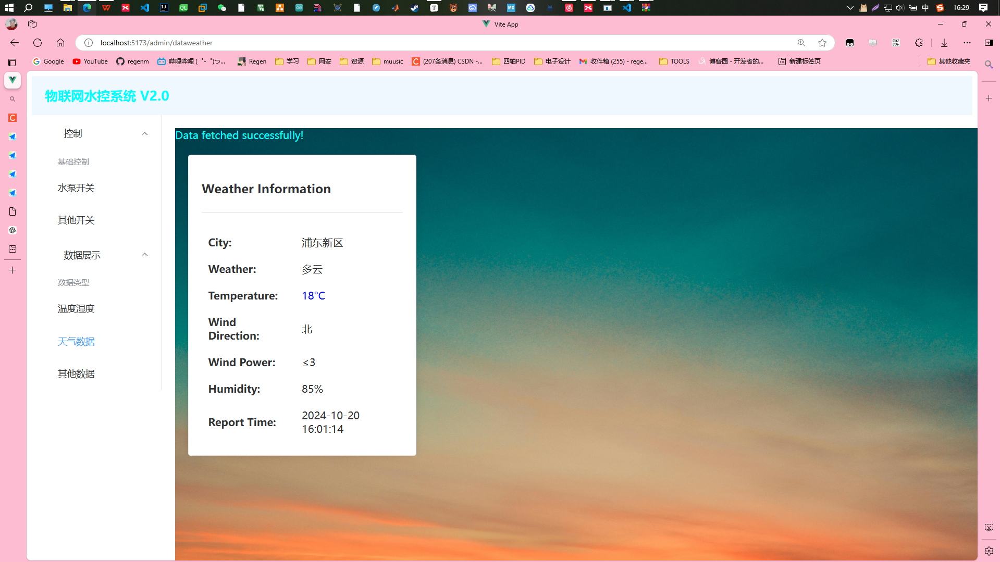
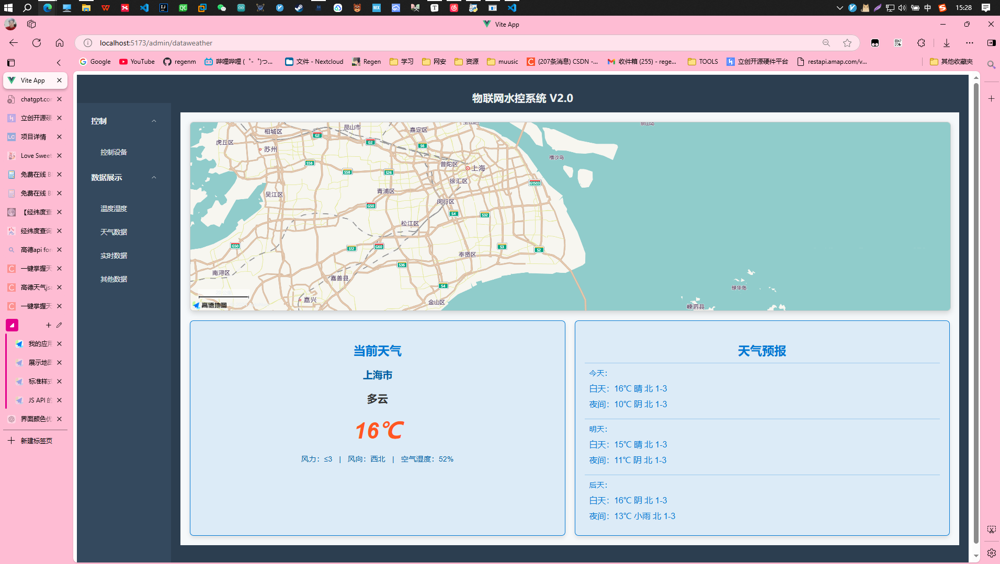

# 1. 获取当地天气等数据（基于web api）

* **实现方法**

    ​	尝试使用现有的api，例如高德。

#### 高德web api的使用    

> 1. 打开并注册[高德开放平台](https://lbs.amap.com/)
> 2. 进入[高德开发平台的控制台](https://console.amap.com/dev/key/app)
> 3. 创建**web服务**应用并获取 API Key
>
> 

```http
https://restapi.amap.com/v3/weather/weatherInfo?city=110101&key=<用户key>
```

 1. 参数的选择

    | **参数名** | **含义**         | **规则说明**                                                 | **是否必须** | **缺省值** |
    | ---------- | ---------------- | ------------------------------------------------------------ | ------------ | ---------- |
    | key        | 请求服务权限标识 | 用户在高德地图官网 [申请 web 服务 API 类型 KEY](https://lbs.amap.com/dev/) | 必填         | 无         |
    | city       | 城市编码         | 输入城市的 adcode，adcode 信息可参考 [城市编码表](https://lbs.amap.com/api/webservice/download) | 必填         | 无         |
    | extensions | 气象类型         | 可选值：base/allbase:返回实况天气all:返回预报天气            | 可选         | 无         |
    | output     | 返回格式         | 可选值：JSON,XML                                             | 可选         | JSON       |

 2. 返回案例结果，浦东新区为案例

    ```json
    {
        "status": "1",
        "count": "1",
        "info": "OK",
        "infocode": "10000",
        "lives": [
            {
                "province": "上海",
                "city": "浦东新区",
                "adcode": "310115",
                "weather": "阴",
                "temperature": "19",
                "winddirection": "西北",
                "windpower": "≤3",
                "humidity": "77",
                "reporttime": "2024-10-20 15:33:12",
                "temperature_float": "19.0",
                "humidity_float": "77.0"
            }
        ]
    }
    ```

#### 前端展示



**代码**

```vue
<template>
    
    <div class="background" >
        <el-message v-if="message" :type="messageType" class="single-line-message" >{{ message }}</el-message>
      <div class="card-container">
        <div class="card" v-if="weatherData">
          <el-card>
            <h3>Weather Information</h3>
            <el-divider></el-divider>
            <table>
              <tr>
                <td><strong>City:</strong></td>
                <td>{{ weatherData.city }}</td>
              </tr>
              <tr>
                <td><strong>Weather:</strong></td>
                <td>{{ weatherData.weather }}</td>
              </tr>
              <tr>
                <td><strong>Temperature:</strong></td>
                <td :style="{ color: weatherData.temperature > 25 ? 'red' : 'blue' }">
                  {{ weatherData.temperature }}°C
                </td>
              </tr>
              <tr>
                <td><strong>Wind Direction:</strong></td>
                <td>{{ weatherData.winddirection }}</td>
              </tr>
              <tr>
                <td><strong>Wind Power:</strong></td>
                <td>{{ weatherData.windpower }}</td>
              </tr>
              <tr>
                <td><strong>Humidity:</strong></td>
                <td>{{ weatherData.humidity }}%</td>
              </tr>
              <tr>
                <td><strong>Report Time:</strong></td>
                <td>{{ weatherData.reporttime }}</td>
              </tr>
              <tr>
                <td><strong>Report Time:</strong></td>
                <td>{{ weatherData.forcast }}</td>
              </tr>
            </table>
          </el-card>
        </div>
      </div>
    </div>
  </template>
  
  <script>
  import axios from 'axios';
  import { ref, onMounted } from 'vue';
  
  export default {
    setup() {
      const message = ref('');
      const messageType = ref('success');
      const weatherData = ref(null);
  
      const getData = async () => {
        try {
          const response = await axios.get('https://restapi.amap.com/v3/weather/weatherInfo', {
            params: {
              city: '310115',
              key: 'regenissb rengenCanDoTHis' //替换
            },
          });
  
          if (response.data.status === '1' && response.data.lives.length > 0) {
            weatherData.value = response.data.lives[0];
            message.value = 'Data fetched successfully!';
            messageType.value = 'success';
          } else {
            message.value = 'Failed to fetch data.';
            messageType.value = 'error';
          }
        } catch (error) {
          console.error('Error fetching data:', error);
          message.value = 'Operation failed, please try again!';
          messageType.value = 'error';
        }
      };
  
      onMounted(() => {
        getData();
      });
  
      return {
        getData,
        message,
        messageType,
        weatherData
      };
    }
  };
  </script>
  
  <style scoped>
.background {
  width: 100%;
  height: 100%;
}
.card-container {
  display: flex;
  flex-wrap: wrap;
  padding: 10px;
  gap: 10px;
}

.card {
  width: 100%;
  max-width: 1000px;
  margin: 20px;
  border-radius: 10px;
  background-color: rgba(255, 255, 255, 0.8);
  display: flex;
  flex-direction: column;
  justify-content: center;
  align-items: center;
  padding: 20px;
  gap: 20px;
}
  
  table {
    width: 100%;
    border-collapse: collapse;
  }
  
  td {
    padding: 10px;
  }
  
  h3 {
    margin-bottom: 10px;
  }
  
  .single-line-message {
    color: aqua;
    white-space: nowrap;
  }
  </style>
  
```

1. # 获取当地天气等数据（基于js api）



基于VUE3的代码

```vue
<template>
  <div class="container">
    <!-- 地图部分 -->
    <div id="map-container"></div>

    <!-- 天气数据卡片 -->
    <div class="cards">
      <!-- 当前天气 -->
      <div class="card">
        <h3>当前天气</h3>
        <p class="city">{{ state.city }}</p>
        <p class="weather">{{ state.weather }}</p>
        <h2 class="temp">
          <em>{{ state.temperature }}℃</em>
        </h2>
        <div class="detail">
          <span>风力：{{ state.windPower }}</span> |
          <span>风向：{{ state.windDir }}</span> |
          <span>空气湿度：{{ state.humidity }}%</span>
        </div>
      </div>

      <!-- 天气预报 -->
      <div class="card" v-if="forecasts.length">
        <h3>天气预报</h3>
        <div
          class="group"
          v-for="(forecast, index) in forecasts.slice(0, forecasts.length - 1)" 
          :key="index"
        >
          <div>{{ index === 0 ? "今天" : index === 1 ? "明天" : "后天" }}：</div>
          <span class="tm">
            白天：{{ forecast.dayTemp }}℃ {{ forecast.dayWeather }}
            {{ forecast.dayWindDir }} {{ forecast.dayWindPower }}
          </span>
          <span class="tm">
            夜间：{{ forecast.nightTemp }}℃ {{ forecast.nightWeather }}
            {{ forecast.nightWindDir }} {{ forecast.nightWindPower }}
          </span>
        </div>
      </div>
      </div>
      </div>

</template>


<script>
import { ref, onMounted, onUnmounted } from "vue";
import AMapLoader from "@amap/amap-jsapi-loader";

export default {
  data() {
    return {
      now: new Date().toLocaleString(),
      state: {
        city: "上海市",
        weather: "",
        temperature: "",
        windPower: "",
        windDir: "",
        humidity: "",
      },
      forecasts: [],
      map: null,
      AMap: null,
      cityList: ["杭州市", "北京市", "上海市", "广州市"], // 城市列表
      currentCityIndex: 0, // 当前选择的城市索引
    };
  },
  methods: {
    // 初始化地图
    initMap() {
      AMapLoader.load({
        key: "", // 替换为你的高德地图 API Key
        version: "2.0",
        plugins: ["AMap.Scale", "AMap.Weather", "AMap.Geocoder"], // 加载必要插件
      })
        .then((AMap) => {
          this.AMap = AMap;
          this.map = new AMap.Map("map-container", {
            mapStyle: "amap://styles/fresh",
            zoom: 11,
            center: [121.896964, 30.882957], // 初始中心点
          });
          this.map.addControl(new AMap.Scale()); // 添加比例尺组件

          // 地图点击事件
          this.map.on("click", (e) => {
            const lnglat = e.lnglat; // 获取点击经纬度
            this.getCityName(lnglat)
              .then((city) => {
                this.state.city = city;
                this.getLiveWeather(city);
                this.getForecastWeather(city);
              })
              .catch((err) => console.error("获取城市名称失败", err));
          });

          // 初始天气查询
          this.getLiveWeather(this.state.city);
          this.getForecastWeather(this.state.city);
        })
        .catch((error) => {
          console.error("地图加载失败:", error);
        });
    },

    // 获取实时天气
    getLiveWeather(city) {
      const weather = new this.AMap.Weather();
      weather.getLive(city, (err, data) => {
        if (!err) {
          this.state.weather = data.weather;
          this.state.temperature = data.temperature;
          this.state.windPower = data.windPower;
          this.state.windDir = data.windDirection;
          this.state.humidity = data.humidity;
        } else {
          console.error("实时天气获取失败:", err);
        }
      });
    },

    // 获取天气预报
    getForecastWeather(city) {
      const weather = new this.AMap.Weather();
      weather.getForecast(city, (err, data) => {
        if (!err) {
          this.forecasts = data.forecasts;
        } else {
          console.error("天气预报获取失败:", err);
        }
      });
    },

    // 获取城市名称
    getCityName(lnglat) {
      return new Promise((resolve, reject) => {
        const geocoder = new this.AMap.Geocoder();
        geocoder.getAddress(lnglat, (status, result) => {
          if (status === "complete" && result.regeocode) {
            const city = result.regeocode.addressComponent.city || result.regeocode.addressComponent.province;
            resolve(city);
          } else {
            reject("无法获取地址");
          }
        });
      });
    },

    // 切换城市
    toggleCity() {
      this.currentCityIndex = (this.currentCityIndex + 1) % this.cityList.length;
      this.state.city = this.cityList[this.currentCityIndex];
      this.getLiveWeather(this.state.city);
      this.getForecastWeather(this.state.city);
    },
  },
  mounted() {
    window._AMapSecurityConfig = {
      securityJsCode: "", // 替换为你的高德开发者平台的安全密钥
    };
    this.initMap();
    // 更新时间
    setInterval(() => {
      this.now = new Date().toLocaleString();
    }, 1000);
  },
  beforeUnmount() {
    this.map?.destroy();
  },
};
</script>
<style scoped>
.container {
  font-family: Arial, sans-serif;
  display: flex;
  flex-direction: column; /* 垂直排列，确保地图和卡片在独立行 */
  gap: 20px;
  padding: 20px;
  background-color: #f5f8fa; /* 背景浅灰蓝，柔和 */
}

#map-container {
  width: 100%;
  height: 400px;
  border: 1px solid #ccc;
  border-radius: 8px;
  box-shadow: 0 4px 10px rgba(0, 0, 0, 0.15);
}

.cards {
  display: flex;
  flex-wrap: wrap; /* 当宽度不足时换行 */
  gap: 20px;
}

.card {
  flex: 1;
  min-width: 300px;
  padding: 20px;
  border: 1px solid #0078d4; /* 边框采用主题色 */
  border-radius: 8px;
  box-shadow: 0 4px 8px rgba(0, 0, 0, 0.1);
  background-color: rgba(0, 120, 212, 0.1); /* 半透明蓝色背景 */
  color: #333; /* 主要文字颜色 */
}

.card h3 {
  margin-bottom: 10px;
  font-size: 1.6rem;
  color: #0078d4; /* 标题采用主题色 */
  text-align: center;
  font-weight: bold;
}

.city {
  font-size: 1.3rem;
  font-weight: bold;
  margin-bottom: 15px;
  text-align: center;
  color: #005ea6; /* 城市名称颜色 */
}

.temp em {
  font-size: 3rem;
  color: #ff5722; /* 温度醒目，橙色 */
  font-weight: bold;
  display: block;
  text-align: center;
}

.weather {
  text-align: center;
  font-size: 1.4rem;
  font-weight: bold;
  color: #333;
  margin-bottom: 10px;
}

.detail {
  font-size: 1rem;
  margin-top: 15px;
  color: #005ea6; /* 细节文字主题色 */
  text-align: center;
}

.detail span {
  display: inline-block;
  margin: 0 10px;
}

.tm {
  display: block;
  margin-top: 10px;
  font-size: 1.1rem;
  color: #0078d4; /* 时间段天气颜色主题一致 */
}

.group {
  margin-top: 10px;
  color: #0078d4;
  padding: 10px;
  border-top: 1px solid rgba(0, 120, 212, 0.3);
}
</style>

```

